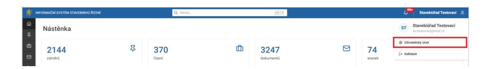
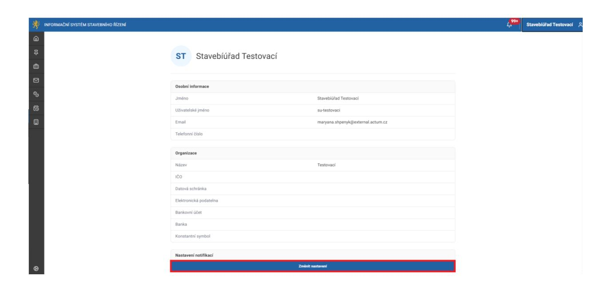
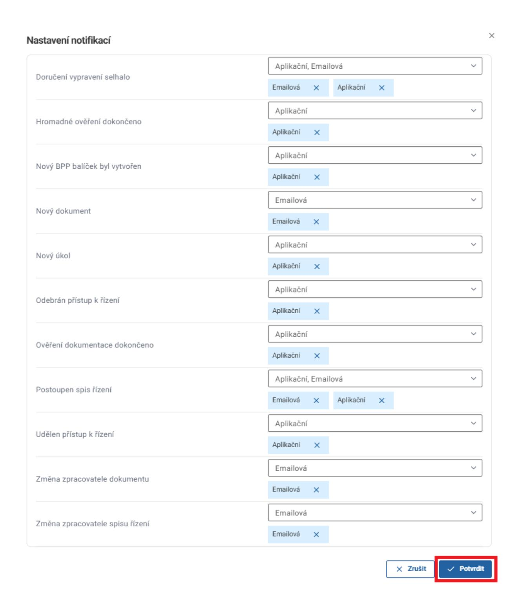

# 2.2 Nastavení účtu

V uživatelském účtu je možné nastavit různé kombinace upozornění (notifikací) přímo v aplikaci ISSŘ a prostřednictvím emailu podle potřeb každého uživatele. Notifikace lze zapnout/vypnout individuálně v nastavení uživatelského účtu. E-mailové notifikace jsou v primárním nastavení vypnuty. Pakliže chcete dostávat e-mailové notifikace, je potřeba je aktivovat.

Upozornění: Pro fungování emailových notifikací je potřebné mít správně nastavenou emailovou adresu daného uživatele. Pro postup nastavení notifikací přejděte na 2.2.1 Postup nastavení notifikací.

Celkový seznam notifikací:

### **Emailové notifikace:**

- selhání vypravení dokumentu
- příchozích dokumentů přijatých z Portálu stavebníka/centrální podatelny pro SÚ i DO
- notifikace při interním předání či postoupení SÚ i DO Upozornění: Notifikace nepřijde v případě postoupení u řízení, které bylo založeno před datem 16.5.2025.
- notifikace při změně zpracovatele žádosti
- notifikace při změně zpracovatele řízení

### **Notifikace v aplikaci (ikona zvonečku):**

- selhání vypravení dokumentu
- notifikace při interním předání či postoupení SÚ i DO
- hromadné ověření dokončeno (pro hromadné ověření osob, parcel, stavebních objektů a navrhovaných stavebních objektů v záměru, anebo účastníků v řízení)
- nový BPP balíček byl vytvořen (týká se pouze vytvoření nového BPP balíčku úředníkem v ISSŘ. Nejedná se o vložení BPP balíčku stavebníkem/zástupcem prostřednictvím Portálu stavebníka)
- upozornění na nový úkol
- ověření dokumentace dokončeno
- udělení a odebrání přístupu k řízení
- postoupení spisu řízení

- změna zpracovatele dokumentu
- změna zpracovatele spisu řízení

### 2.2.1 Postup nastavení notifikací

V pravém horním rohu klikněte na uživatelské jméno a poté vyberete možnost "Uživatelský účet". Zobrazí se vám informace o daném uživateli.

V části "Nastavení notifikací" kliknete na tlačítko "Změnit nastavení".

V otevřeném okně je možné měnit nastavení pro jednotlivé typy notifikací. Nastavení notifikací uložíte stisknutím tlačítka Potvrdit.

Pro správné fungování notifikačních e-mailů v ISSŘ je nezbytné, aby měl uživatel vyplněnou platnou e-mailovou adresu v systému JIP/KAAS.

Pokud se uživatel přihlašuje do ISSŘ prostřednictvím JIP/KAAS a e-mail není v tomto systému uveden, při přihlášení do ISSŘ dojde k odstranění e-mailové adresy i z jeho profilu v ISSŘ, a to i v případě, že tam byla dříve ručně zadána.

### 2.2.2 Uživatelské nastavení

Evidence v systému má uložené nastavení pro jednotlivé uživatele. Například, pokud uživatel změní rozložení sloupců, přidá filtr, nebo změní řazení, pak si systém tato nastavení pro konkrétního uživatele zapamatuje. Nastavení bude uloženo v tabulce uživatelského nastavení

Uživatelské nastavení zůstává obvykle zachováno i v případech, kdy s vývojem přibude sloupec, nebo se změní typ a podobně. Po některých větších změnách systému však může dojít ke ztrátě některého uživatelského nastavení a je potřeba, aby si uživatel nastavil své rozhraní znovu.

Nastavení lze resetovat jednotlivě nebo hromadně pomocí tlačítek Obnovit a Obnovit výchozí nastavení.

| vidence                     | Obnovit  |
|-----------------------------|----------|
| BPP                         | <b>⊕</b> |
| COMPONENTS                  | ê        |
| Dokument: Přílohy           | ê        |
| Dokumenty: Ke zpracování    | û        |
| Dokumenty: Odeslané         | ê        |
| Dokumenty: Všechny          | ê        |
| Dokumenty: Zpracované       | ê        |
| PROCEDURE_PERSON_COLLECTION | ê        |
| Řízení: Běžící              | ê        |
| Řízení: Všechny             | ê        |
| Úkoly: Aktivní              | ê        |
| Záměr: Osoby                | ê        |
| Záměr: Parcely              | ê        |
| Záměr: Řízení               | ê        |
| Záměr: Stavební objekty     | ê        |
| Záměry: Aktivní             | ê        |
| Záměry: Aktivní             | ê        |
| Záměry: Všechny             | <u> </u> |
| Záměry: Všechny             | û        |
