# 3 Základní orientace v ISSŘ

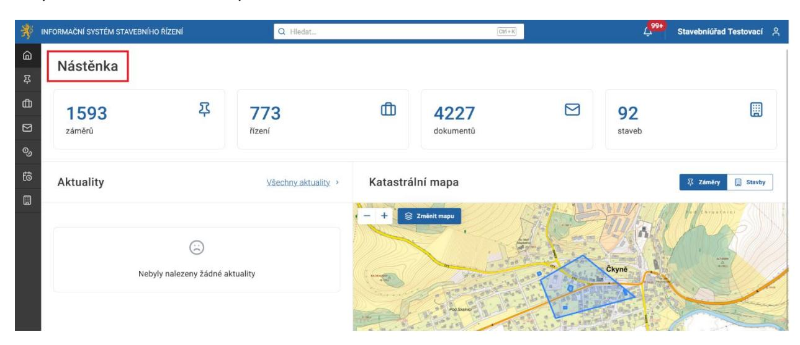

Na Nástěnce naleznete základní statistické údaje o záměrech, řízeních, dokumentech a stavbách v systému. Pod těmito údaji je rovněž Katastrální mapa, která zobrazuje záměry realizované v ISSŘ.

Poslední částí Nástěnky jsou Aktuality, prostřednictvím kterých jsou sdělovány důležité informace týkající se systému.

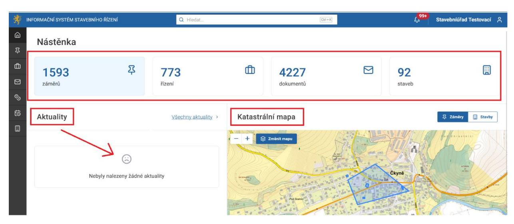

### 3.1 Popis horní lišty

V horní liště naleznete pole Hledat, ve kterém můžete vyhledávat (viz dále). Pod tlačítkem s ikonou zvonečku naleznete notifikace, tedy oznámení o událostech, které vyžadují akce z Vaší strany (například zpracování doručeného dokumentu) či informace o výsledcích Vašich předešlých akcí (například ověření dokumentace v záměru či řízení). Úplně vpravo pak naleznete informace o přihlášené osobě.

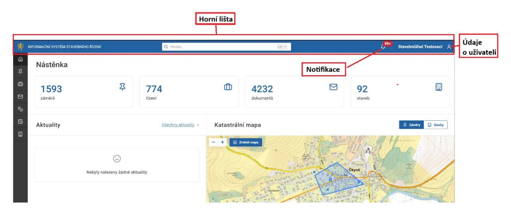

### 3.1.1 Vyhledávání

Do řádku pro vyhledávání v horní části obrazovky zadejte alespoň první znak hledaného výrazu. Následně vyberte oblast, ve které chcete hledání provést.

Pokud hledáte přímo z Nástěnky, vybíráte z oblastí Záměr, Řízení, Dokument, Platby, Stavební objekty.

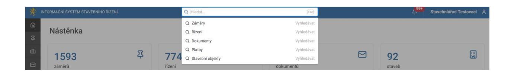

V případě, že tuto funkci využijete z jiného náhledu, automaticky vyhledáváte v dané sekci systému. Např. po kliknutí na Dokument jste přesměrováni do dokumentů, kde můžete v případě potřeby dále vybírat z jednotlivých stavů dokumentů.

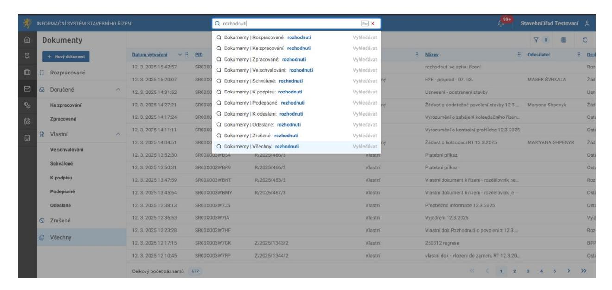

Při vyhledávání si nemusíte dávat pozor na zadávání velkých či malých písmen. Vyhledávač hledaný název vyhledá bez ohledu na malá či velká písmena.

### 3.1.2 Notifikace (oznámení)

Každý nový úkol se vám zobrazí pod tlačítkem s ikonou zvonečku v záložce Notifikace (čili oznámení).

Notifikace upozorňují přihlášeného uživatele na události v ISSŘ, které vyžadují jeho akci (například upozornění na nově doručený dokument), anebo jsou výsledkem jeho předešlých akcí v systému (například notifikace o výsledku hromadného ověření účastníků řízení). Při kliknutí na konkrétní notifikaci budete přesměrováni – například, jak vidíte na obrázku níže, k úkolu "Odeslat ke schválení dokument".

Nastavení notifikací je popsáno v kapitole 2.2.1 Postup nastavení notifikací.

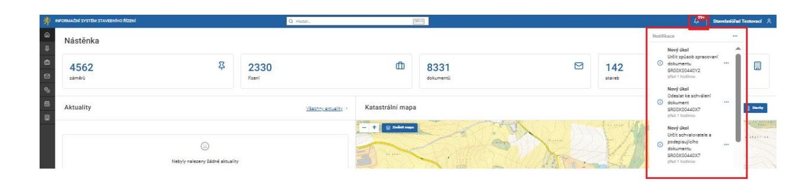

### 3.1.3 Uživatel

Přes kliknutí na jméno v pravém horním rohu se můžete odhlásit ze systému či otevřít nastavení uživatelského profilu.

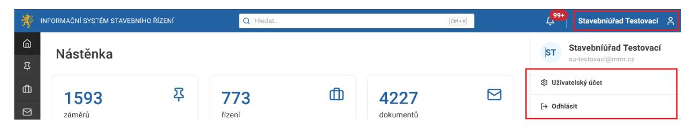

Na obrazovce uživatelský účet naleznete základní informace o svém účtu a organizaci. Můžete také změnit nastavení notifikací a zobrazení dat na jednotlivých obrazovkách.

Sekce Nastavení notifikací umožňuje uživateli zapnout/vypnout notifikace pro specifické události v ISSŘ a určit jejich podobu. Způsob a náležitosti nastavení notifikací je podrobně popsán v kapitole 2.2.1 Postup nastavení notifikací.

Sekce Uživatelské nastavení umožňuje uživateli obnovit původní nastavení zobrazení a pozic sloupců při vyhledávání. Postup a dopady jednotlivých úkonů jsou podrobně popsány v kapitole 2.2.2 Uživatelské nastavení.

### 3.2 Popis levé lišty = hlavní menu

Na levém okraji obrazovky se nachází tmavě šedé svislé menu, kde naleznete několik záložek.

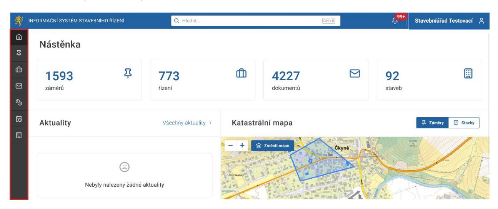

Jakmile na záložky najedete myší, zobrazí se nápověda, co jednotlivá záložka obsahuje. Mezi záložkami můžete jednoduše přepínat. Postupně lze odshora zobrazit záložky Nástěnka, Záměry, Řízení, Dokumenty, Správní poplatky, Úkoly, Stavební objekty.

### 3.2.1 Nástěnka

Při kliknutí na tlačítko Nástěnka systém načte úvodní stránku.

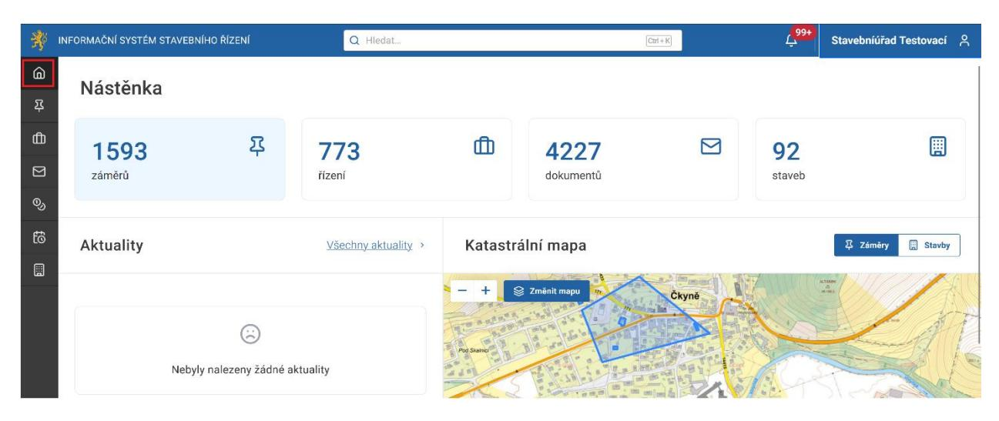

### 3.2.2 Záměry

Při kliknutí na tlačítko Záměry

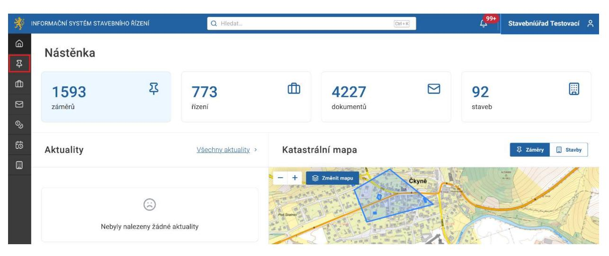

systém načte seznam záměrů pro Celou ČR i Můj úřad a jejich jednotlivé stavy.

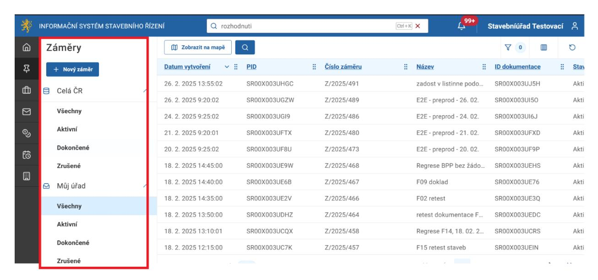

### 3.2.3 Řízení

### Při kliknutí na tlačítko Řízení

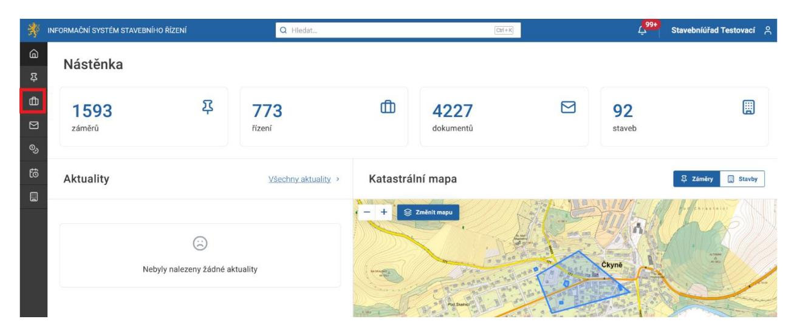

### systém načte seznam Řízení (Běžící, Přerušené, Dokončené, Všechny).

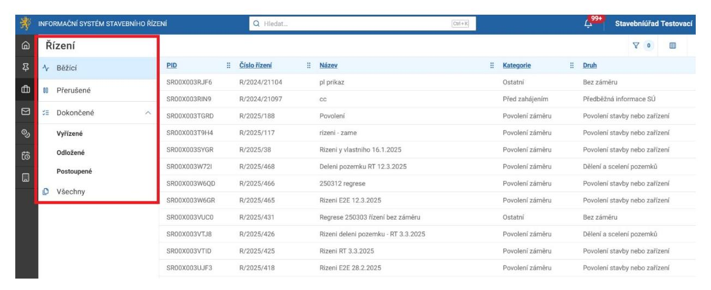

### 3.2.4 Dokumenty

### Při kliknutí na tlačítko Dokumenty

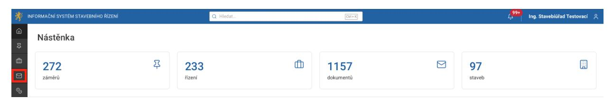

### systém načte seznam Dokumenty (Rozpracované, Doručené, Vlastní, Zrušené, Všechny).

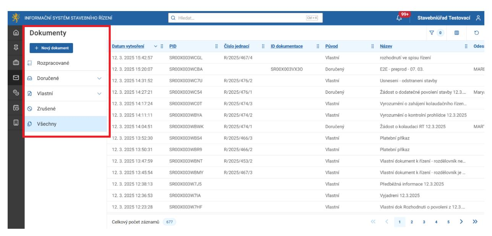

### 3.2.5 Správní poplatky

Při kliknutí na tlačítko Správní poplatky

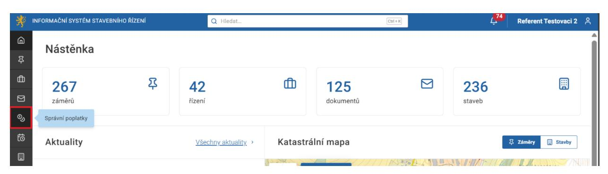

systém načte seznam Správní poplatky (Neuhrazené, Uhrazené, Zrušené, Neuhrazené – řízení zastaveno, Všechny).

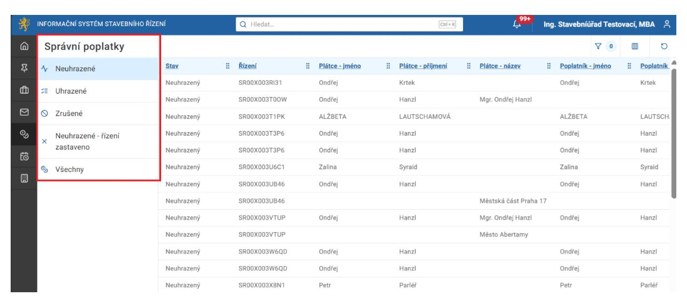
