# 3 Základní orientace v ISSŘ

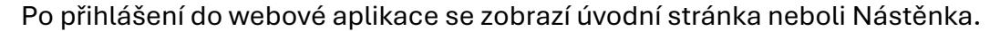
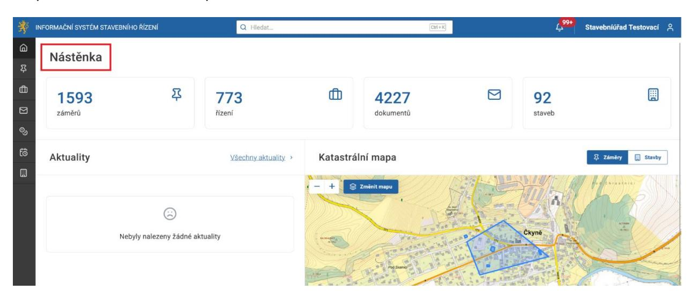

Na <Badge type="info" text="Nástěnce" /> naleznete základní statistické údaje o záměrech, řízeních, dokumentech a stavbách v systému. Pod těmito údaji je rovněž **Katastrální mapa**, která zobrazuje záměry realizované v ISSŘ.

Poslední částí Nástěnky jsou **Aktuality**, prostřednictvím kterých jsou sdělovány důležité informace týkající se systému.

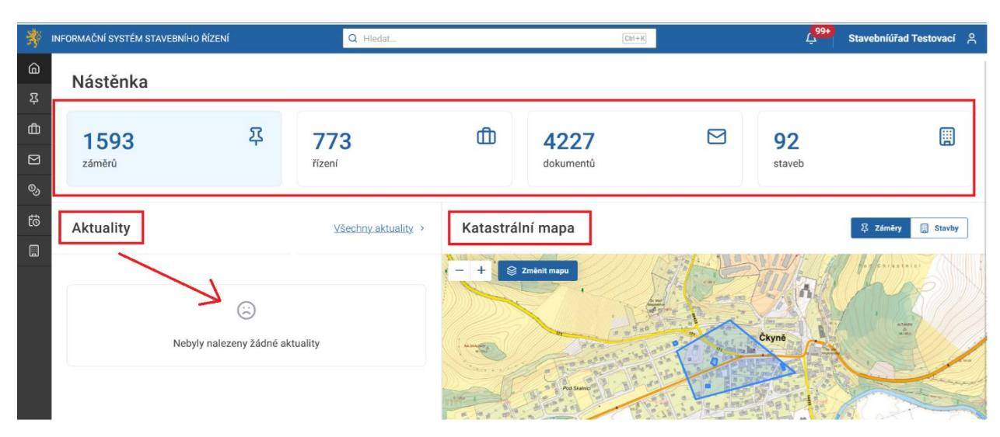

## 3.1 Popis horní lišty

V horní liště naleznete pole **Hledat**, ve kterém můžete vyhledávat (viz dále). Pod tlačítkem s ikonou zvonečku naleznete **notifikace**, tedy oznámení o událostech, které vyžadují akce z Vaší strany (například zpracování doručeného dokumentu) či informace o výsledcích Vašich předešlých akcí (například ověření dokumentace v záměru či řízení). Úplně vpravo pak naleznete informace o přihlášené osobě.

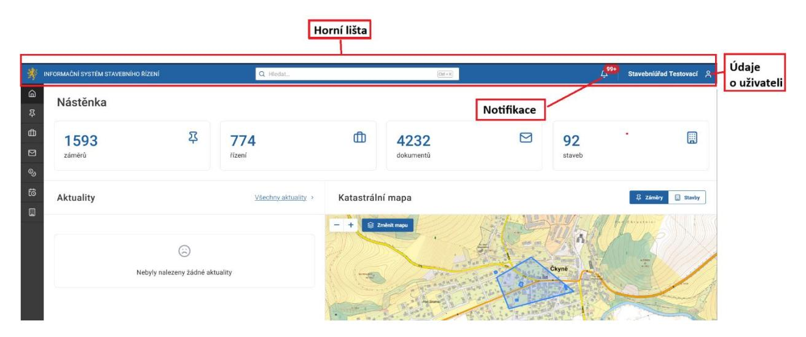

### 3.1.1 Vyhledávání

Do řádku pro vyhledávání v horní části obrazovky zadejte alespoň první znak hledaného výrazu. Následně vyberte oblast, ve které chcete hledání provést.

::: tip Hledání z Nástěnky
Pokud hledáte přímo z Nástěnky, vybíráte z oblastí: `Záměr`, `Řízení`, `Dokument`, `Platby`, `Stavební objekty`.
:::

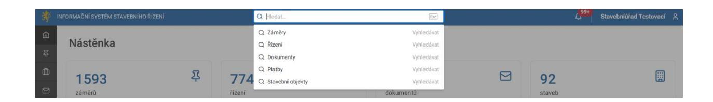

V případě, že tuto funkci využijete z jiného náhledu, automaticky vyhledáváte v dané sekci systému. Např. po kliknutí na Dokument jste přesměrováni do dokumentů, kde můžete v případě potřeby dále vybírat z jednotlivých stavů dokumentů.

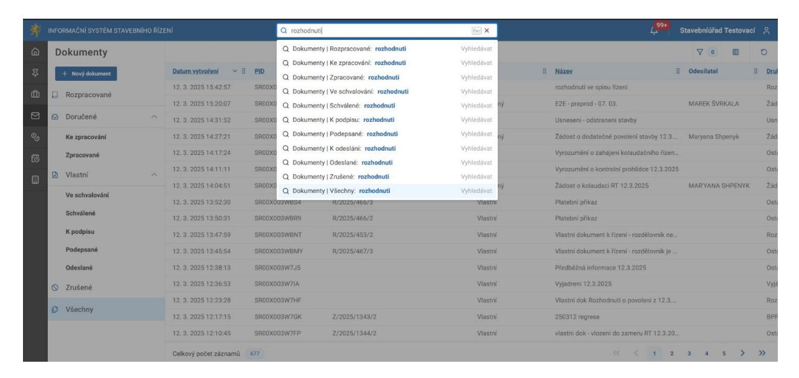

::: info Velká a malá písmena
Při vyhledávání si nemusíte dávat pozor na zadávání velkých či malých písmen. Vyhledávač hledaný název vyhledá bez ohledu na velikost znaků.
:::

### 3.1.2 Notifikace (oznámení)

Každý nový úkol se vám zobrazí pod tlačítkem s ikonou zvonečku v záložce **Notifikace**.

Notifikace upozorňují přihlášeného uživatele na události v ISSŘ, které vyžadují jeho akci (například upozornění na nově doručený dokument), anebo jsou výsledkem jeho předešlých akcí v systému (například notifikace o výsledku hromadného ověření účastníků řízení). 

Při kliknutí na konkrétní notifikaci budete přesměrováni – například k úkolu *"Odeslat ke schválení dokument"*.

::: details Nastavení notifikací
Nastavení notifikací je detailněji popsáno v kapitole **2.2.1 Postup nastavení notifikací**. Umožňuje zapnout/vypnout upozornění pro specifické události v ISSŘ a určit jejich podobu.
:::

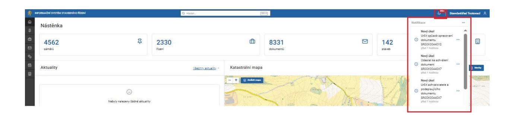

### 3.1.3 Uživatel

Přes kliknutí na jméno v pravém horním rohu se můžete odhlásit ze systému či otevřít nastavení uživatelského profilu.

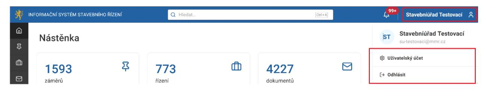

Na obrazovce **Uživatelský účet** naleznete základní informace o svém účtu a organizaci. Můžete také změnit nastavení notifikací a zobrazení dat na jednotlivých obrazovkách.

* **Sekce Nastavení notifikací:** Viz předchozí bod.
* **Sekce Uživatelské nastavení:** Umožňuje obnovit původní nastavení zobrazení a pozic sloupců při vyhledávání (podrobně popsáno v kapitole *2.2.2 Uživatelské nastavení*).

---

## 3.2 Popis levé lišty (Hlavní menu)

Na levém okraji obrazovky se nachází tmavě šedé svislé menu, kde naleznete několik záložek.

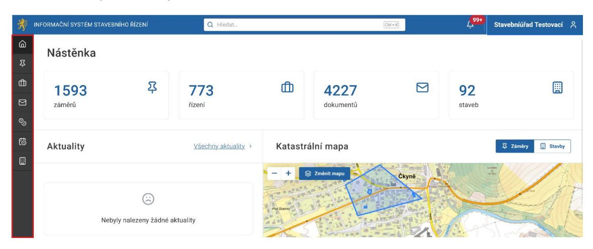

Jakmile na záložky najedete myší, zobrazí se nápověda, co jednotlivá položka obsahuje. Mezi záložkami můžete jednoduše přepínat. Postupně lze odshora zobrazit následující položky:

### 3.2.1 Nástěnka
Při kliknutí na tlačítko <Badge type="tip" text="Nástěnka" /> systém načte úvodní stránku.
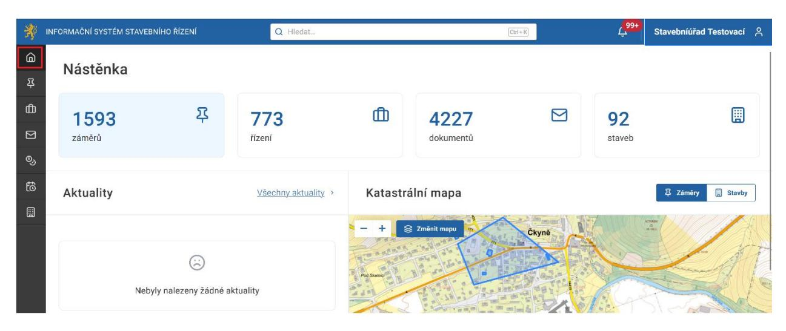

### 3.2.2 Záměry
Při kliknutí na tlačítko <Badge type="tip" text="Záměry" /> systém načte seznam záměrů pro *Celou ČR* i *Můj úřad* a jejich jednotlivé stavy.
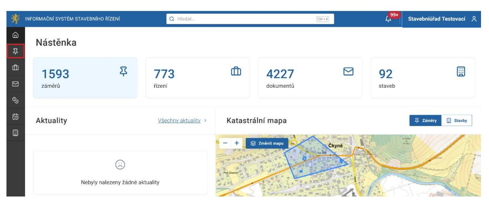
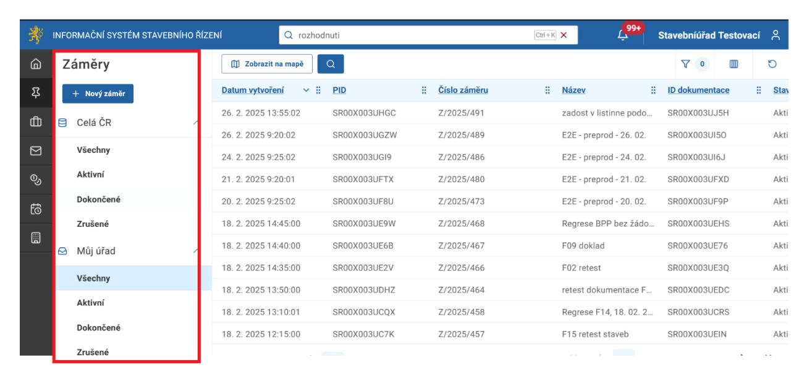

### 3.2.3 Řízení
Při kliknutí na tlačítko <Badge type="tip" text="Řízení" /> systém načte seznam řízení (`Běžící`, `Přerušené`, `Dokončené`, `Všechny`).
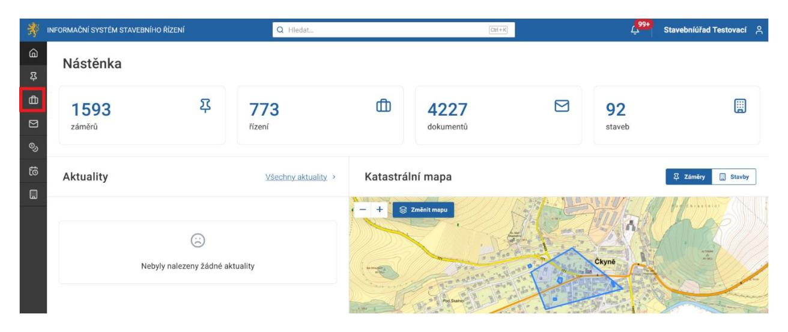
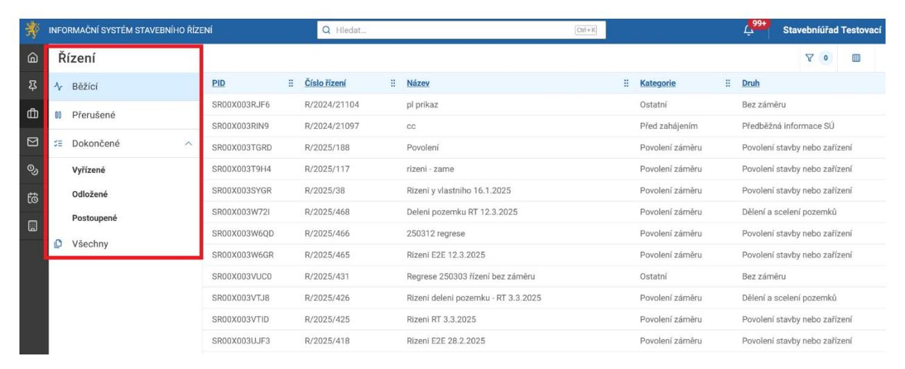

### 3.2.4 Dokumenty
Při kliknutí na tlačítko <Badge type="tip" text="Dokumenty" /> systém načte seznam dokumentů (`Rozpracované`, `Doručené`, `Vlastní`, `Zrušené`, `Všechny`).
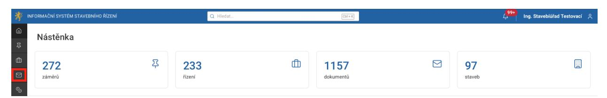
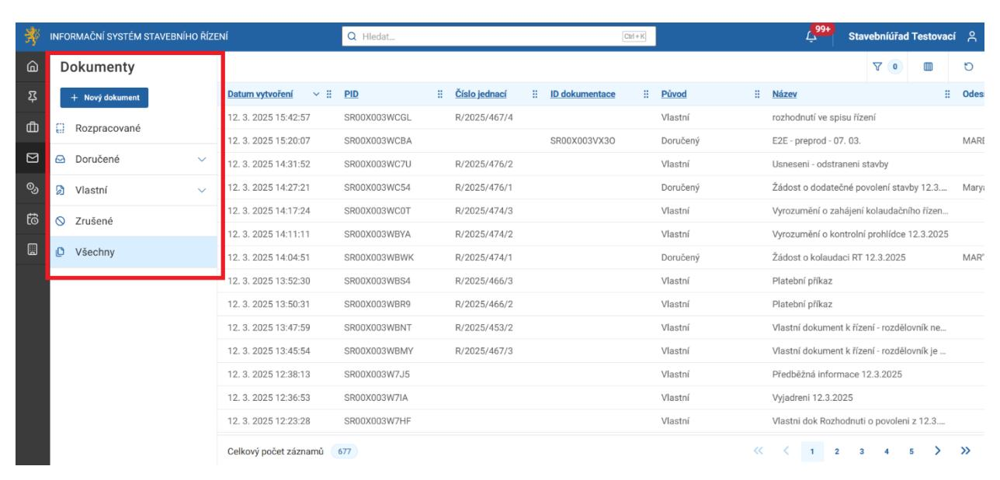

### 3.2.5 Správní poplatky
Při kliknutí na tlačítko <Badge type="tip" text="Správní poplatky" /> systém načte seznam správních poplatků (`Neuhrazené`, `Uhrazené`, `Zrušené`, `Neuhrazené – řízení zastaveno`, `Všechny`).
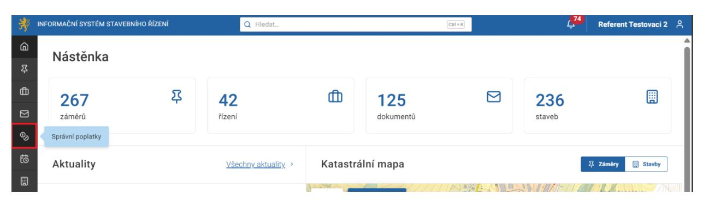
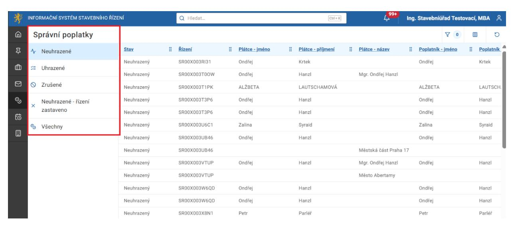
