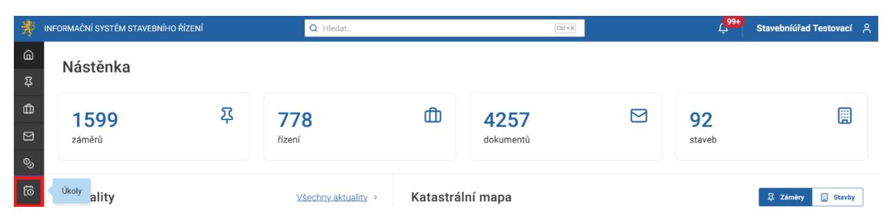
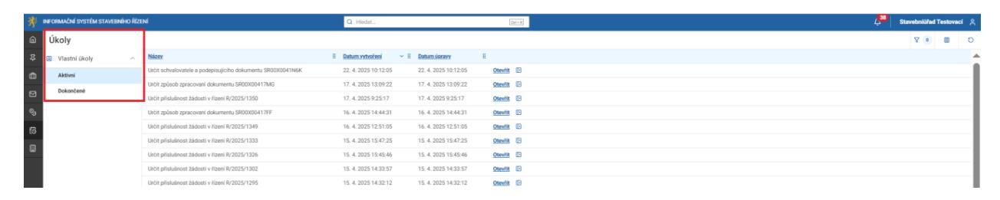
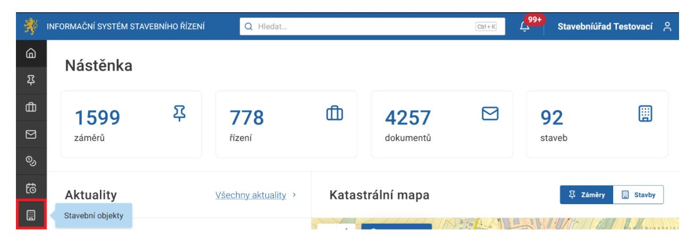
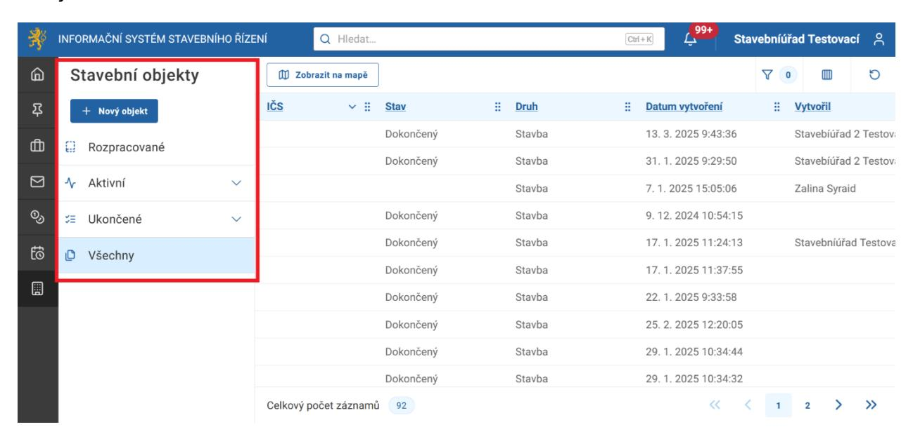
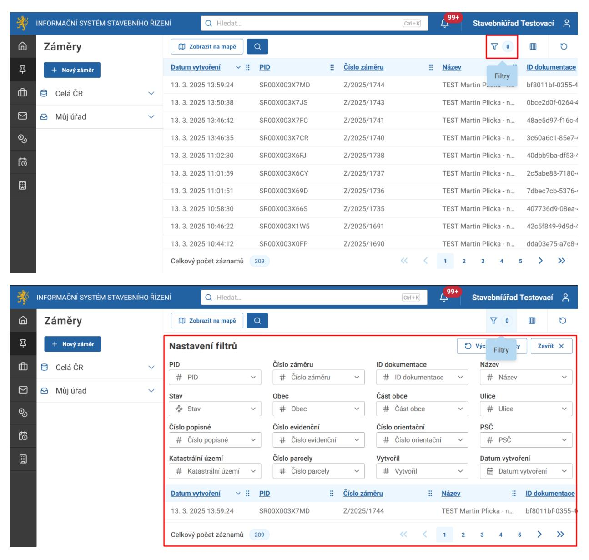
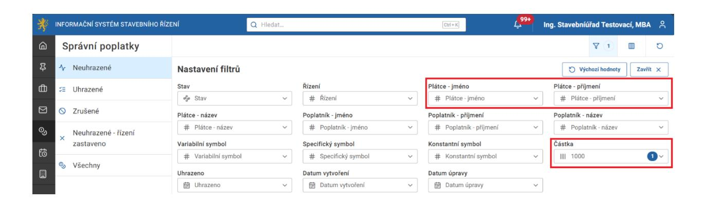
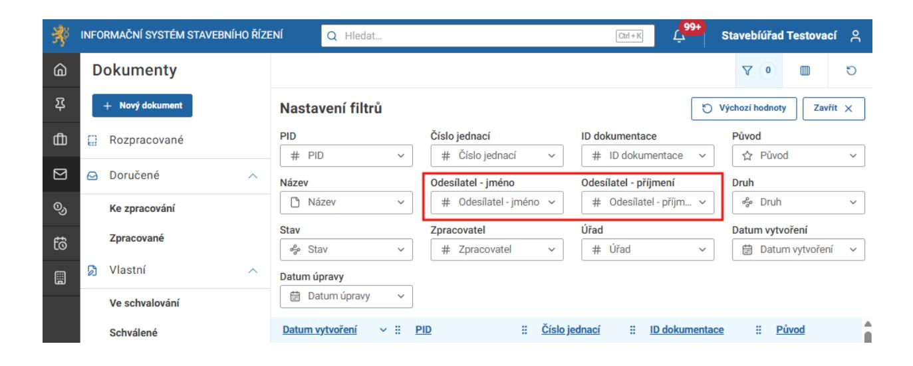

# 3.2.6 Úkoly

Při kliknutí na tlačítko Úkoly

systém načte seznam Úkoly.

### 3.2.7 Stavební objekty (stávající stavby)

Při kliknutí na tlačítko Stavební objekty (stávající stavby)

systém načte seznam Stavební objekty (Rozpracované, Aktivní, Ukončené, Všechny) a jejich stavy.

### 3.3 Filtrování

Tlačítko Filtry slouží k pokročilému vyhledávání na obrazovkách Záměry, Řízení, Dokumenty atd. Nachází se nalevo od tlačítka Sloupce (viz snímek níže). Pro nastavení filtrů pokročilého vyhledávání je potřeba použít tlačítko "+", anebo Enter po zapsání vyhledávané hodnoty do filtrovacího pole. Po uplatnění filtrů můžete opět zadat vyhledávaný výraz do pole pro vyhledávání v horní části obrazovky. Systém nyní vyhledává pouze mezi záznamy, které projdou Vámi nastaveným filtrováním.

V rámci filtrů můžete vyhledávat záznamy pomocí více parametrů současně.

Správní poplatky lze filtrovat kromě základních parametrů i dle jména a příjmení plátce, a dle kompletní částky.

Doručené dokumenty lze filtrovat kromě základních parametrů také dle jména a příjmení odesílatele. U vlastních dokumentů zůstává tento údaj prázdný.

Pokud máte zadán jeden nebo více filtrů a přejete si je všechny vymazat, můžete tak učinit pomocí tlačítka Výchozí hodnoty.
