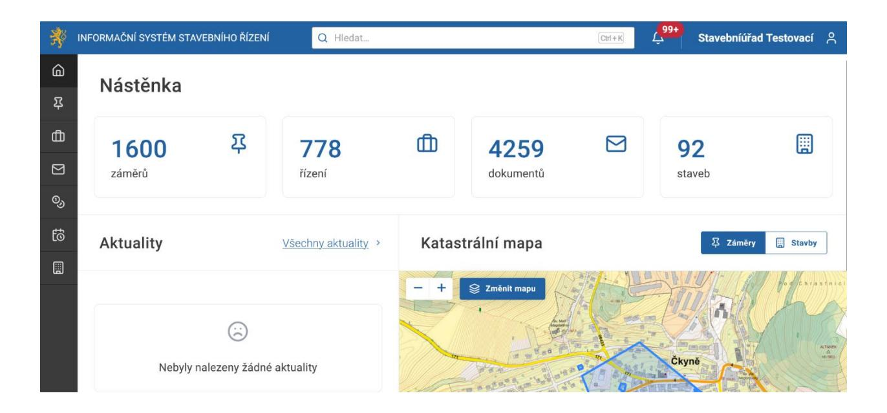
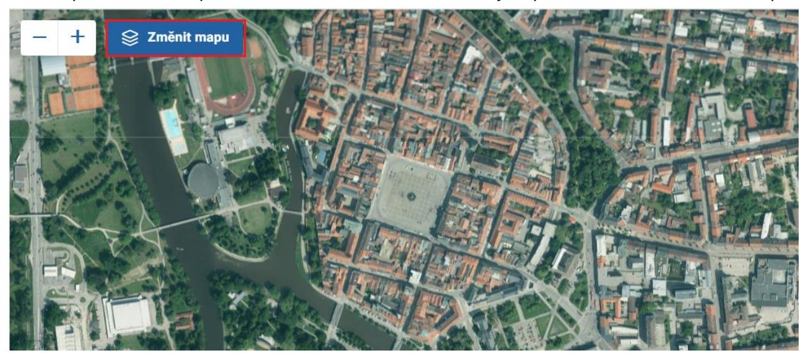
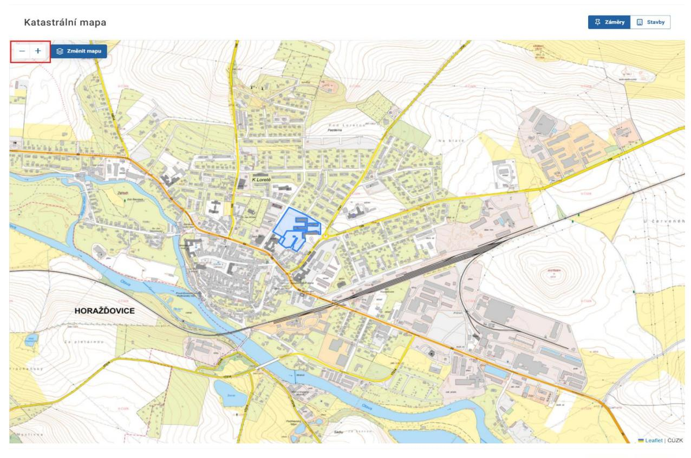
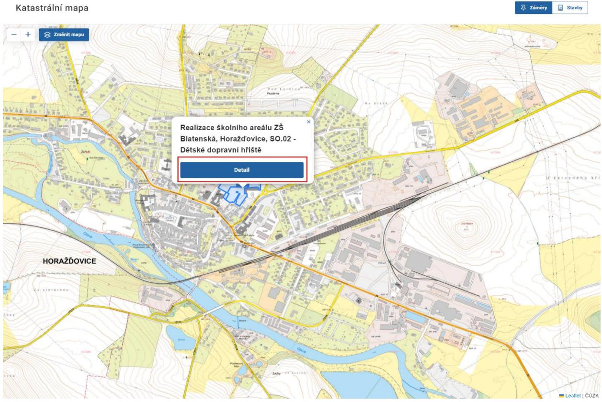

# 4 Nástěnka

Nástěnka je úvodní obrazovkou systému ISSŘ.

V levém svislém menu umožňuje proklik na Záměry, Řízení, Dokumenty, Správní poplatky, Úkoly a Stavební objekty.

V horním menu je k dispozici globální vyhledávání, notifikace a nastavení vlastního profilu. Tyto položky jsou podrobně diskutovány v samostatných kapitolách.

Nástěnka zobrazuje přehled statistik o počtu záměrů, řízení, dokumentů a staveb. Uvedená čísla jsou vždy vztažena ke konkrétnímu úřadu, pod který uživatel spadá.

V sekci Aktuality je přehled novinek, změn, nových funkcionalit, odstávek atd. Aktuality jsou spravovány globálním administrátorem MMR. Tuto sekci je vhodné pravidelně sledovat.

Součástí nástěnky je funkcionalita Katastrální mapy, která je automaticky přiblížena na adresu úřadu přihlášeného uživatele.

Na mapě je možné přepínat mezi zobrazením záměrů a staveb.

Na mapě lze měnit pohled mezi základním a leteckým po kliknutí na Změnit mapu.

Na mapě lze měnit přiblížení pomocí tlačítek ,,+" a ,,-".

Mapa zobrazuje všechny záměry/stavby v ČR. Po kliknutí na záměr/stavbu na mapě jsou zobrazeny základní informace. Kliknutí na tlačítko detail umožňuje získat detailnější informace.

