# 5 Záměry

Záměr stavby ve stavebním řízení je soubor plánů a dokumentace předkládaný stavebníkem stavebnímu úřadu za účelem získání stavebního povolení. Tento soubor detailně popisuje zamýšlený stavební projekt a jeho technické a právní aspekty.

Pro zobrazení přehledu záměrů klikněte na položku Záměry ve vertikálním menu.

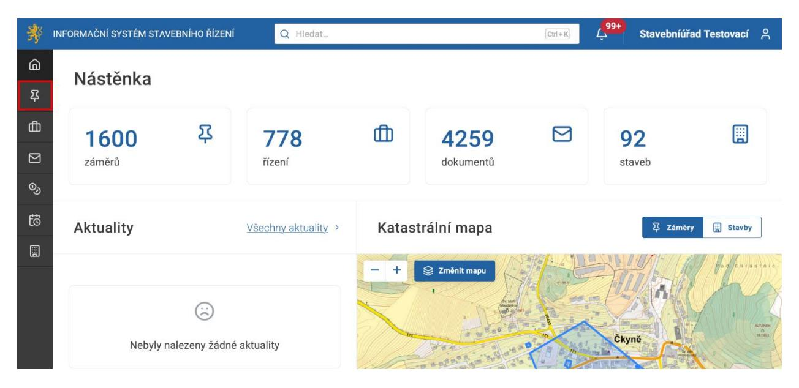

Následně se zobrazí seznam záměrů.

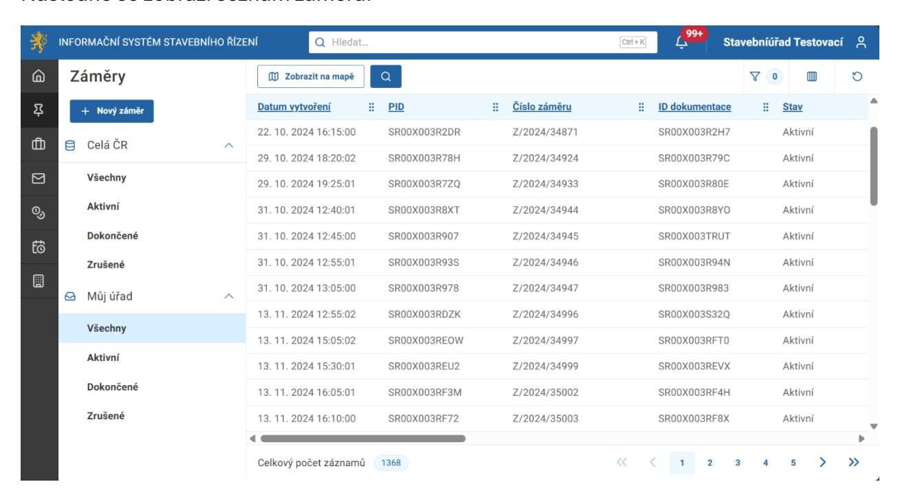

### 5.1 Záložky detailu záměru

Pro zobrazení detailu vybraného záměru klikněte na položku z přehledu.

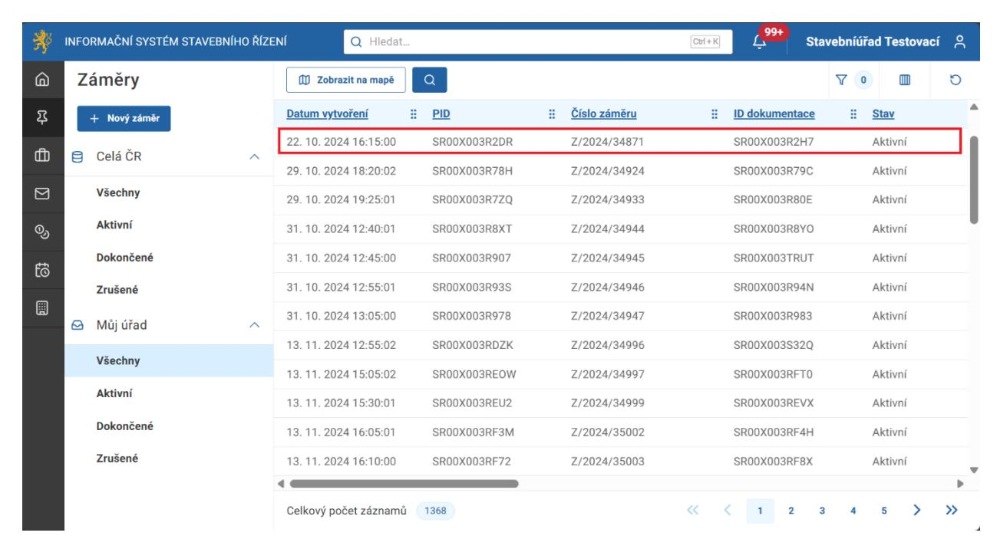

### 5.1.1 Základní informace

Záložka Základní informace obsahuje informace o záměru, jako je například stav záměru či ID dokumentace, které určují, ze kterého dokumentu se bude načítat dokumentace záměru.

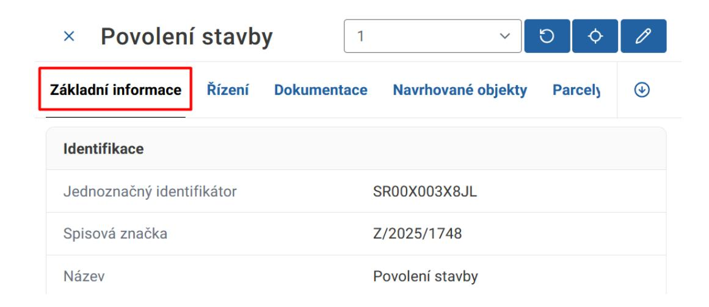

### 5.1.2 Řízení

V rámci řízení u záměru stavby se posuzuje soulad projektu s územním plánem, stavebními předpisy a normami, vliv na životní prostředí a zajištění všech potřebných povolení a souhlasů dotčených orgánů.

Pro přechod na záložku Řízení klikněte na příslušný název záložky. Na záložce Řízení vidíte řízení, která se vztahují k danému záměru.

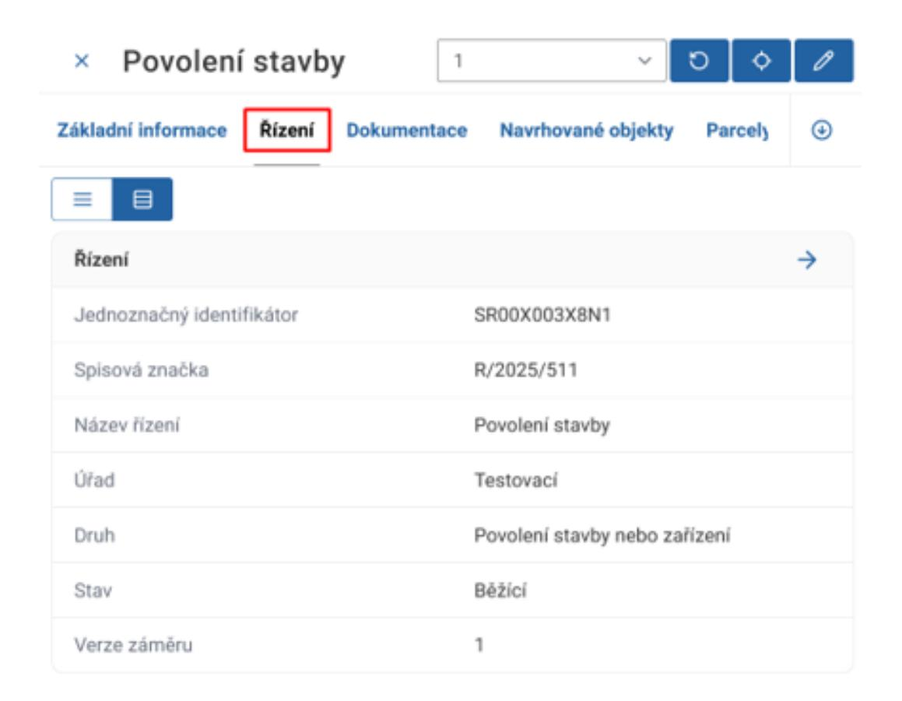

### 5.1.3 Dokumentace

Projektová dokumentace obsahuje detailní plány stavby, architektonické výkresy, technické zprávy, specifikace materiálů, statické výpočty, řešení technických zařízení a další informace potřebné pro realizaci a schválení stavebního projektu.

Pro přechod na záložku Dokumentace klikněte na příslušný název záložky. Na této záložce vidíte dokumentaci příslušného záměru. Pokud je dokumentace dostupná, zobrazí se tlačítko Načíst BPP. Pro načtení dokumentace klikněte na tlačítko Načíst BPP.

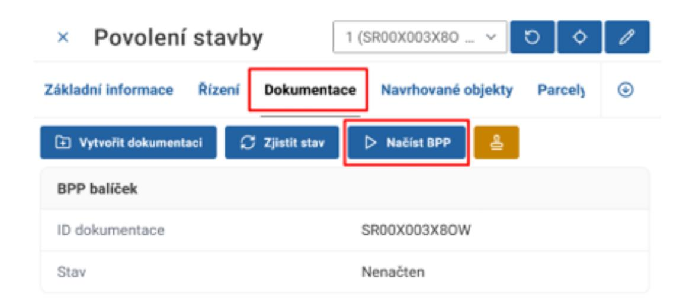

Po načtení dokumentace se objeví tlačítko Otevřít BPP. Pro zobrazení jednotlivých dokumentů, které dokumentace obsahuje, klikněte na toto tlačítko.

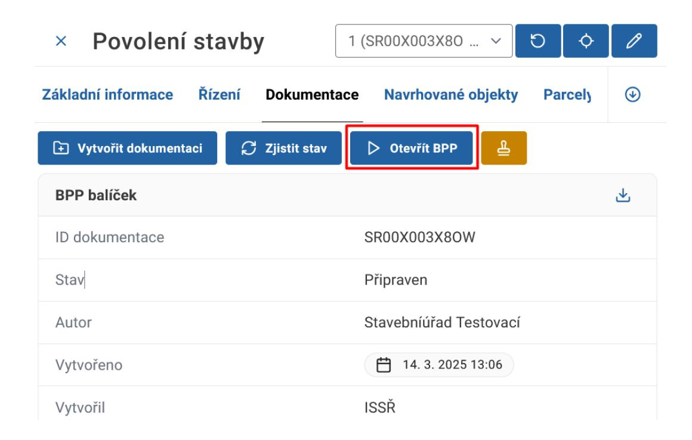

Zobrazí se nové okno. Použijte šipky k rozbalení obsahu projektové dokumentace s jednotlivými soubory či ikonu "+" a "-" pro rozbalení či sbalení všech dokumentů.

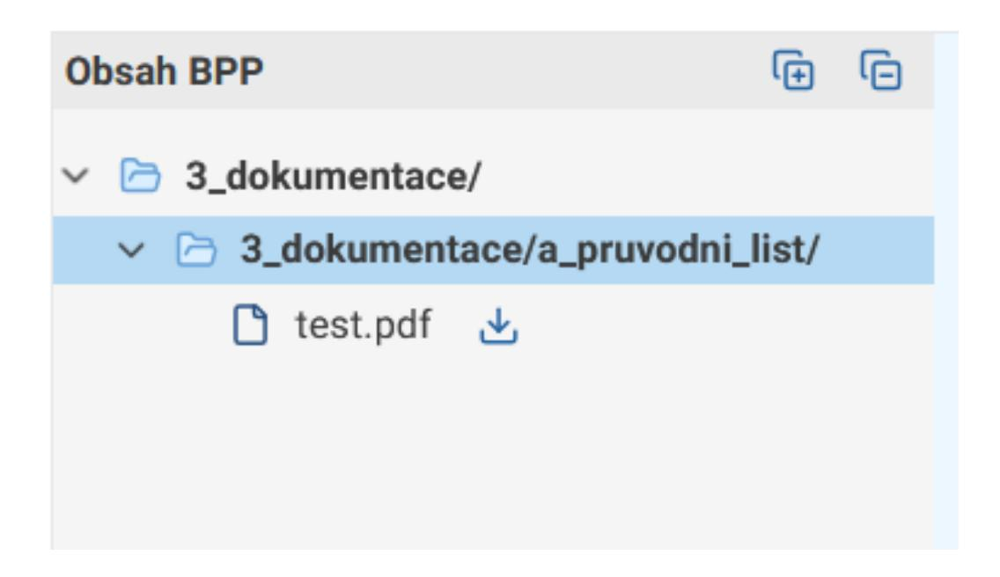

Na snímku níže je zobrazen obsah projektové dokumentace s jednotlivými soubory.

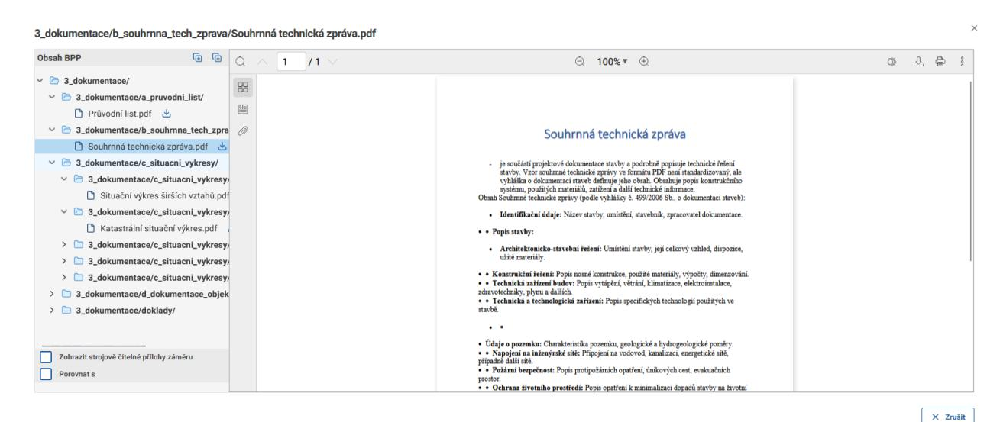

Dokumentaci je možné stáhnout do svého PC pomocí tlačítka Stáhnout BPP balíček.

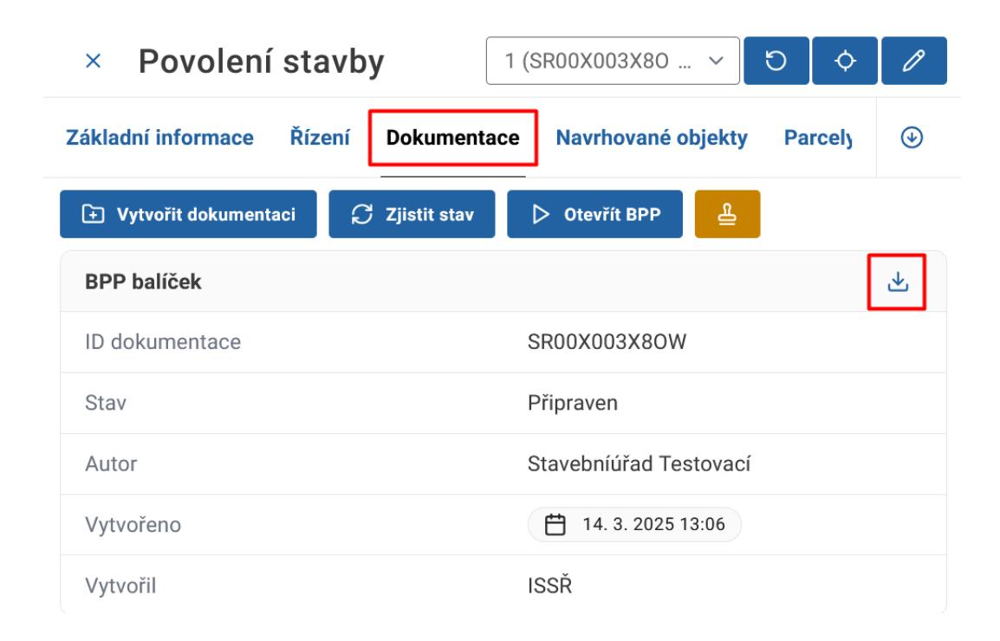

V dalším kroku je možné zvolit formát BPP nebo ZIP.

V případě zvolení formátu ZIP a stažení přejděte ve svém PC do složky stažené soubory.

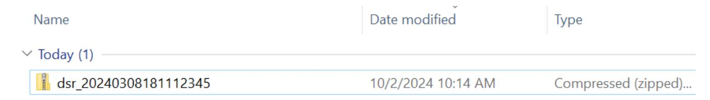

Po rozkliknutí staženého souboru se zobrazí jednotlivé složky.

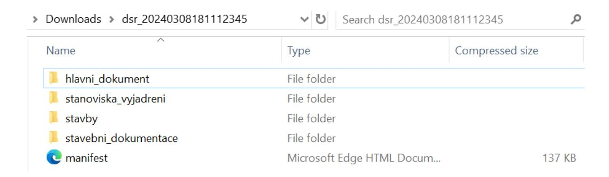

V případě zvolení formátu BPP je po dokončení stahování důležité změnit příponu souboru z ".bpp" na ".zip". Tento krok je nutný k tomu, abyste mohli balíček rozbalit a pracovat s jeho obsahem na Vašem zařízení.

Po stažení přejděte ve svém PC do složky stažené soubory.

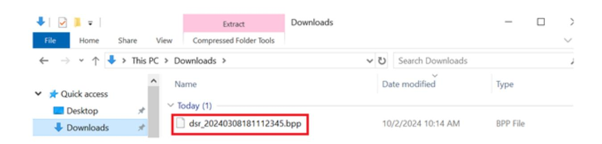

Klikněte pravým tlačítkem na stažený soubor. Zvolte možnost "Přejmenovat" ("Rename").

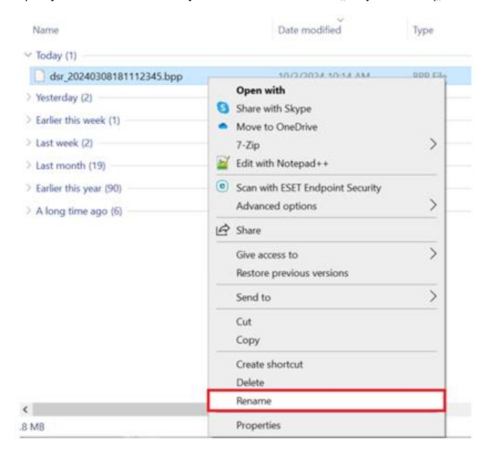

Změňte koncovku souboru z ".bpp" na ".zip" a potvrďte stiskem klávesy Enter. Poté budete dotázáni, zda chcete změnu přípony skutečně provést. Klikněte na "Ano".

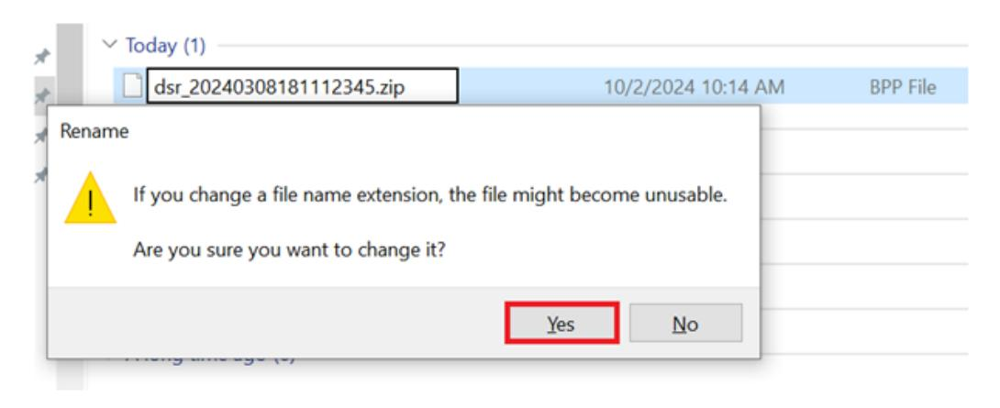

### Následně vidíte soubor zip.

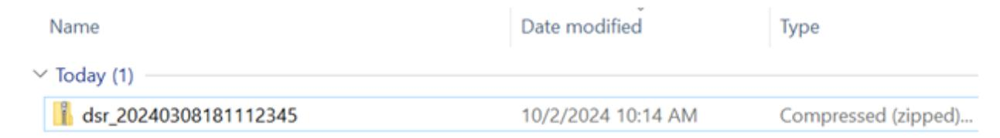

Po rozkliknutí se zobrazí jednotlivé složky.

### *5.1.3.1 Porovnání verzí dokumentace*

Systém ISSŘ umožňuje zobrazení změn mezi jednotlivými verzemi projektové́ dokumentace.

Vyberte verzi záměru a otevřete BPP balíček.

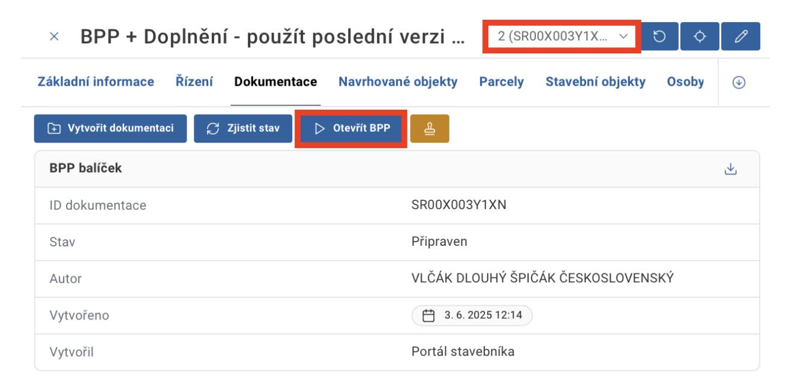

Následně rozbalte všechny složky, zaškrtněte zaškrtávací políčko s názvem Porovnat s a zvolte verzi, kterou chcete porovnat s verzí vybranou v předchozím kroku.

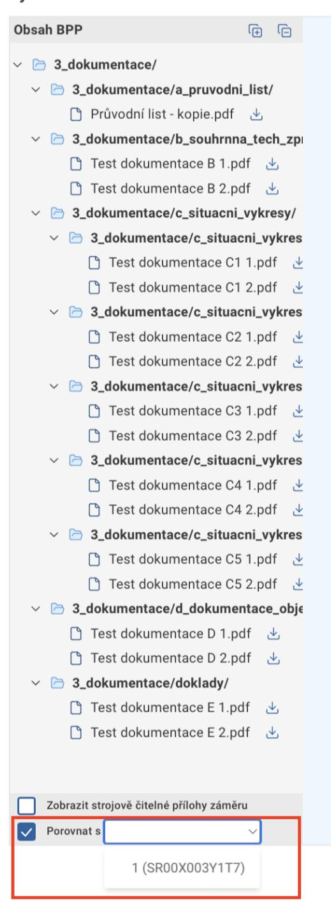

Zobrazte všechny soubory, které jsou barevně označeny podle rozdílů mezi verzemi:

- Modře soubor byl mezi verzemi změněn
- Červeně soubor byl v aktuální verzi smazán (v porovnávané existuje), soubory označené červeně nelze otevřít, protože nejsou součástí aktuálního balíčku
- Zeleně soubor byl v aktuální verzi přidán (v porovnávané neexistuje)
- Černě soubor je beze změny

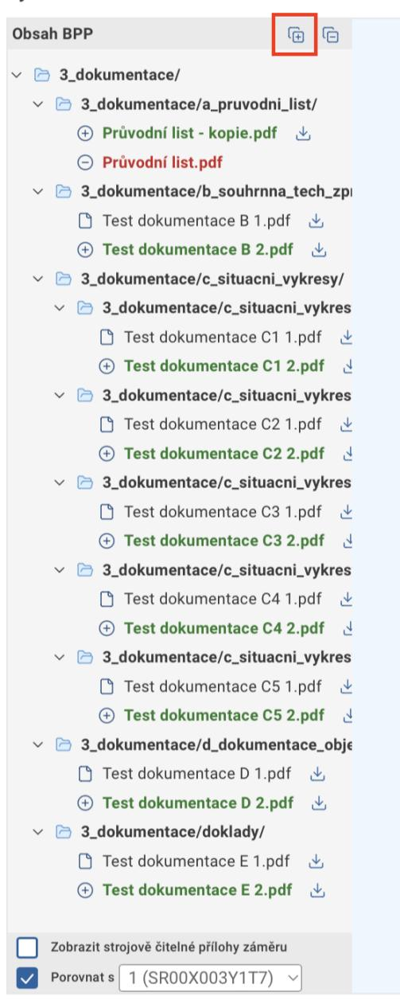

### *5.1.3.2 Ověření dokumentace*

Tato funkcionalita slouží k ověření schválené dokumentace po vydání pravomocného rozhodnutí.

Ověření dokumentace je omezeno na role Referent, Vedoucí pracovník nebo Lokální administrátor stavebního úřadu či dotčeného orgánu.

Ověřením dokumentace se vytvoří její nová verze a obsah BPP balíčku je podepsán – ve všech PDF souborech je doplněn elektronický podpis a časové razítko pro zachování integrity dokumentů.

Ověření se vyvolá stisknutím tlačítka se symbolem razítka.

Tlačítko je přístupné v záložce dokumentace, a to jak přímo z řízení, tak i ze záměru (zde umožní ověřit i dokumentaci, nebude-li řízení vedeno přímo v ISSŘ).

Před vlastním ověřením je třeba zkontrolovat, že byla vybrána správná verze dokumentace k ověření!

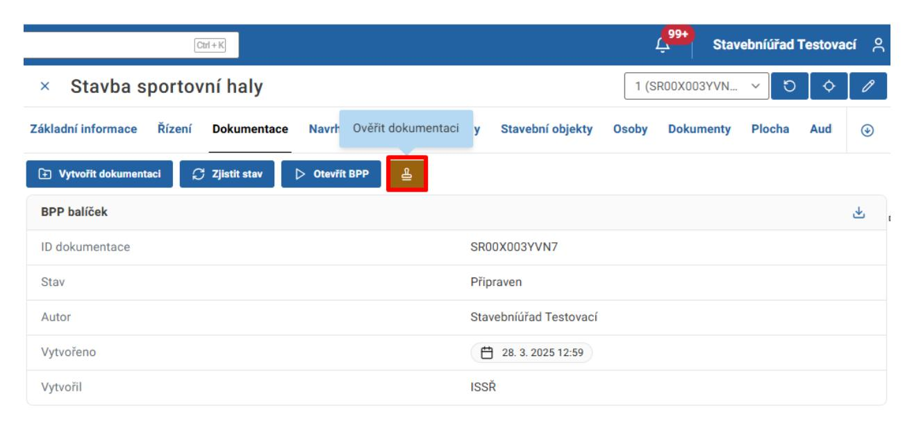

*Upozornění:* **Tento proces je nevratný.**

Před spuštěním akce je uživatel ISSŘ informován o dopadech a spuštění akce potvrdí tlačítkem.

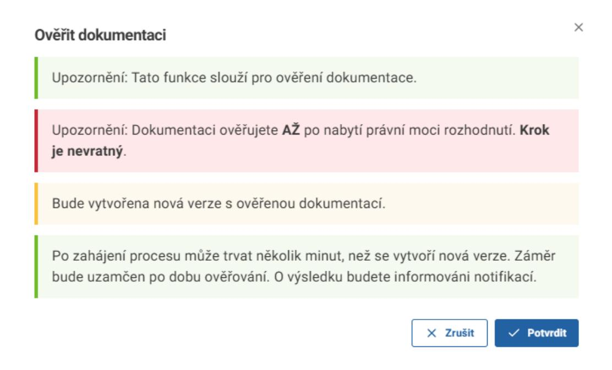

Délka trvání ověření, a tedy vytvoření nové verze dokumentace, je závislá od vytížení ISSŘ a velikosti dokumentace. Doba trvání u menších dokumentací je v jednotkách minut, u větších dokumentací to mohou být desítky minut. O dokončení ověření budete informováni notifikací, pokud ji máte aktivovanou.

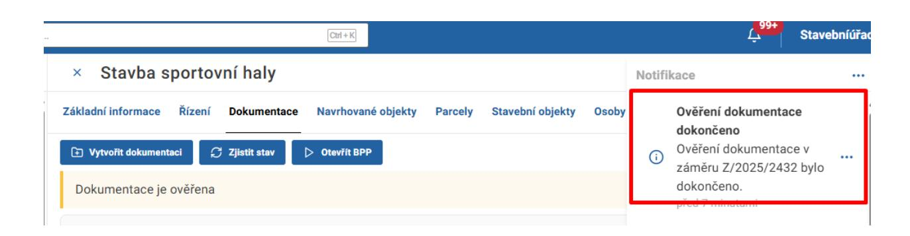

Po dokončení operace je vytvořena nová verze dokumentace, která je označená příznakem ověření.

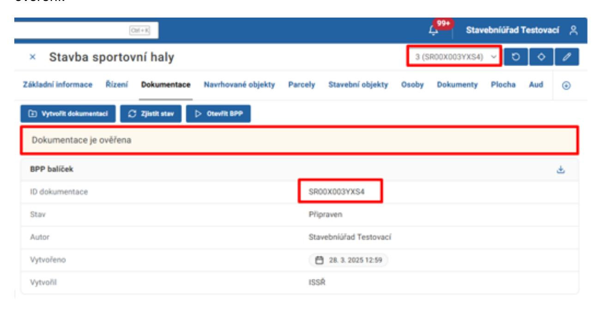

Informace o zahájení, ukončení procesu ověření dokumentace a vytvoření nové verze záměru je logována a viditelná v Auditních záznamech v detailu záměru.

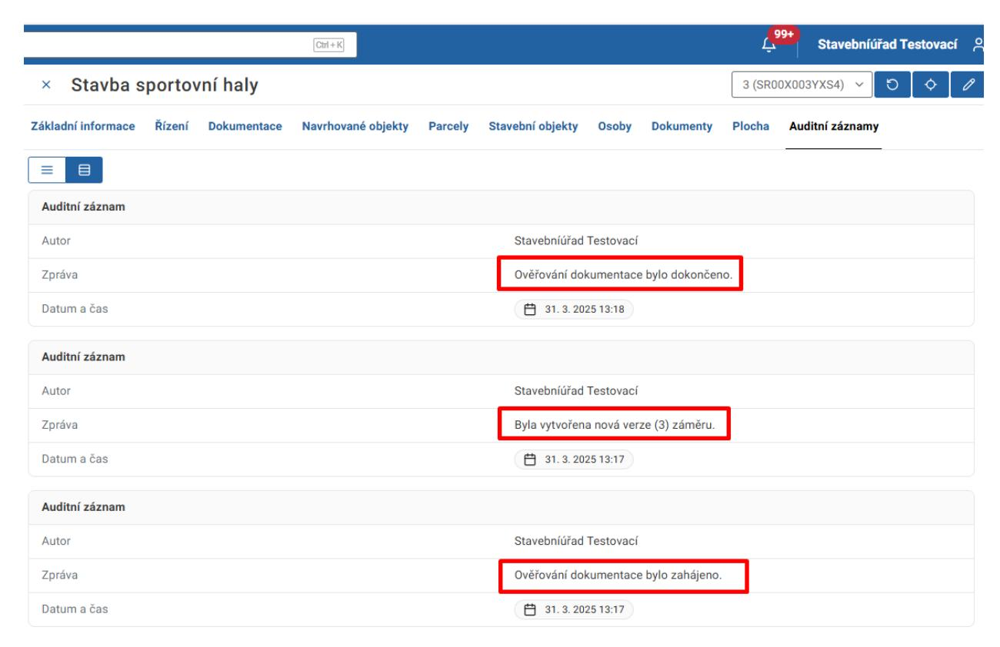

V případě, že ověření bylo spuštěno z řízení, je tato nová ověřená verze automaticky k řízení přiřazena.

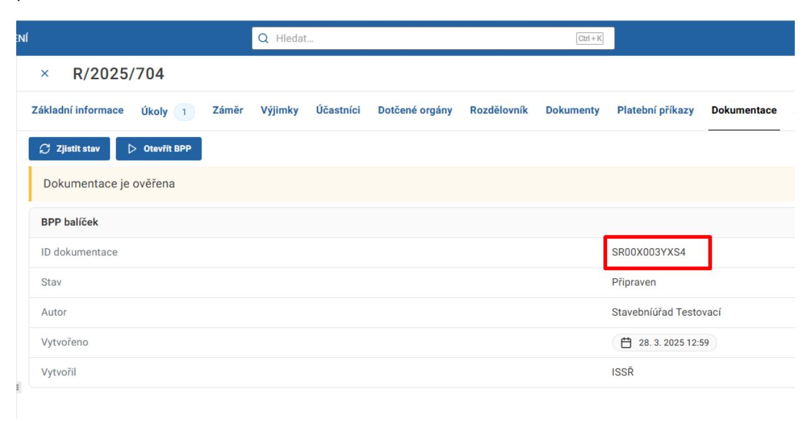

Jakoukoliv dokumentaci (i neověřenou) je možné stáhnout pomocí ikony se symbolem pro stahování, která se na záložce dokumentace objeví po stisknutí tlačítka Načíst BPP, poté co se popis tohoto tlačítka změní na Otevřít BPP. Ikona se zobrazí v pravé středové části obrazovky.

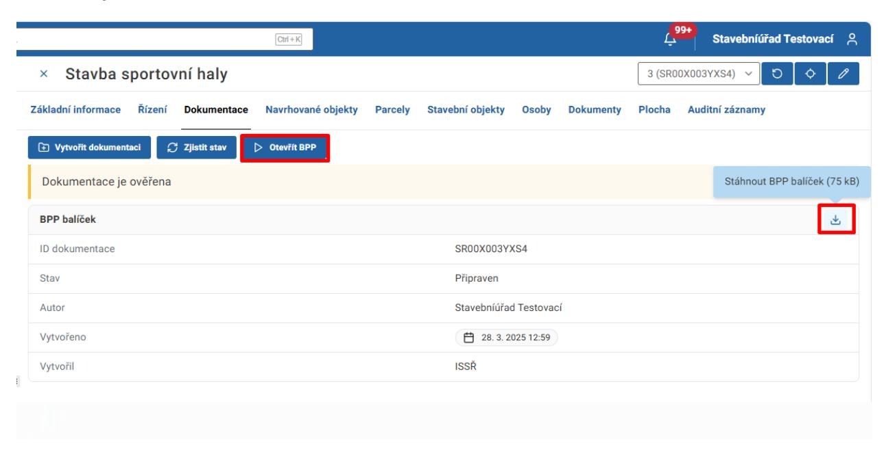

Dokumentaci je možné stáhnout ve formátech BPP nebo ZIP výběrem v následujícím dialogu.

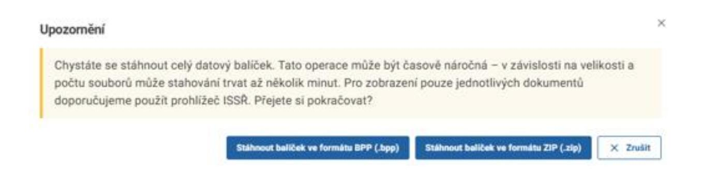

Všechny dokumenty, které jsou součásti ověřené dokumentace, jsou opatřeny elektronickým podpisem a časovým razítkem. Elektronický podpis není vizualizovaný, lze ho ověřit například otevřením souboru v aplikaci Adobe Acrobat Reader, kde se informace o podpisu objeví v liště Panel podpisu.

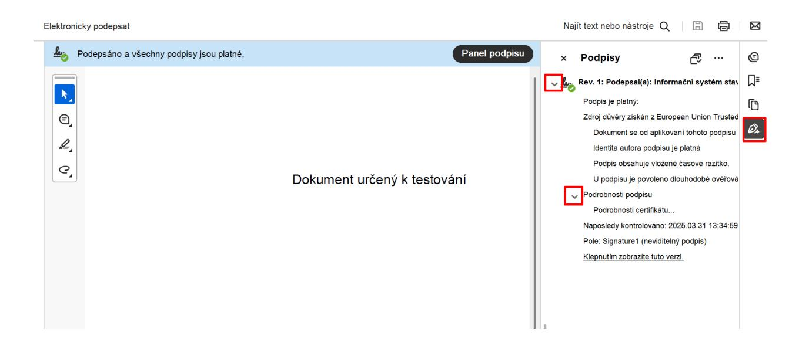

Kliknutím na Podrobnosti certifikátu se otevře prohlížeč certifikátu, kde naleznete podrobností o certifikátu a jeho vydání.

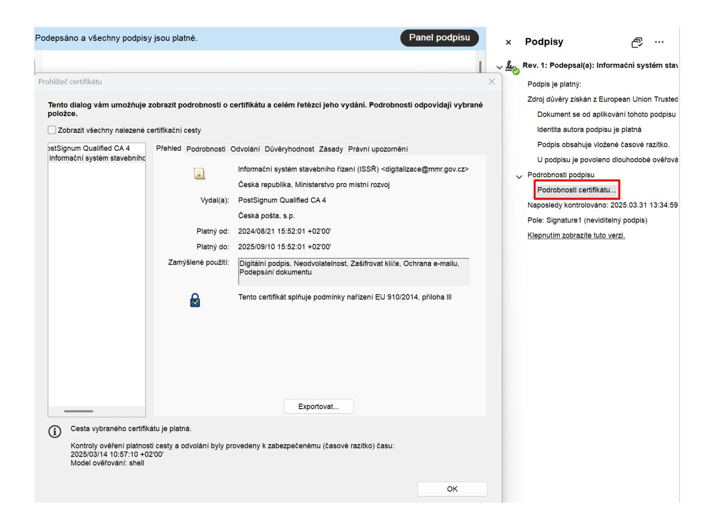

### *5.1.3.3 Vytvoření dokumentace úředníkem*

Funkcionalita slouží pro vložení dokumentace zpracované kvalifikovanou osobou, kterou stavebník předá stavebnímu úřadu nebo dotčenému orgánu v listinné (papírové) podobě. Nástroj pro vytvoření dokumentace je vyvolán v ISSŘ, avšak sestavení dokumentace probíhá v nástroji, který poskytuje Portál stavebníka. Vytvoření dokumentace může provést role referent, vedoucí pracovník nebo lokální administrátor stavebního úřadu i dotčeného orgánu. Po otevření detailu záměru v sekci Dokumentace je tlačítko Vytvořit dokumentaci.

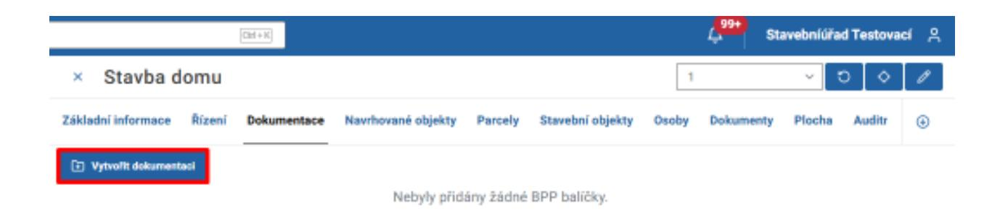

Po stisknutí tlačítka se zobrazí upozornění.

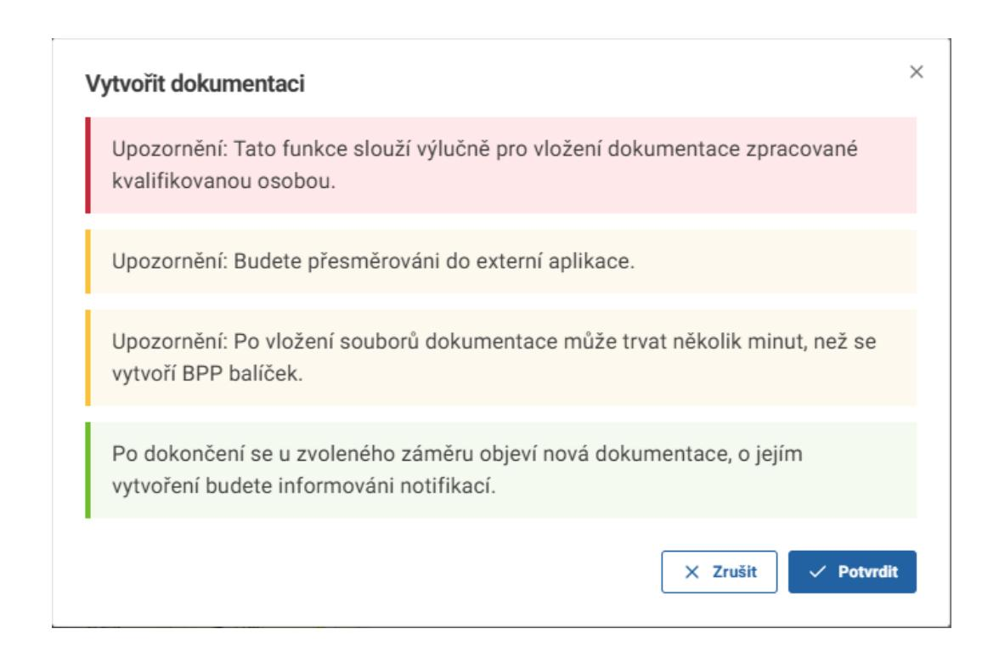

Po potvrzení budete přesměrováni do prostředí Portálu stavebníka, kde postupujte dle instrukcí v Portálu stavebníka.

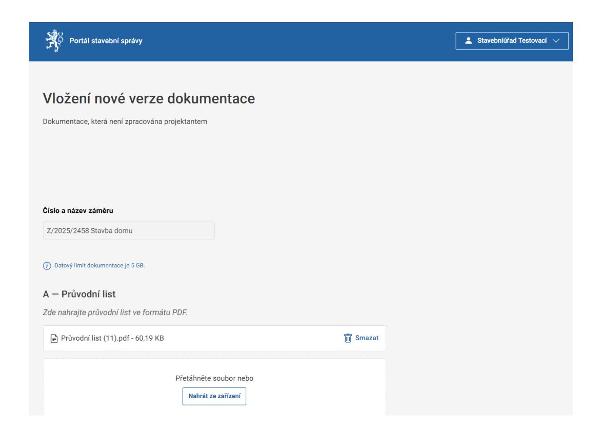

Nahrajte potřebné soubory a klikněte na tlačítko Vložit dokumentaci.

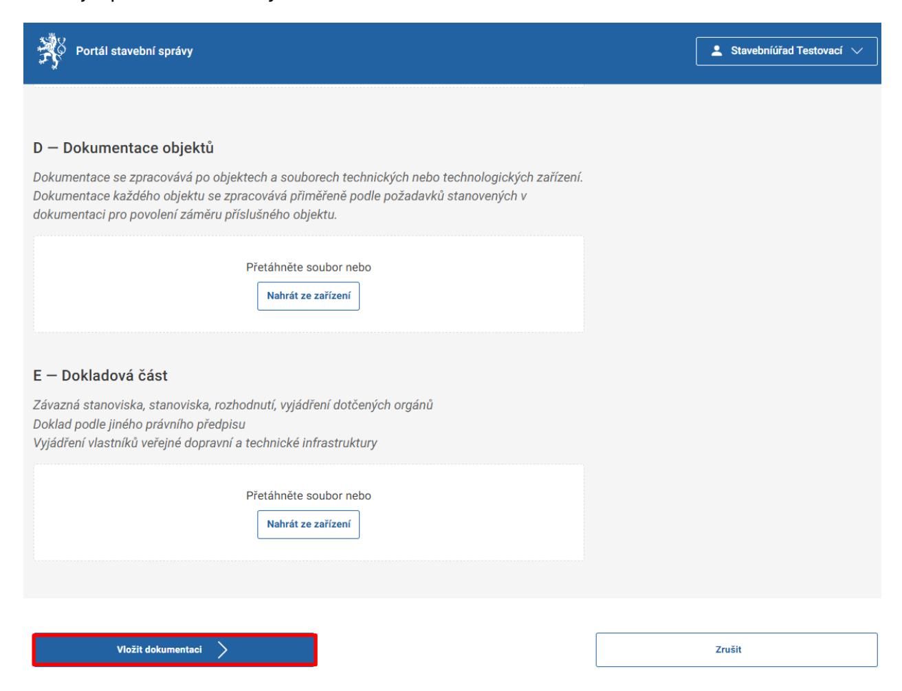

Po úspěšném dokončení aktivit v Portálu stavebníka se objeví upozornění o vložení dokumentace.

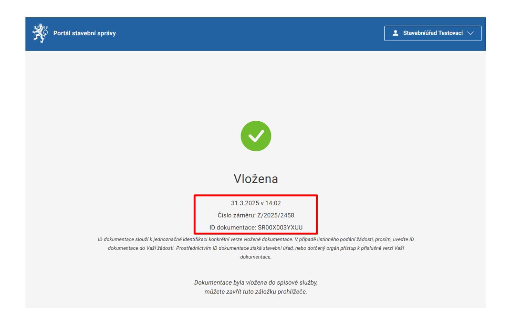

Na pozadí proběhne vytvoření BPP balíčku.

Po úspěšném dokončení se objeví notifikace v ISSŘ. Vytvoření může trvat několik minut.

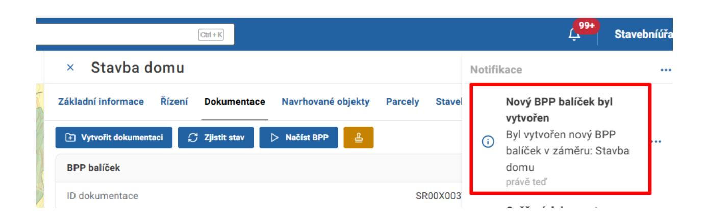

Po dokončení vytvoření dokumentace systém přidělí záměru ID dokumentace. Na záložce Dokumentace se objeví odpovídající informace.

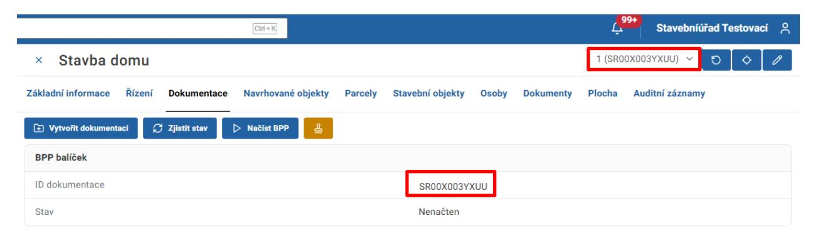

BPP baliček je možné načíst. Po načtení se objeví podrobná informace o vytvoření. Dokumentaci je možné otevřít a stáhnout pomocí tlačítek Načíst BPP, Otevřít BPP a Stáhnout BPP balíček.

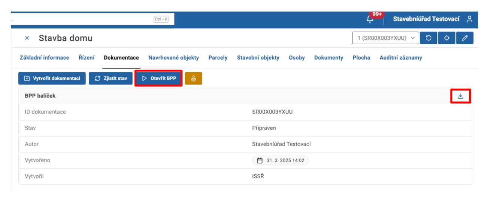

Operace vložení dokumentace do záměru je logována. Je viditelná v Auditních záznamech v detailu záměru.

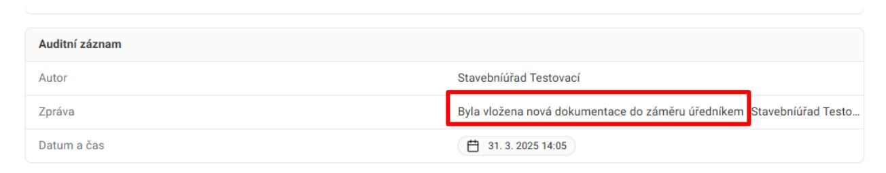

### 5.1.4 Navrhované objekty (záměru)

Navrhované objekty jsou budovy, stavby nebo jiné konstrukce, které jsou plánovány k výstavbě a jsou součástí projektové dokumentace předkládané ke schválení ve stavebním řízení.

Pro přechod na záložku Navrhované objekty klikněte na příslušný název záložky.

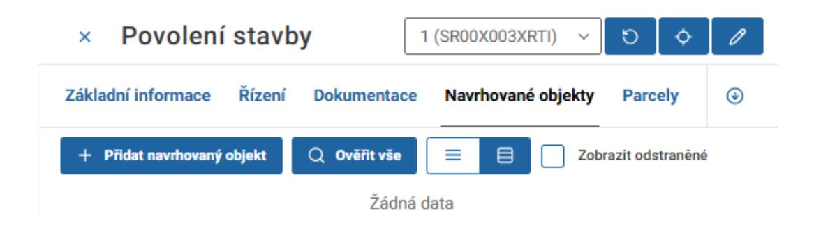

### *5.1.4.1 Přidat navrhovaný objekt*

Pro přidání navrhovaného objektu klikněte na tlačítko Přidat navrhovaný objekt.

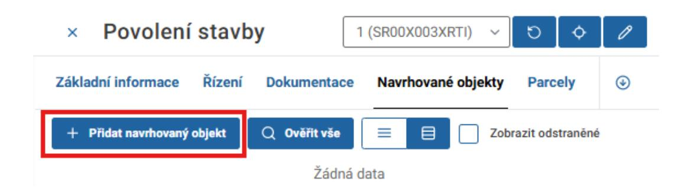

Následně se otevře formulář pro vyplnění informací o navrhovaném objektu.

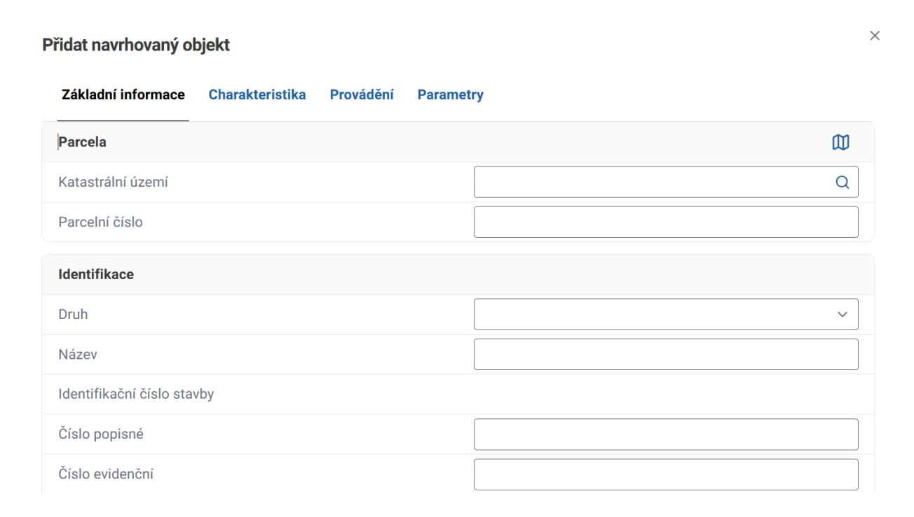

Atributy formuláře můžete vyplnit ručně, anebo pomocí výběru parcely na mapě. Pro výběr parcely z mapy klikněte na tlačítko Vybrat parcelu na mapě.

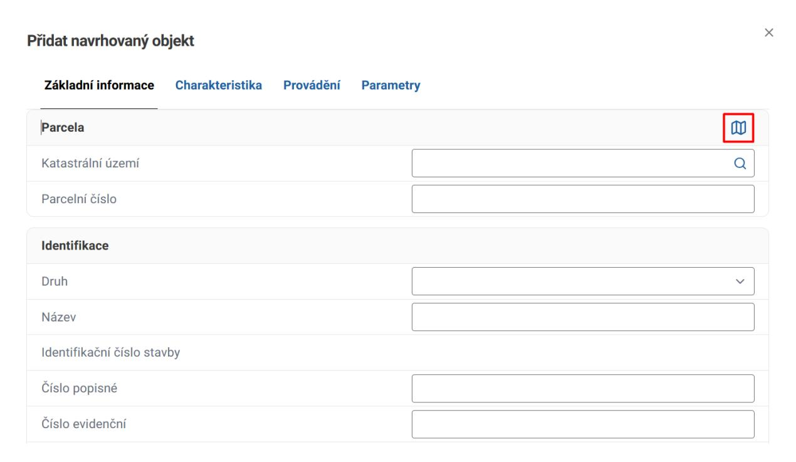

Poté klikněte na parcelu, kterou chcete k záměru přidat, a akci potvrďte kliknutím na tlačítko Vybrat.

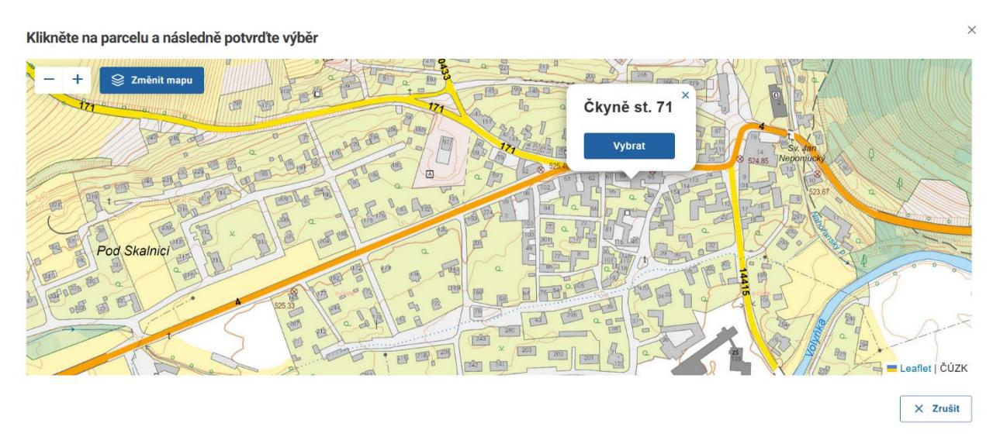

Po vybrání navrhovaného objektu z mapy vyplňte Druh a doplňující informace o objektu a uložte kliknutím na tlačítko Potvrdit.

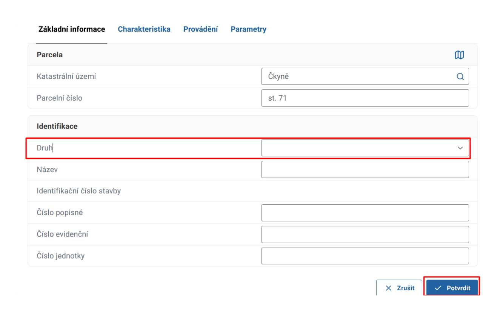

K záměru byl přidán nový navrhovaný objekt.

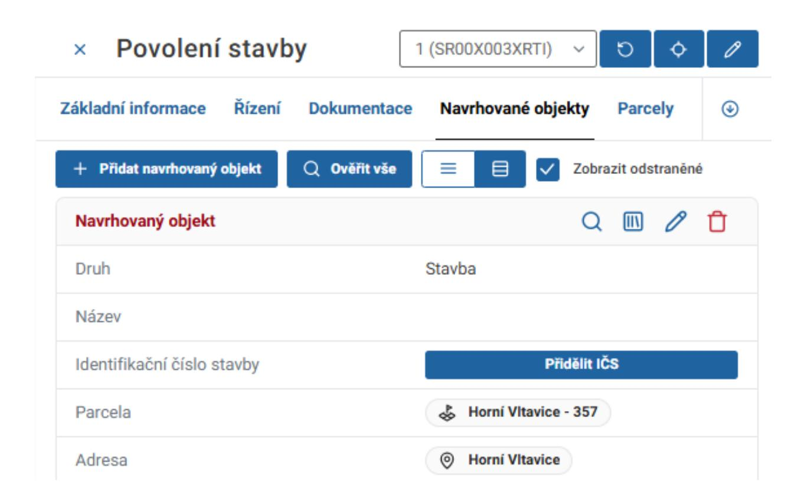

### *5.1.4.2 Ověřit vše.*

Všechny navrhované objekty lze ověřit najednou kliknutím na tlačítko Ověřit vše.

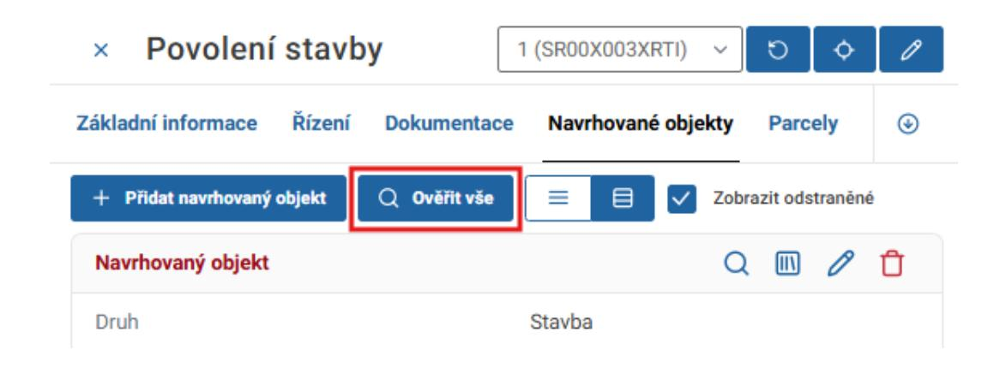

V novém okně klikněte na tlačítko Potvrdit.

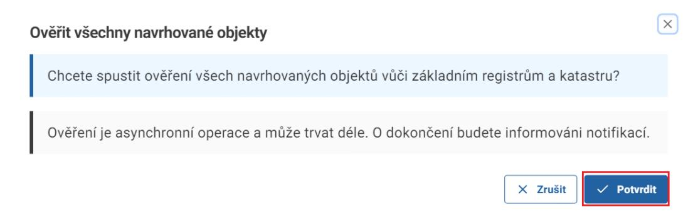

Hromadné ověření může trvat déle. O dokončení budete informováni notifikací, pokud ji máte aktivní.

### *5.1.4.3 Zobrazení a obnovení odstraněných objektů*

Navrhované objekty můžete v případě potřeby odebrat tlačítkem Odebrat stavební objekt.

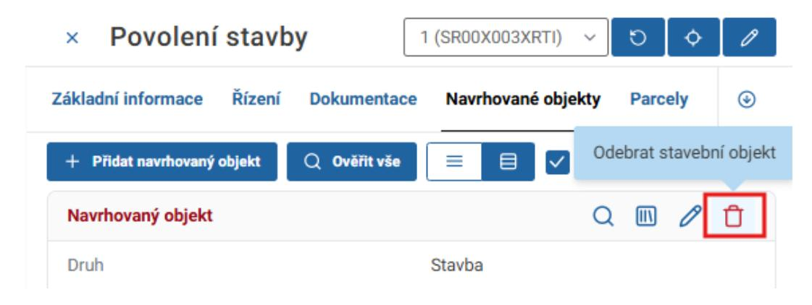

V novém dialogovém okně klikněte na tlačítko Potvrdit.

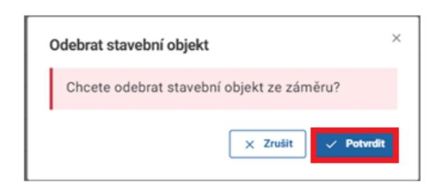

Odebrané objekty si můžete zobrazit zaškrtnutím možnosti Zobrazit odstraněné. Odebrané objekty budou podbarveny červeně.

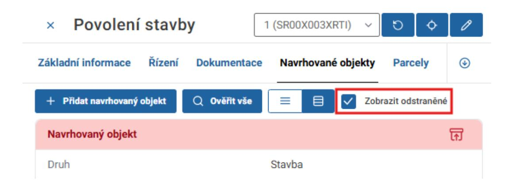

Odebrané navrhované objekty můžete obnovit stisknutím tlačítka Obnovit navrhovaný objekt.


V novém dialogovém okně klikněte na tlačítko Potvrdit.


### 5.1.5 Parcely

Parcely jsou konkrétní pozemky vymezené katastrálními hranicemi, na kterých je plánována výstavba nebo jsou jinak využívány v rámci stavebního projektu.

Pro přechod na záložku Parcely klikněte na příslušný název záložky.


### *5.1.5.1 Přidání parcely*

Pro přidání nové parcely klikněte na tlačítko Přidat parcelu.


V nově otevřeném formuláři můžete vyplnit atributy parcely, nebo parcelu vybrat z mapy. Pro vybrání parcely z mapy klikněte na tlačítko Vybrat parcelu na mapě.


Poté klikněte na parcelu, kterou chcete k záměru přidat, a akci potvrďte kliknutím na tlačítko vybrat.


Po vybrání parcely z mapy vyplňte doplňující informace a parcelu uložte kliknutím na tlačítko Potvrdit.


Nyní je parcela přidána k záměru.


### *5.1.5.2 Ověřit vše*

Všechny parcely lze je ověřit hromadně kliknutím na tlačítko Ověřit vše.

Hromadné ověření může trvat déle. O dokončení budete informováni notifikací, pokud ji máte aktivní.


V novém okně klikněte na tlačítko Potvrdit.


Následně dojde k ověření parcel.


Osoby z listu vlastnictví je možné zobrazit tlačítkem Zobrazit.


### *5.1.5.3 Zobrazení a obnovení odstraněných parcel*

Parcely můžete v případě potřeby odebrat tlačítkem Odebrat parcelu.


V novém dialogovém okně klikněte na tlačítko Potvrdit.


Odebrané parcely si můžete zobrazit zaškrtnutím možnosti "Zobrazit odstraněné". Odebrané parcely budou podbarveny červeně.


Odebrané parcely můžete obnovit stisknutím tlačítka Obnovit parcelu.


V novém dialogovém okně klikněte na tlačítko Potvrdit.


### 5.1.6 Stavební objekty (stávající stavby)

Stavební objekty (stávající stavby) jsou již postavené budovy nebo jiné konstrukce na pozemku, které existují před zahájením nového stavebního projektu a mohou být buď ponechány, upraveny, nebo odstraněny v rámci nového záměru stavby.

Pro přechod na záložku Stavební objekty klikněte na příslušný název záložky.


### *5.1.6.1 Přidat stavební objekt*

Pro přidání nového stavebního objektu klikněte na tlačítko Přidat stavební objekt.


66

V nově otevřeném formuláři vyplňte atributy stavebního objektu.


Po výběru položky Druh stavebního objektu se mohou zobrazit další pole k vyplnění. Po zvolení druhu "Stavba" je možno parcelu stavby zadat buď manuálně, nebo vyhledáním na mapě po kliknutí na tlačítko Vybrat parcelu na mapě


Klikněte na parcelu, kde se nachází přidávaná stavba, a akci potvrďte kliknutím na tlačítko Vybrat.


Po vybrání parcely z mapy vyplňte doplňující informace o stavbě a stavební objekt uložte kliknutím na tlačítko Potvrdit.


Nyní je stavební objekt přidán k záměru.


### *5.1.6.2 Ověřit vše*

Všechny stavební objekty lze je ověřit hromadně kliknutím na tlačítko Ověřit vše. Hromadné ověření může trvat delší dobu. O jeho dokončení budete informováni notifikací, pokud ji máte aktivní.


V novém okně klikněte na tlačítko Potvrdit.


Výsledek ověření je zobrazený na záložce Stavební objekty.


### *5.1.6.3 Zobrazení a obnovení odstraněných stavebních objektů*

Stavební objekty můžete v případě potřeby odebrat tlačítkem Odebrat stavební objekt.


V novém dialogovém okně klikněte na tlačítko Potvrdit.


Odebrané stavební objekty si můžete zobrazit zaškrtnutím možnosti "Zobrazit odstraněné". Odebrané stavební objekty budou podbarveny červeně.


Odebrané stavební objekty můžete obnovit stisknutím tlačítka Obnovit stavební objekt.


V novém dialogovém okně klikněte na tlačítko Potvrdit.


### 5.1.7 Osoby

Osoby stavebního záměru jsou všechny fyzické a právnické osoby, které se podílejí na plánování, schvalování a realizaci stavebního projektu.

Pro přechod na záložku Osoby klikněte na příslušný název záložky.


### *5.1.7.1 Přidat osobu*

Pro přidání nové osoby klikněte na tlačítko Přidat osobu.

V nově otevřeném formuláři vyberte vztah osoby k záměru a druh osoby.


Poté vyplňte jednotlivé údaje o osobě a uložte kliknutím na tlačítko Potvrdit.


Nyní je nová osoba přidána k záměru.


### *5.1.7.2 Ověřit vše*

Všechny osoby lze ověřit hromadně kliknutím na tlačítko Ověřit vše. Hromadné ověření může trvat déle. O dokončení budete informováni notifikací, pokud ji máte aktivní.


Po kliknutí na toto tlačítko se objeví dialogové okno a jeho potvrzením spustíte hromadné ověření.


Podle počtu účastníků může hromadné ověření trvat delší dobu. O dokončení budete informováni notifikací, pokud ji máte aktivní.

### *5.1.7.3 Ověření zesnulé osoby*

Po ověření osob u záměru se v případě zesnulé osoby automaticky zobrazí pole Datum úmrtí s vyplněným datem. Uživatel bude navíc upozorněn pomocí ikony s vykřičníkem, že osoba již není naživu.


*Upozornění:* **Systém kontroluje případné úmrtí osoby pouze v okamžiku ověření. Tento údaj není automaticky kontrolován.**

### *5.1.7.4 Zobrazení a obnovení odstraněných osob*

Osoby můžete v případě potřeby odebrat tlačítkem Odebrat osobu.


V novém dialogovém okně klikněte na tlačítko Potvrdit.


Odebrané osoby si můžete zobrazit zaškrtnutím možnosti "Zobrazit odstraněné". Odebrané osoby budou podbarveny červeně.


Odebrané osoby můžete obnovit stisknutím tlačítka Obnovit osobu.


V novém dialogovém okně klikněte na tlačítko Potvrdit.


### 5.1.8 Dokumenty

Dokumenty ve stavebním řízení jsou veškeré písemné materiály a podklady, jako jsou žádosti, stavební povolení, smlouvy, vyjádření a souhlasy dotčených orgánů, technické zprávy a další oficiální listiny, které jsou potřebné pro schválení a realizaci stavebního záměru.

Pro přechod na záložku Dokumenty klikněte na příslušný název záložky.


Na záložce Dokumenty vidíte dokumenty, které se vztahují k danému záměru. Pro přechod do detailu dokumentu klikněte na tlačítko s ikonou šipky u vybraného dokumentu.


### 5.1.9 Plocha

Plocha je generována z navrhovaných objektů, stávajících stavebních objektů a parcel. Pro přechod na záložku Plochy klikněte na příslušný název záložky.


Pro vygenerování ploch klikněte na tlačítko Určit plochu záměru ze vstupních dat. Vygenerovány budou plochy z ověřených stavebních objektů, navrhovaných objektů a parcel.


V novém dialogovém okně klikněte na tlačítko Potvrdit.


Nyní můžete vidět vygenerované objekty.


### 5.1.10 Auditní záznam

Záložka auditní záznam obsahuje informace o akcích, které byly se záměrem provedeny.

Pro přechod na záložku Auditní záznam klikněte na příslušný název záložky.


### 5.2 Vyhledání záměru dle ID dokumentace

Funkcionalita slouží k vyhledání záměru pomocí ID dokumentace, které uživatel ISSŘ obdrží od stavebníka jako součást žádosti, která byla podaná prostřednictvím DS nebo v listinné podobě. Funkcionalita také umožní uživateli ISSŘ získat přístup k dokumentaci bez nutnosti založení řízení v ISSŘ. Funkce je dostupná v evidenci záměrů pod tlačítkem Vyhledat záměr (ikona lupy).


Po kliknutí na tlačítko Vyhledat záměr se zobrazí dialog s možností vložení ID dokumentace.


*Upozornění:* Nevkládejte PID záměru.

Systém dohledá záměr a otevře jeho detail.


V případě zadání nesprávného ID dokumentace není záměr dohledán. Systém na tuto skutečnost upozorní chybovou hláškou umístěnou v pravém dolním rohu obrazovky.


### 5.3 Zpřístupnění dokumentace

Tato funkcionalita umožňuje získat přístup k dokumentaci a metadatům záměru. V evidenci Záměrů vyhledejte daný záměr a otevřete jeho detail. Pro získání přístupu klikněte na tlačítko Požádat o přístup k záměru v pravém horním rohu.


V nově otevřeném okně stiskněte tlačítko Potvrdit.


Dialog obsahuje varování před nezákonným prohlížením dokumentace.

Potvrzením dialogu získáváte trvalý přístup k dokumentaci a metadatům záměru. Informace je logována a viditelná v Auditních záznamech v detailu záměru.


Záměr je nadále přístupný v ISSŘ v evidenci záměrů v části Můj úřad.


