# 7.1 Záložky detailu dokumentu

Pro zobrazení detailu vybraného dokumentu klikněte na položku z přehledu.

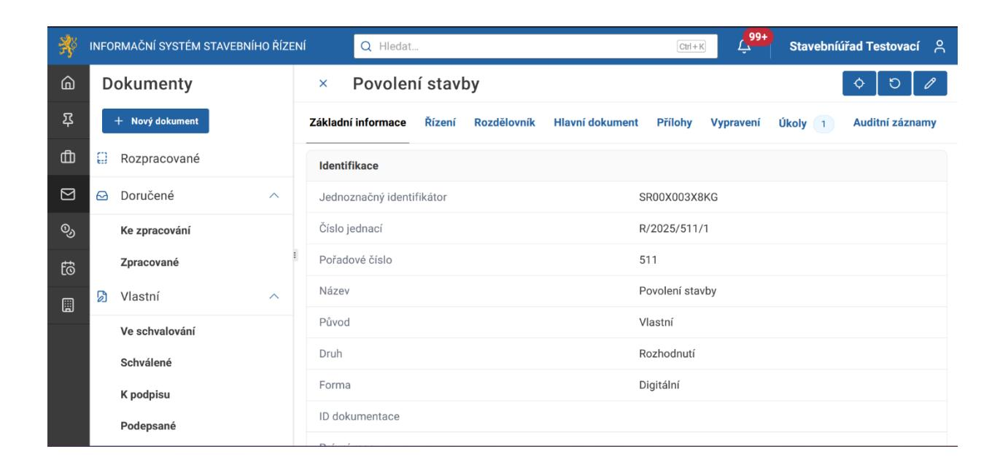

### 7.1.1 Základní informace

Záložka Základní informace obsahuje identifikační údaje a informace o zpracování. Mimo jiné je zde uveden jednoznačný identifikátor (PID dokumentu), podle kterého je možné tento dokument vyhledat.

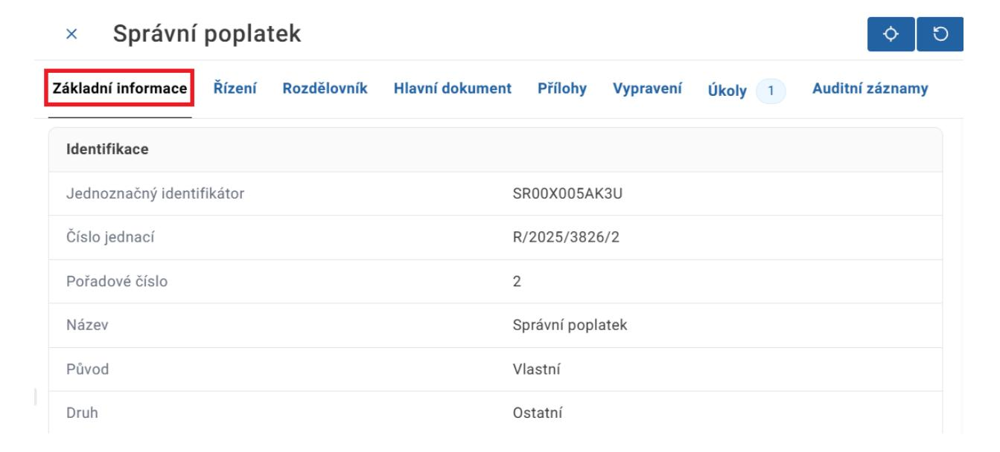

### 7.1.2 Řízení

Pro přechod na záložku Řízení klikněte na příslušný název záložky. Na této záložce je zobrazeno řízení, ke kterému se daný dokument vztahuje. Na detail řízení lze přejít kliknutím na tlačítko Zobrazit detail.

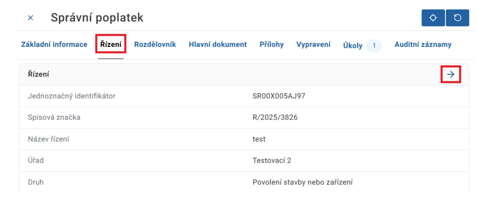

### 7.1.3 Rozdělovník

Rozdělovník obsahuje skupiny osob, kterým má být dokument vypraven. Pro přechod na záložku Rozdělovník klikněte na příslušný název záložky.

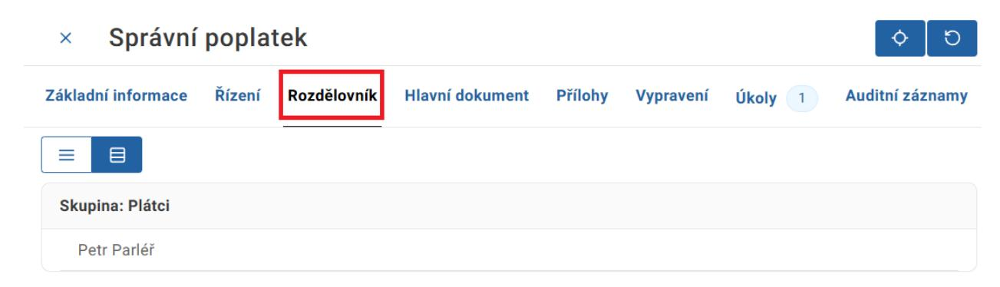

Podrobný postup přidání skupiny rozdělovníku naleznete v kapitole 12 Vytvoření rozdělovníku/ů.

### 7.1.4 Hlavní dokument

Hlavní dokument obsahuje samotný dokument a soubor, který je vypravován. Hlavní dokument připojíte k dokumentu stisknutím tlačítka Přidat hlavní dokument.

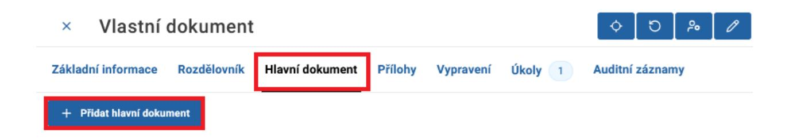

V nově otevřeném formuláři vyplňte název dokumentu a další potřebné údaje. Dokument můžete vytvořit pomocí šablony (je zaškrtnut checkbox Strukturovaný obsah). K tvorbě dokumentu pomocí šablony viz kapitola 15.2.1. Dále můžete dokument připojit (dokument byl vytvořen např. mimo systém a šablony). Pro připojení souboru s dokumentem zrušte zaškrtnutí políčka "Strukturovaný obsah" a poté vyberte soubor kliknutím na tlačítko Vybrat soubor.

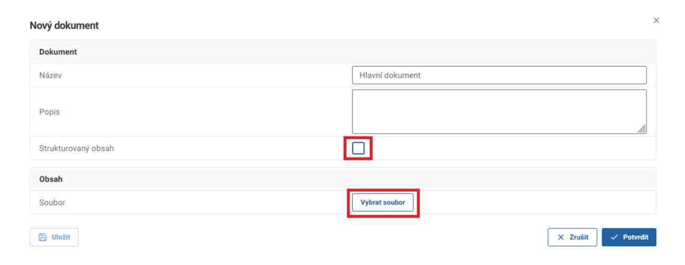

Pro potvrzení přidání klikněte na tlačítko Potvrdit.

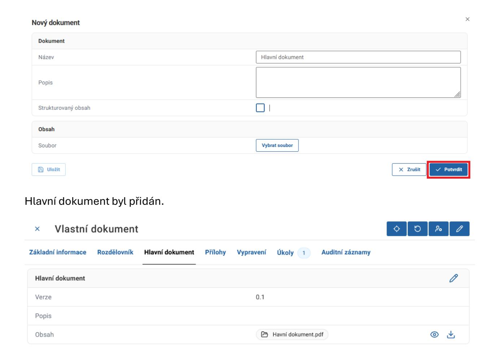

Hlavní dokument lze následně upravovat stisknutím tlačítka Upravit.

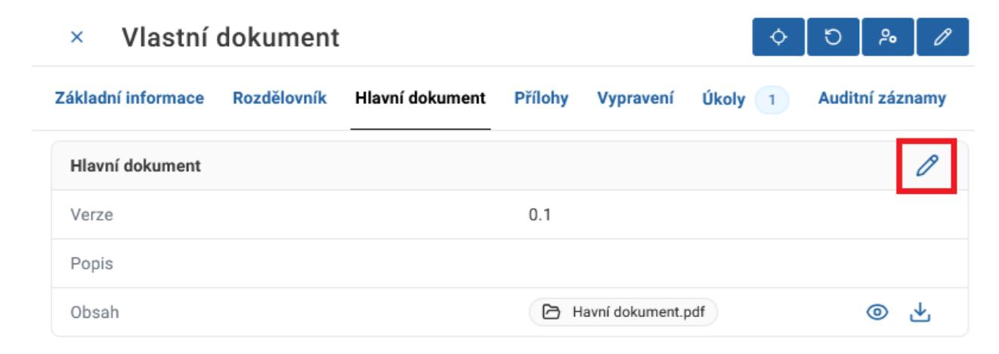

Pro zobrazení dokumentu klikněte na tlačítko Otevřít.

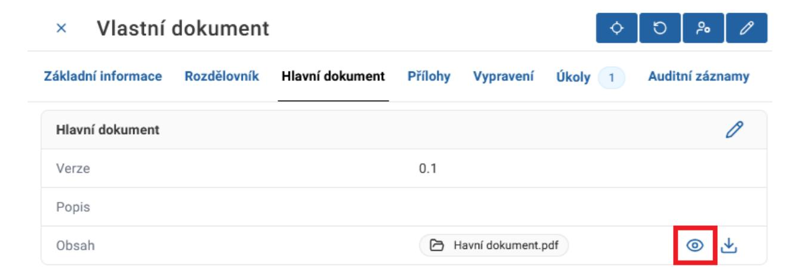

Pro stažení dokumentu klikněte na tlačítko Stáhnout.

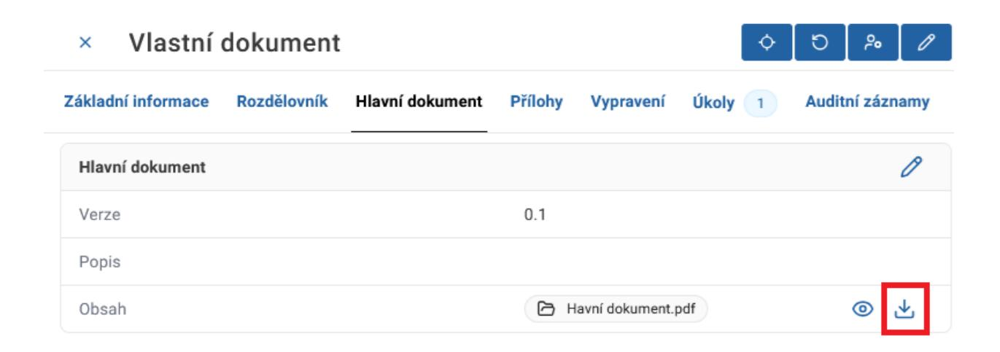

### 7.1.5 Přílohy

V záložce Přílohy jsou zobrazeny přílohy dokumentu. Ty je možné připojit k dokumentu stisknutím tlačítka Přidat přílohu.

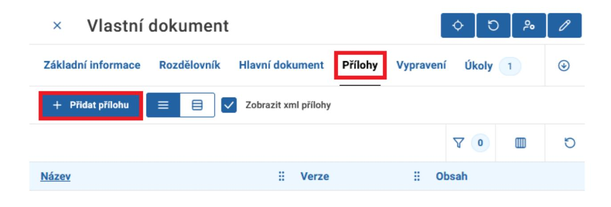

Pro přidání přílohy vyplňte název, popis a vyberte z počítače soubor, který chcete připojit. Následně stiskněte tlačítko Potvrdit.

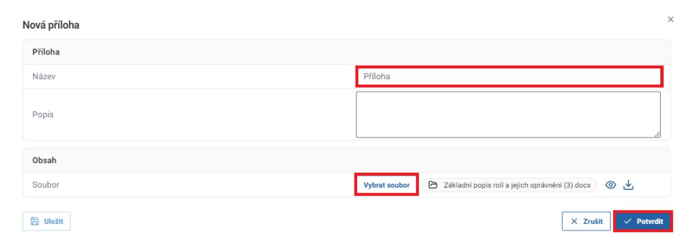

Pro editaci nebo odstranění přílohyklikněte na tlačítko Upravit přílohu.

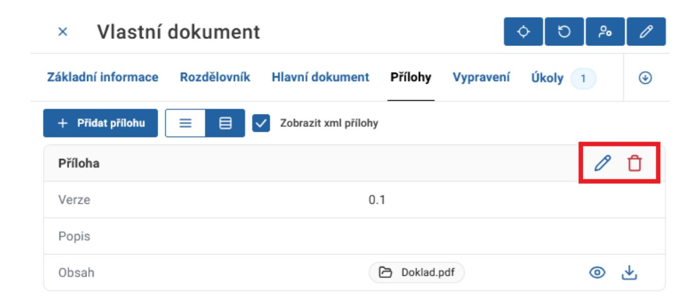

### 7.1.6 Vypravení

V záložce Vypravení se nachází záznamy o vypravených vlastních dokumentech, které byly odeslány osobám z rozdělovníku.

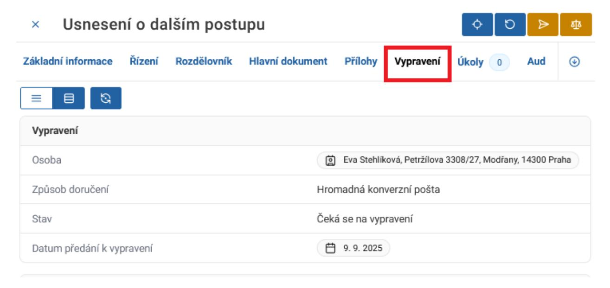

### *7.1.6.1 Ruční synchronizace stavu vypravení*

Tlačítko Ruční synchronizace stavu vypravení slouží k ručnímu vyvolání aktualizace stavu vypravení. Tlačítko je aktivní pro všechny způsoby doručení, avšak u způsobů vypravení Osobně a Vyhláškou nedochází k aktualizaci stavu.

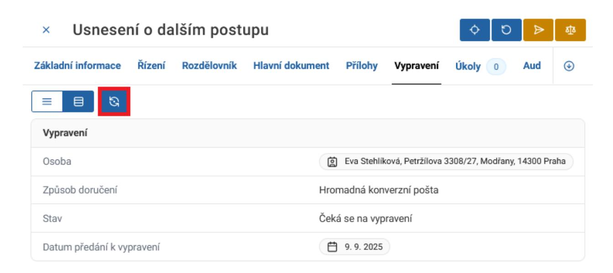

### *7.1.6.2 Kontrola vypraveného obsahu*

U vypravení lze zobrazit odeslaný dokument kliknutím na tlačítko Zobrazit v řádku Odeslaný dokument.

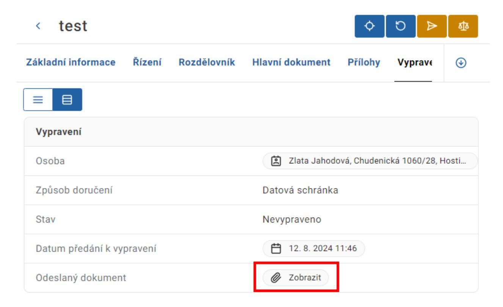

V nově otevřeném okně zobrazte odeslaný dokument kliknutím na tlačítko Otevřít.

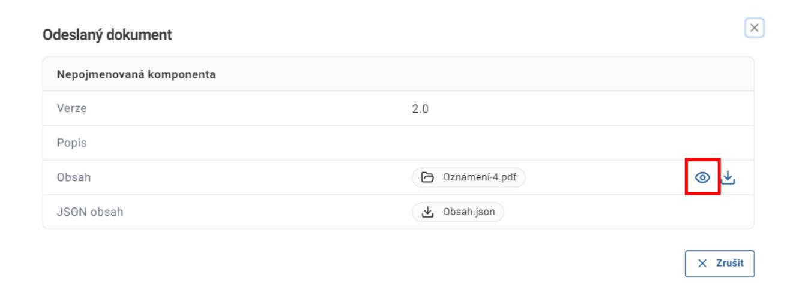

### *7.1.6.3 Sledování zásilky*

Při vypravení dokumentu hromadnou konverzní poštou se v sekci Vypravení zobrazí u konkrétního účastníka pole Podací číslo, kde je uvedeno podací číslo zásilky spolu s odkazem, který umožňuje sledování zásilky na webových stránkách České pošty.

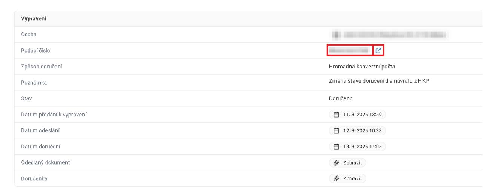

### *7.1.6.4 Zobrazení doručenky*

Řádek s doručenkou je v systému aktuálně zobrazen v momentě, kdy je doručenka předána do spisové služby.

U vypravení lze zobrazit doručenku kliknutím na tlačítko Zobrazit.

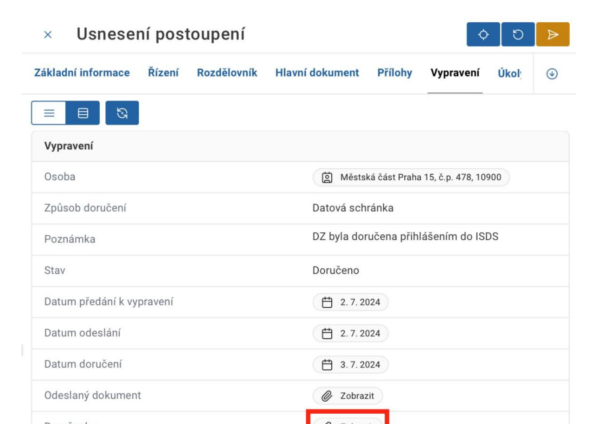

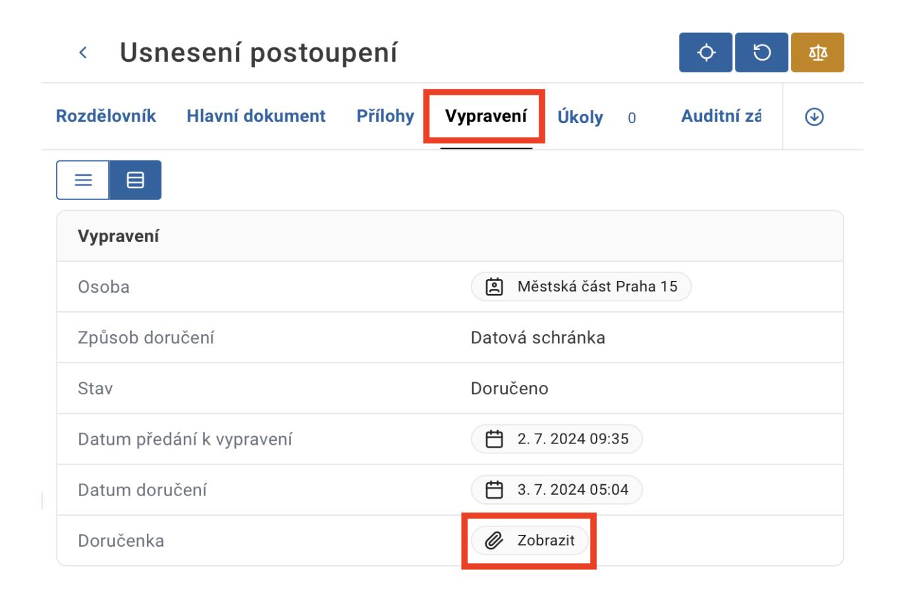

V případě, že kliknete na tlačítko Otevřít.

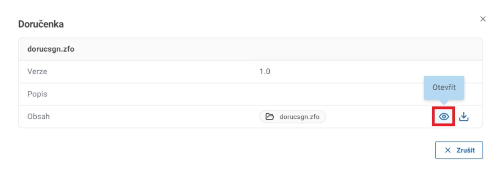

Systém Vás upozorní na nemožnost zobrazení náhledu. Není to chyba systému.

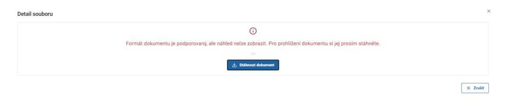

ZFO je formát datové schránky a ISSŘ neumožňuje jeho náhled. Pro zobrazení dokumentu je nutné ho stáhnout a otevřít v počítači pomocí programu s touto funkcionalitou. Obsah klasické doručenky je možné nahlédnout přímo v ISSŘ.

Ve vyskakovacím okně stáhněte doručenku kliknutím na tlačítko Stáhnout.

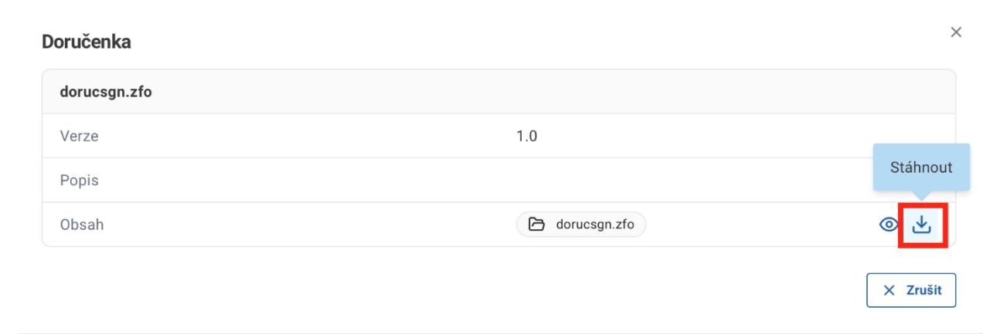

Doručenky lze také nalézt v přílohách vypravených dokumentů.

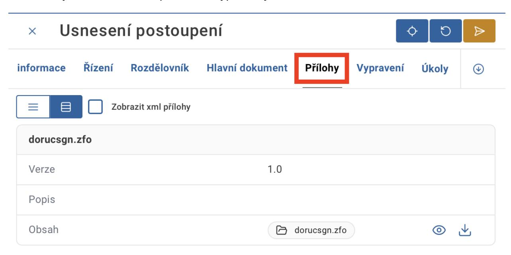

### *7.1.6.5 Vypravení Osobně a nahrání doručenky*

Dokument vytvořený v ISSŘ lze doručit i osobně, tedy fyzicky předat účastníkovi řízení. Pokud si přejete dokument vypravit tímto způsobem, zvolte u daného účastníka řízení způsob komunikace Osobně. Způsob komunikace lze nastavit buď při přidání osoby, anebo později jejím upravením.

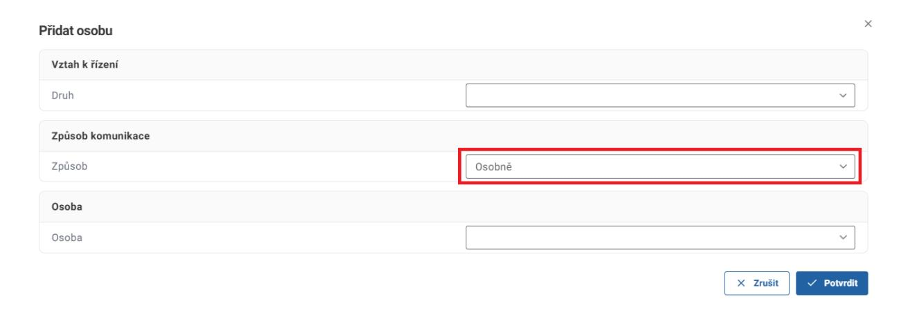

Po vypravení dokumentu je u tohoto účastníka v sekci Vypravení dostupné tlačítko pro nahrání doručenky.

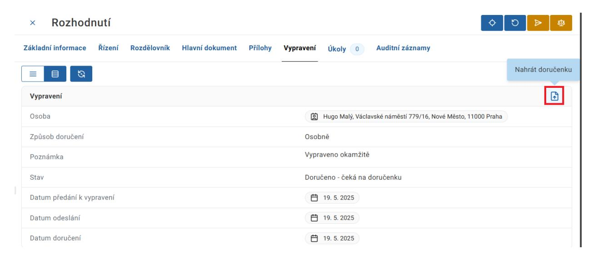

Po stisknutí tlačítka se zobrazí dialog pro zadání data doručení a nahrání souboru doručenky.

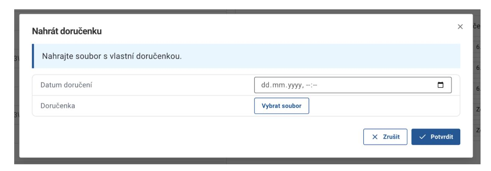

### *7.1.6.6 Vypravení mezi úřady*

Základní metoda pro vypravení mezi úřady je datová schránka. Podle potřeby je možné zvolit alternativní způsoby, například interně.

Pro interní vypravení musí být úřad zaveden v ISSŘ a musí mít přiřazenou osobu pro příjem dokumentů. Pokud tyto podmínky nejsou splněny, uživateli nebude interní vypravení nabídnuto. Interní vypravení neobsahuje doručenku.

### *7.1.6.7 Opětovné vypravení dokumentu*

Opětovné vypravení dokumentu je možné použít v případě, kdy vypravení z nějakého důvodu selhalo nebo potřebujete vypravit dokument novému účastníkovi. Toto akční tlačítko je dostupné pro dokumenty ve stavu Odeslané.

Přejděte na pohled Dokumenty. Na záložce Odeslané vyberte potřebný dokument. V detailu dokumentu v pravém horním rohu klikněte na tlačítko Odeslat dokument jednotlivě.

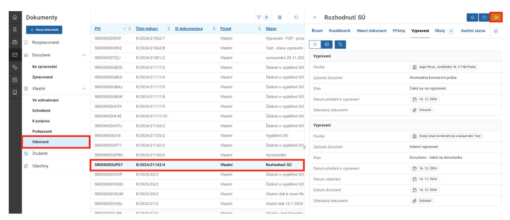

Na dialogu Odeslat dokument jednotlivě vyberte účastníka, kterému chcete dokument odeslat, a klikněte na tlačítko Potvrdit.

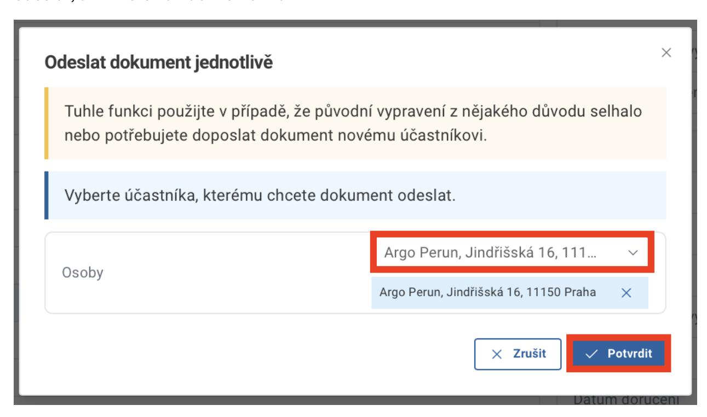

Po potvrzení se objeví upozornění, že dokument byl předán do výpravny. Na záložce Vypravení se objeví záznam o vypravení dokumentu s informací o stavu a způsobu doručení dokumentu.

| ^ KOZIIOGIIG          | 11 30             |                 |             |                   |                    |       |   |
|-----------------------|-------------------|-----------------|-------------|-------------------|--------------------|-------|---|
| ákladní informace Ř   | ízení Rozdělovník | Hlavní dokument | Přílohy     | Vypravení         | Úkoly 0            | Audit | • |
| ≣ 目 5                 |                   |                 |             |                   |                    |       |   |
| Vypravení             |                   |                 |             |                   |                    |       |   |
| Osoba                 |                   |                 | Argo Perur  | n, Jindřišská 16, | 11150 Praha        |       |   |
| Způsob doručení       |                   | Hror            | nadná kor   | overzní pošta     |                    |       |   |
| Stav                  |                   | Čeka            | á se na vyp | oravení           |                    |       |   |
| Datum předání k vypra | ivení             |                 | 16. 12. 202 | 24                |                    |       |   |
| Odeslaný dokument     |                   | 0               | Zobrazit    |                   |                    |       |   |
| Vypravení             |                   |                 |             |                   |                    |       |   |
| Osoba                 |                   | ä               | Český úřac  | d zeměměřický a   | a katastrální Test |       |   |
| Způsob doručení       |                   | Inter           | ní vyprave  | ení               |                    |       |   |
| Stav                  |                   | Doru            | ičeno - čel | ká na doručer     | nku                |       |   |
| Datum předání k vypra | avení             |                 | 16. 12. 202 | 24                |                    |       |   |
| Datum odeslání        |                   |                 | 16. 12. 202 | 24                |                    |       |   |
| Datum doručení        |                   |                 | 16. 12. 202 | 24                |                    |       |   |
| Odeslaný dokument     |                   | 0               | Zobrazit    |                   |                    |       |   |
| Vypravení             |                   |                 |             |                   |                    |       |   |
| Osoba                 |                   |                 | Argo Perur  | n, Jindřišská 16, | 11150 Praha        |       |   |
| Způsob doručení       |                   | Hror            | nadná kor   | nverzní pošta     |                    |       |   |
| Stav                  |                   | Čeka            | á se na vyp | oravení           |                    |       |   |
| Datum předání k vypra | avení             | Ö               | 2. 7. 2025  |                   |                    |       |   |
| Odeslaný dokument     |                   | 0               | Zobrazit    |                   |                    |       |   |
