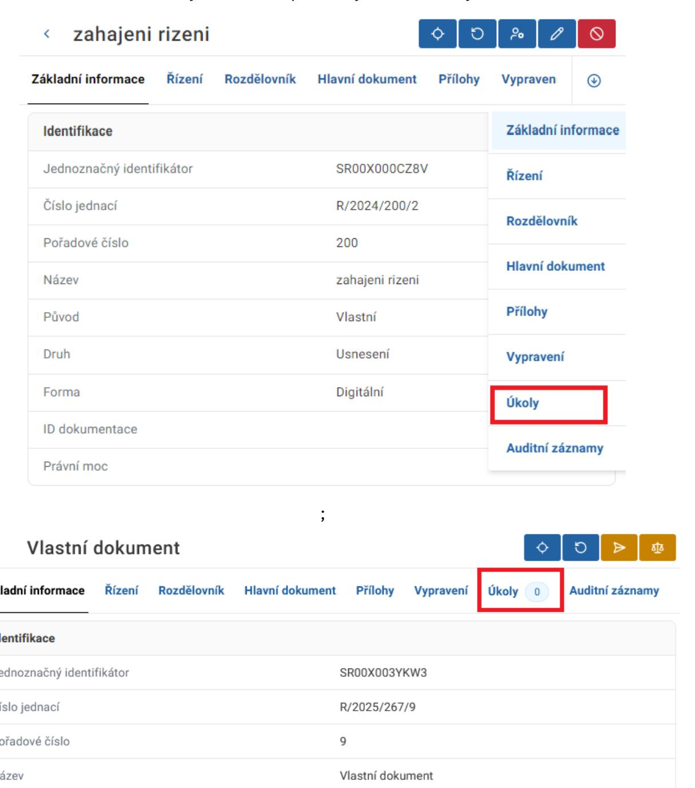
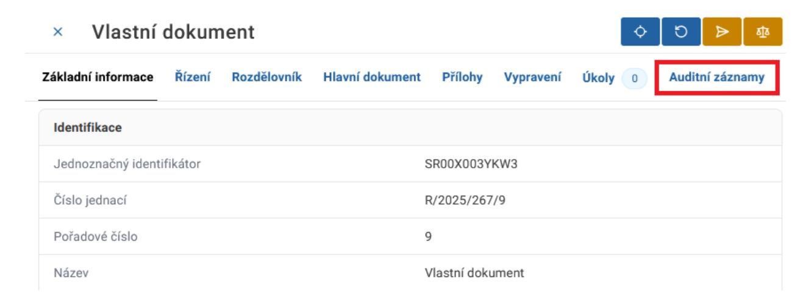
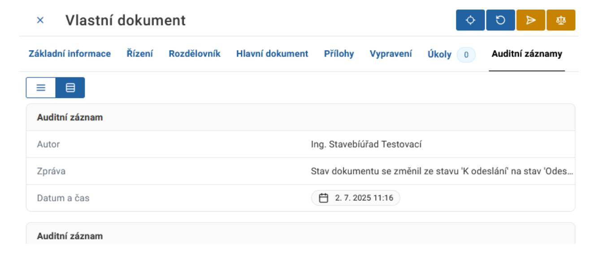

# 7.1.7 Úkoly

V záložce Úkoly je zobrazen seznam aktuálních a dokončených úkolů souvisejících s daným dokumentem včetně informací o zpracovatelích, lhůtách a stavu úkolů.

Pro přechod na záložku Úkoly klikněte na příslušný název záložky.

### 7.1.8 Auditní záznamy

Záložka auditní záznamy obsahuje informace o akcích, které byly s dokumentem provedeny. Pro přechod na záložku Auditní záznamy klikněte na příslušný název záložky.

Následně je zobrazen detail Auditního záznamu.

### 7.2 Zrušení/storno dokumentu

Dokumenty vlastní i doručené je možné zrušit/stornovat lokálním administrátorem.

Dokumenty původu vlastní je možné editovat do momentu splnění úkolu "Odeslat ke schválení". Po dokončení tohoto úkolu je obsah dokumentu needitovatelným. Pokud však dokument obsahuje nesprávný obsah a chyba je již nenapravitelná, je vhodné použít funkcionalitu zrušení/storno dokumentu. Následně pokračovat od začátku a dokument znovu vytvořit.

Dokumenty původu doručené je možné zrušit pouze před splněním úkolu "Určit způsob zpracování dokumentu", a to v případě, kdy byl dokument původu doručený vytvořen manuálně na základě příjmu dokumentu datovou schránkou či v listinné podobě. Dokumenty doručené přes portál stavebníka není možné rušit.

Upozorňujeme, že všechna data jsou navázána na spisovou službu, která přiděluje spisové značky a kde jsou data uložena. Z tohoto důvodu není možné data ze systému smazat, pouze zrušit.
