# 8 Správní poplatky

Správní poplatky u řízení jsou instrukce vydané k provedení finančních transakcí, například úhrady poplatků či jiných plateb spojených s administrativními nebo právními procesy v rámci daného řízení.

Pro zobrazení přehledu správních poplatků klikněte na položku Správní poplakty ve vertikálním menu.

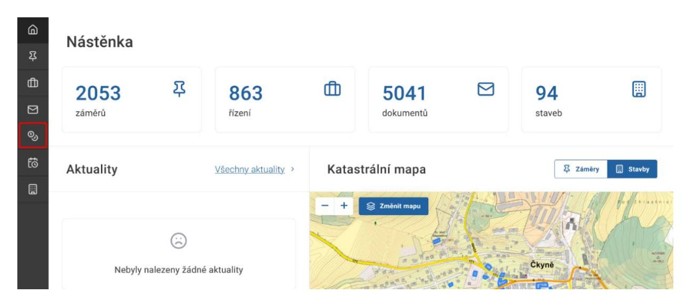

Systém načte seznam všech Správních poplatků (Neuhrazené, Uhrazené, Zrušené, Neuhrazené – řízení zastaveno, Všechny).

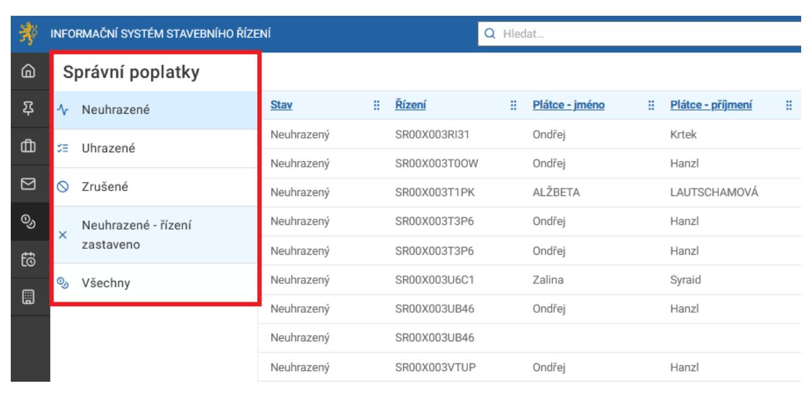

### 8.1 Záložky detailu správních poplatků

Ve složce Neuhrazené vidíte seznam všech neuhrazených správních poplatků. Po kliknutí na vybraný správní poplatek se na pravé straně obrazovky zobrazí detail tohoto poplatku.

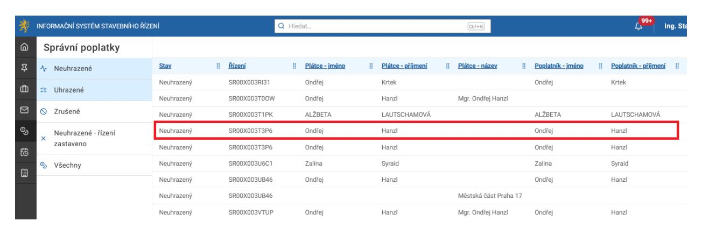

Detail správního poplatku obsahuje 3 záložky: Základní informace, Řízení a Dokument.

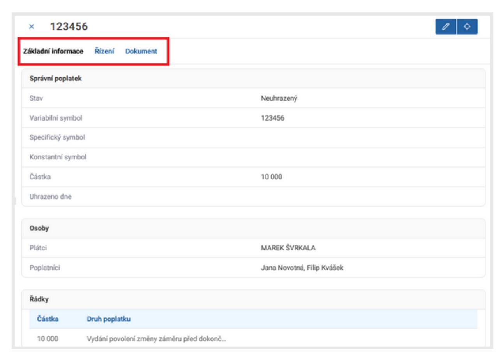

### 8.1.1 Základní informace

V záložce Základní informace jsou uvedeny základní údaje správního poplatku.

V detailu správního poplatku jsou vždy vyplněna povinná pole Variabilní symbol, Plátci, Poplatníci, Lhůta a dále Částka a Druh poplatku.

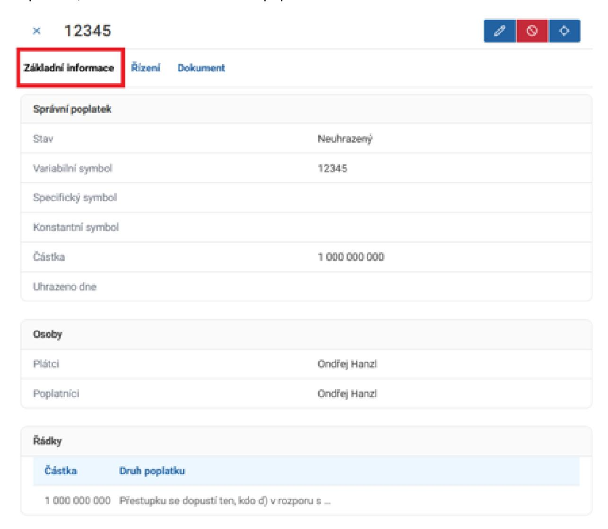

### 8.1.2 Řízení

V záložce Řízení jsou zobrazeny základní údaje řízení, ke kterému se správní poplatek vztahuje. Po kliknutí na tlačítko s modrou šipkou se dostanete přímo do detailu příslušného řízení.

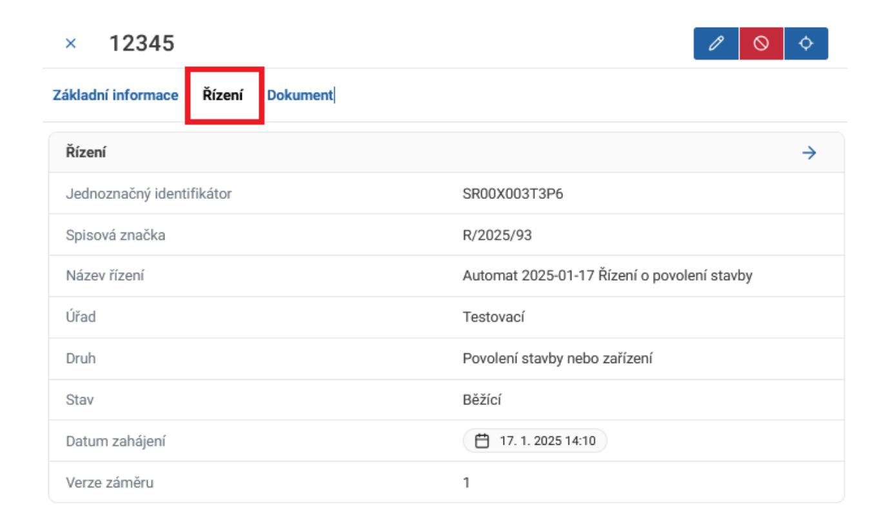

### 8.1.3 Dokumenty

V záložce Dokument jsou vidět základní údaje dokumentu správního poplatku, který se následně odesílá. Po kliknutí na tlačítko s šipkou se dostanete do detailu tohoto dokumentu.

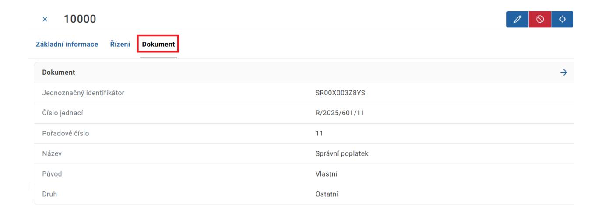

### 8.2 Vytvoření správního poplatku

Správní poplatek se vytváří přímo v řízení.

Na přehledu Řízení vyberte řízení pro otevření detailu.

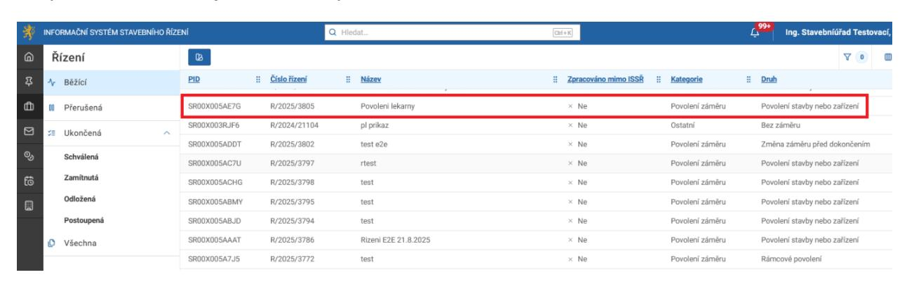

V pravé horní liště klikněte na tlačítko Stanovit správní poplatek.

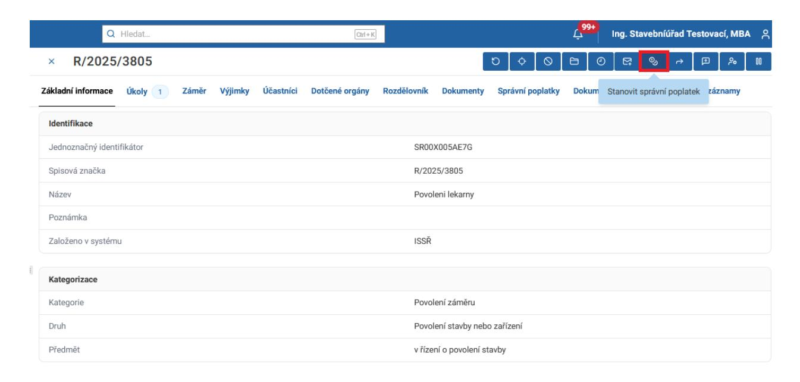

Na otevřené kartě Stanovit správní poplatek vyplňte potřebné údaje:

- Variabilní symbol
- Plátce (zástupce nebo zástupci, kteří platbu technicky provádí)
- Poplatníky (osoby, které podaly žádost nebo v jejichž zájmu byl úkon proveden)
- Lhůtu

Ve správním poplatku je možnost rozlišit osobu poplatníka (osoba, která podala žádost nebo v jejímž zájmu byl úkon proveden) a plátce (zástupce, který platbu technicky provádí). U obou polí může být uvedena jedna anebo více osob.

Dle potřeby je možné vyplnit i nepovinné údaje, jako je specifický a konstantní symbol.

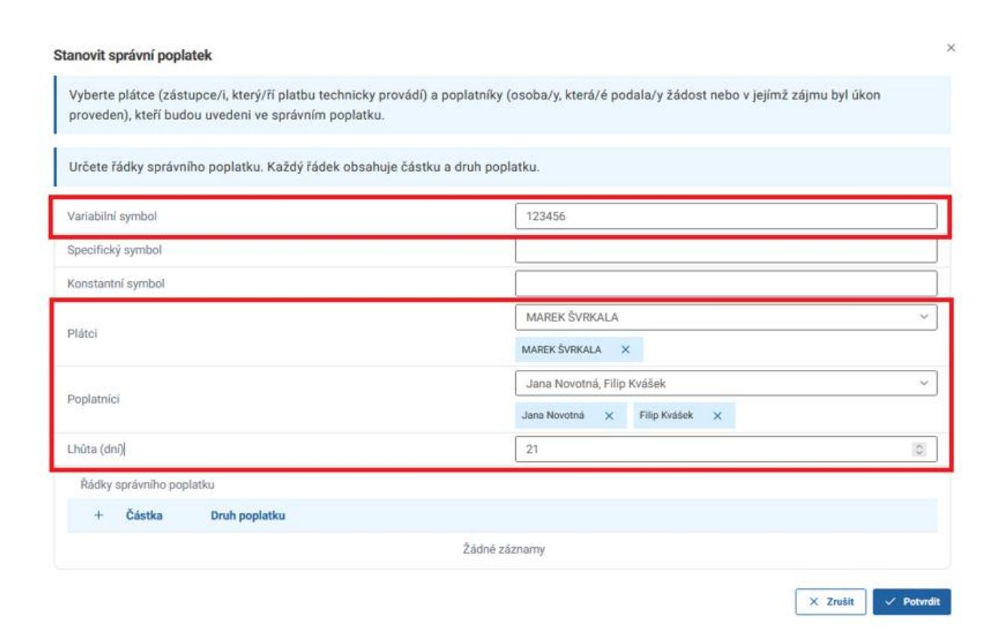

Dále vyberte druh poplatku a částku. Je možné vybrat i vícero poplatků. Klikněte na tlačítko Potvrdit.

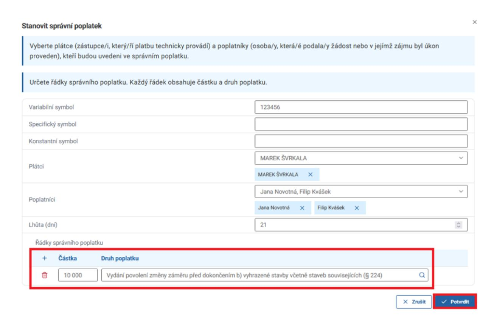

Správní poplatek je úspěšně vytvořen a zobrazen na záložce Správní poplatky. Nově vytvořený správní poplatek je ve stavu Neuhrazený.

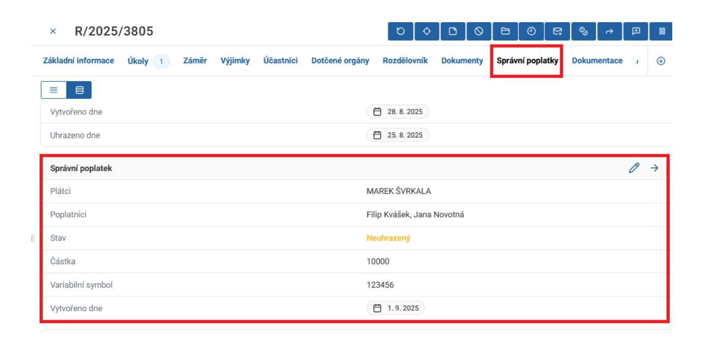

Při vytvoření správního poplatku je automaticky vytvořen také **dokument** správního poplatku. V rozdělovníku dokumentu správního poplatku se automaticky vytváří skupina s názvem Plátci.

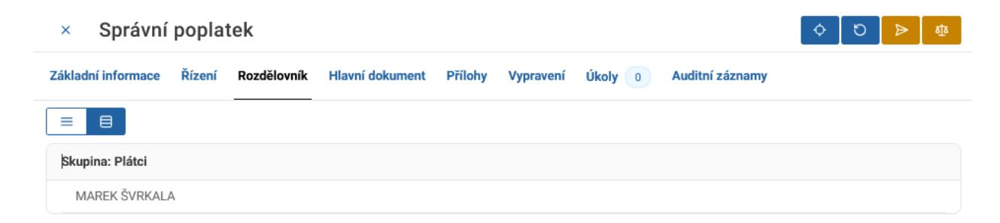

Do části Adresát se v šabloně správního poplatku automaticky vyplňují zadaní plátci.

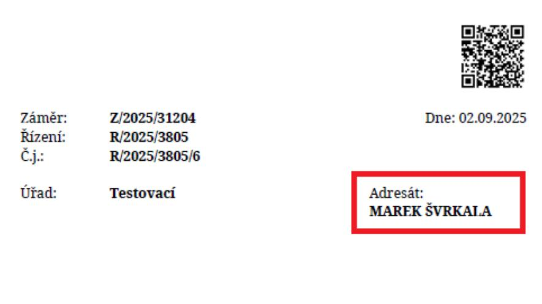

Pokud chce úřad vyrozumět i poplatníka, je možné v rozdělovníku dokumentu vytvořit další skupinu (např. Poplatníci). Adresátem dokumentu pak budou všechny skupiny uvedené v rozdělovníku.

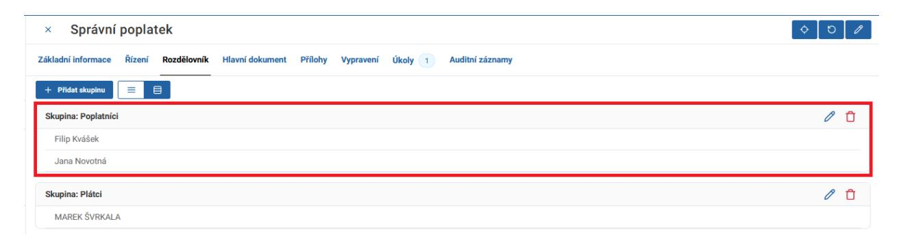

Pokud byly zadány i nepovinné údaje specifický a konstantní symbol, pak se tyto údaje automaticky propíší i do šablony správního poplatku.

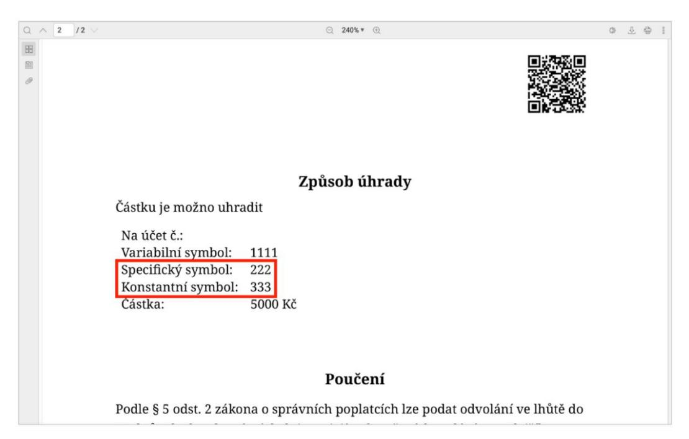

### 8.3 Změna stavu správního poplatku

V ISSŘ je možnost změny stavu správního poplatku.

### 8.3.1 Automatické změny stavu

V případě odložení řízení se stav správního poplatku automaticky nastaví na "Neuhrazený – řízení zastaveno".

Stav "Zrušený" je u správního poplatku nastaven automaticky při zrušení správního poplatku.

### 8.3.2 Manuální změny stavu

Funkcionalita Změnit stav správního poplatku umožňuje nastavit stav správního poplatku na "Uhrazený" nebo "Neuhrazený", a zároveň při změně stavu na "Uhrazený" umožňuje zadat datum úhrady.

Akční tlačítko Změnit stav správního poplatku je umístěno v detailu správního poplatku v sekci Správní poplatky.

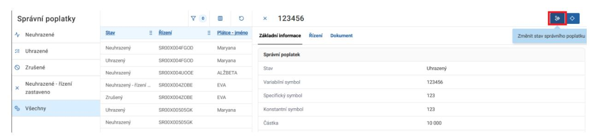

Tlačítko se zobrazuje pouze, pokud uživatel má uživatel roli Zaměstnanec sekretariátu nebo dodatečnou roli Oprávnění potvrzení platby, a zároveň jsou dokončeny všechny úkoly na příslušném dokumentu správního poplatku. V úkolu Určit způsob vyřízení dokumentu je potřeba vybrat Odeslat dokument subjektům z rozdělovníku. Pro neodeslané správní poplatky se tlačítko nezobrazí.

Možnost změny stavu je také dostupná v přehledu řízení na záložce správní poplatky.

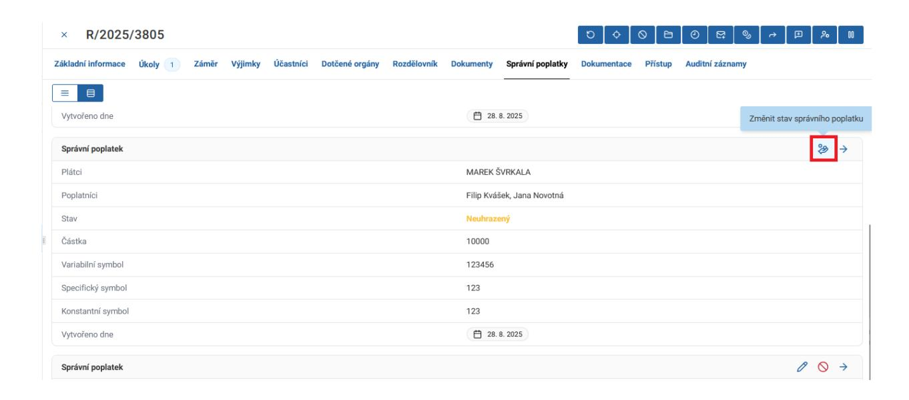

Nastavte Stav na Uhrazený a vyplňte Uhrazeno dne. Poté klikněte na tlačítko Potvrdit.

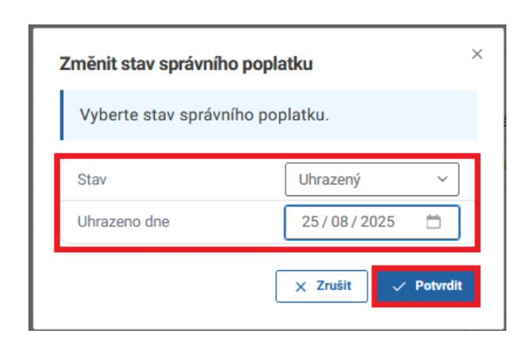

Správní poplatek je ve stavu Uhrazený.

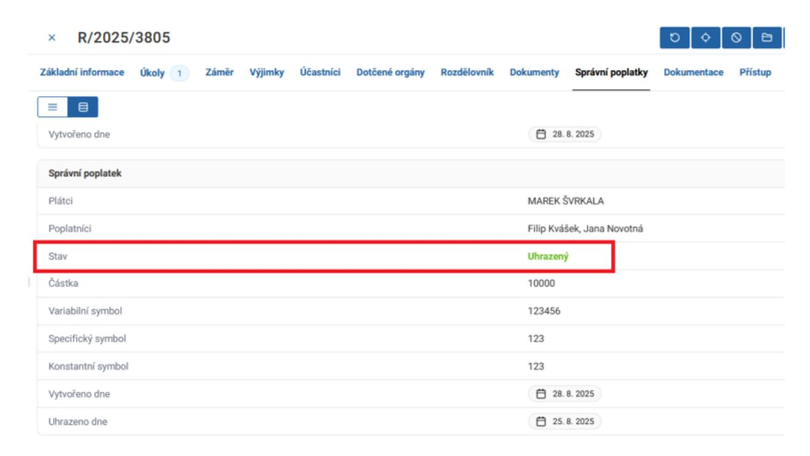

Uhrazené správní poplatky lze najít na pohledu Správní poplatky, záložka Uhrazené.

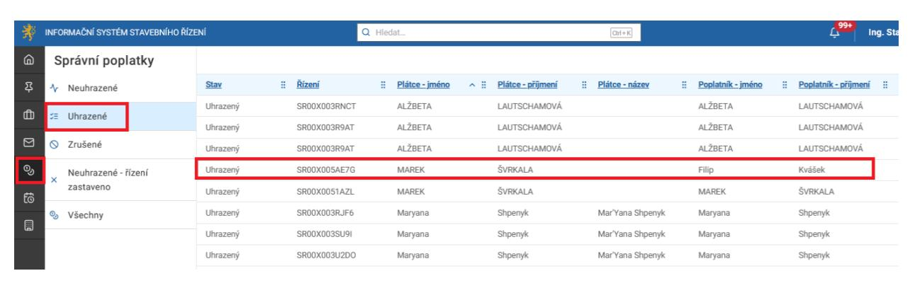

### 8.4 Zrušení správního poplatku

Lokální administrátor má oprávnění pro zrušení správního poplatku, které je možno využít například v případě chybně vytvořeného poplatku. Po potvrzení zrušení se změní stav poplatku na "Zrušený". Zrušení je možné před zpracováním úkolu Určit způsob vyřízení dokumentu správního poplatku.

Zrušit správní poplatek lze v přehledu správních poplatků kliknutím na tlačítko Zrušit správní poplatek.

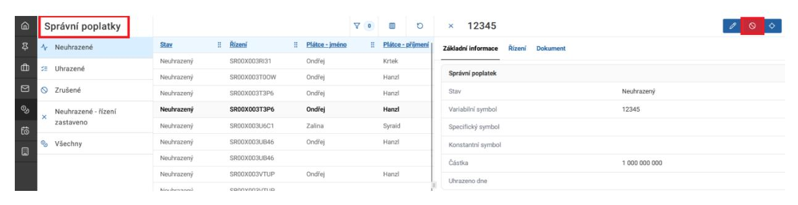

Stejná možnost je i v detailu řízení na záložce Správní poplatky

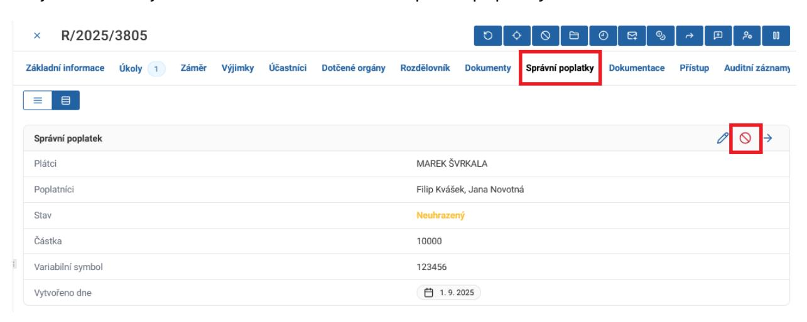

*Upozornění:* **Při zrušení správního poplatku se automaticky zruší i odpovídající dokument správního poplatku v sekci Dokumenty. Tento mechanismus nefunguje opačně – pokud je zrušen pouze dokument, správní poplatek zůstává aktivní a je potřeba ho zrušit manuálně.**

### 8.5 Úprava vyplněných údajů správního poplatku

Všechny vyplnitelné údaje správního poplatku je možné editovat, například v případě chybného zadání. Editace je povolena pouze do okamžiku, kdy je dokument správního poplatku ve stavu "Ke schválení". Po tomto kroku už není možné správní poplatek upravit.

Upravit správní poplatek lze z přehledu správních poplatků kliknutím na tlačítko Upravit správní poplatek

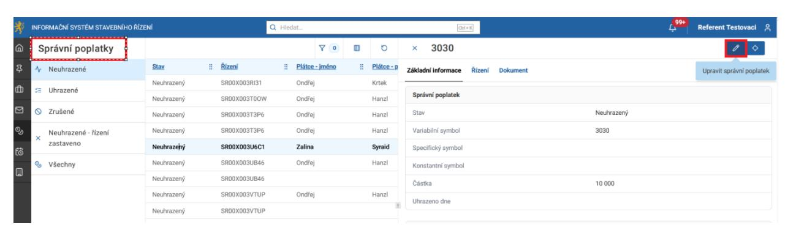

Stejná možnost je i v detailu řízení na záložce Správní poplatky

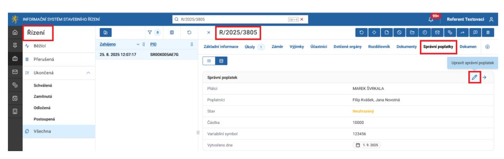

Po provedení úprav ve správním poplatku, je potřeba změny propsat i do šablony hlavního dokumentu.

To provedete tak, že v záložce Hlavní dokument příslušného poplatku, kliknete na ikonu Upravit dokument

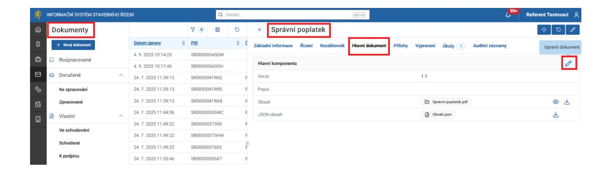

A následně v novém okně – bez provádění jakýchkoliv úprav – stisknete tlačítko Potvrdit.

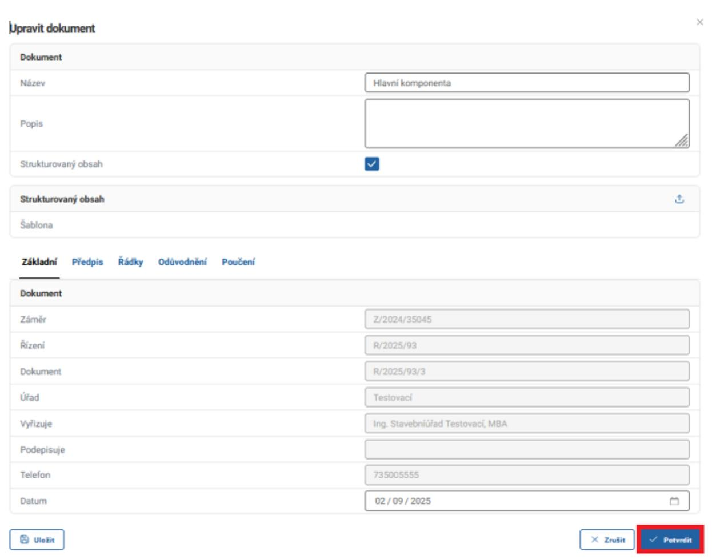

Tím dojde k přegenerování šablony s aktuálními údaji ze správního poplatku.
