# 9 Příjem žádosti a její evidence

Žádost (formulář) je možné podat přes Portál stavebníka, zaslat datovou schránkou či podat osobně na příslušném stavebním úřadu či dotčeném orgánu.

### **Žádosti nevyžadující dokumentaci:**

- F1 Žádost o předběžnou informaci SÚ
- F1 Žádost o předběžnou informaci DO
- F5 žádost o změnu povolení
- F7 Žádost o povolení dělení nebo scelení pozemků
- F10 Návrh na stanovení ochranného pásma
- F13 Žádost o povolení zkušebního provozu
- F14 Žádost o povolení změny v užívání stavby
- F18 Dokumentace průvodní list

### **Žádosti vyžadující dokumentaci:**

- F2 Žádost o vyjádření nebo závazné stanovisko dotčeného orgánu
- F4 Žádost o povolení stavby nebo zařízení
- F6 Žádost o povolení změny využití území
- F8 Žádost o vydání rámcového povolení
- F9 Žádost o změnu záměru před dokončením
- F11 Žádost o vydání kolaudačního rozhodnutí (Pouze pokud je vybrána možnost "Stavba byla provedena s nepodstatnými odchylkami od ověřené projektové dokumentace**")**
- F12 Žádost o povolení předčasného užívání stavby (Pouze pokud je vybrána možnost "Stavba byla provedena s nepodstatnými odchylkami od ověřené projektové dokumentace**")**
- F15 Žádost o povolení odstranění stavby, zařízení a terénních úprav
- F16 Žádost o dodatečné povolení stavby, zařízení a terénních úprav

### 9.1 Příjem žádosti přes Portál stavebníka a její zpracování

V případě, že žadatel podá žádost prostřednictvím Portálu stavebníka, Váš úřad (platí pro stavební úřady i dotčené orgány) obdrží příslušné dokumenty podle toho, zda je žádost doprovázena povinnou dokumentací.

Na žádost směřovanou na Váš úřad Vás upozorní notifikace, pakliže ji máte nastavenou.

Systém automaticky založí záměr se stejným názvem jako doručený dokument. Pokud je součástí žádosti dokumentace, je obsažena u záměru.

Doručenou žádost naleznete v evidenci Dokumenty, Doručené, Ke zpracování.

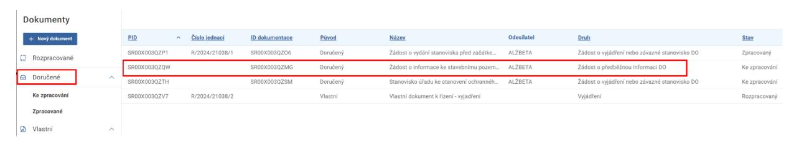

Záměr se nachází ve skupině Celá ČR (v kategoriích Všechny, případně Aktivní).

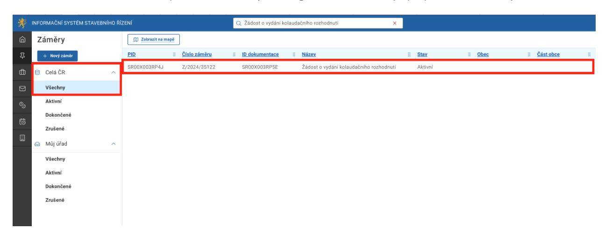

Po rozkliknutí detailu záměru v záložkách Dokumentace a Dokumenty se zobrazí hláška "Údaje nejsou dostupné". Tato hláška je správná a zobrazena záměrně jako součást opatření pro ochranu a zabezpečení citlivých dat.

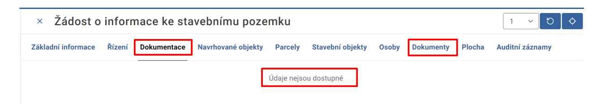

Pro zpracování žádosti rozklikněte záznam daného dokumentu v sekci Dokumenty. Poté se zobrazí detail žádosti.

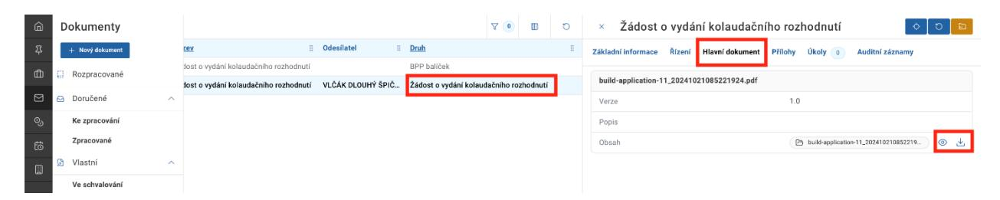

Samotná žádost se nachází na záložce Hlavní dokument.

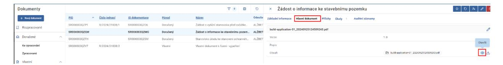

V záložce Přílohy se nacházejí žadatelem/zástupcem přiložené dokumenty. Zde je třeba zvýšené pozornosti. Při zobrazení v režimu tabulky se zobrazuje maximálně 10 příloh na stránku, je tedy možné, že má záložka více stran, a to podle počtu příloh.

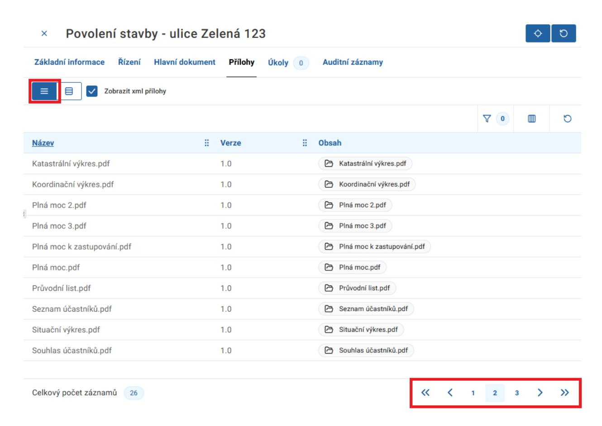

Při zobrazení v režimu karet jsou zobrazeny všechny přílohy, bez stránkování.

Pokud se jedná o žádost vyžadující dokumentaci, žádost obsahuje žadatelem přiložené dokumenty a technické prvky. Technické prvky lze identifikovat podle názvů začínajících na "build-application" a "build-intention". Tyto dokumenty lze zobrazit či skrýt pomocí checkboxu Zobrazit xml přílohy.

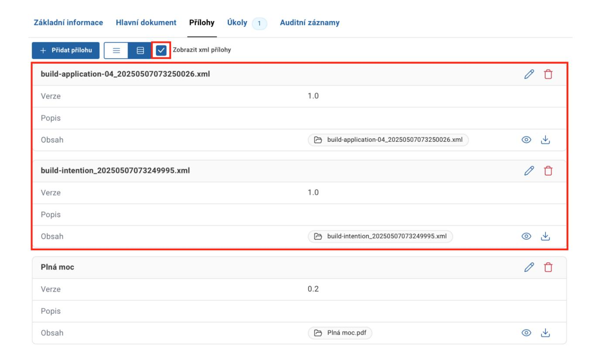

Pro zpracování doručené žádosti je nutné dokončit úkol Určit způsob zpracování dokumentu.

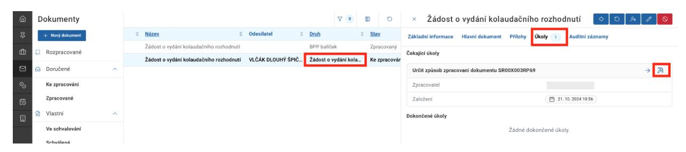

Po určení způsobu zpracování dokumentu žádosti se záměr přemístí do skupiny Můj úřad (v kategoriích Všechny, případně Aktivní).

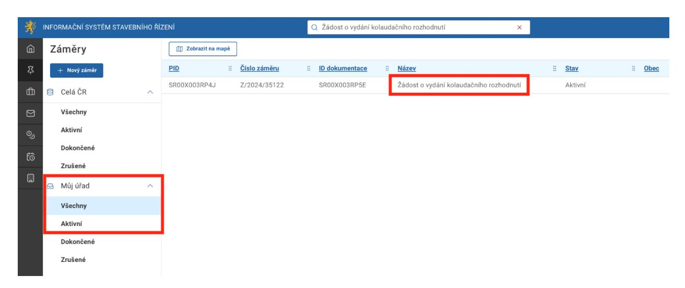

Po zpracování dokumentu žádosti (založením nového řízení) se v detailu objeví záložka Řízení, kde jsou zobrazeny základní údaje o navázaném řízení. Skrze tlačítko s modrou šipkou je možné přejít na detail daného řízení.

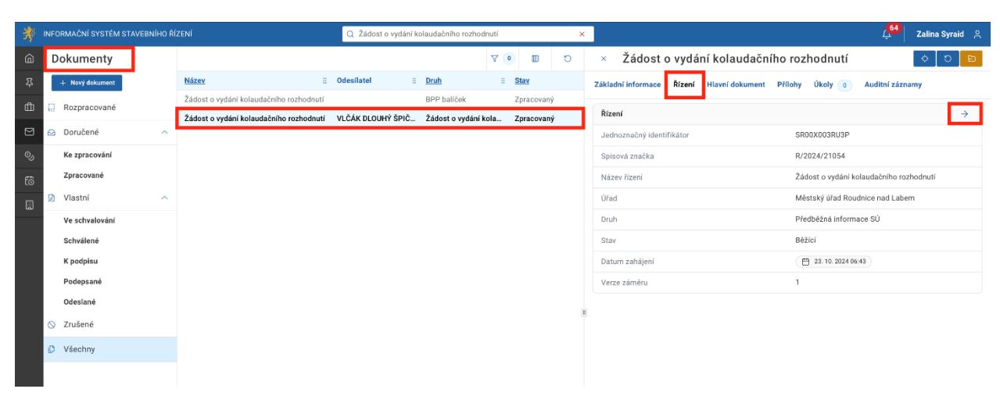

V detailu příslušného řízení v záložce Dokumenty se objeví záznam o dané žádostí.

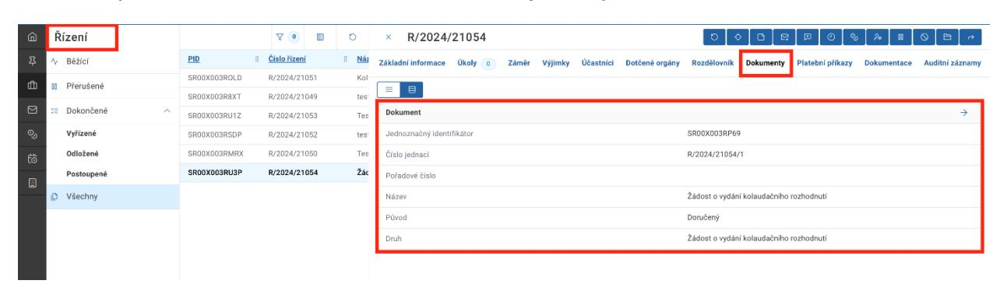

Pokud byla součástí žádosti dokumentace, v záložce Dokumentace se objeví možnost pro otevření BPP balíčku. Jedná se o stejný BPP balíček jako v záložce Dokumentace u záměru, tzn. v případě žádosti nevyžadující dokumentaci je tato záložka prázdná.

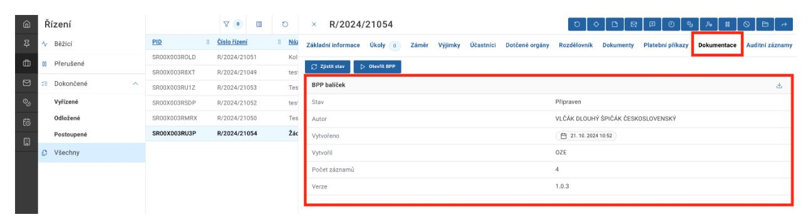

Po rozkliknutí detailu záměru v záložkách Dokumentace je možnost pro načtení BPP balíčku.

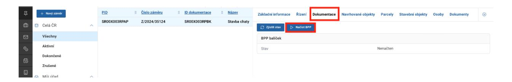

Po načtení BPP balíčku klikněte na tlačítko Otevřít BPP.

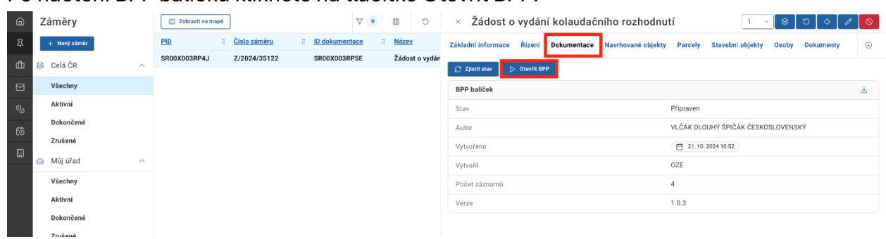

V náhledu dokumentace je možné nahlížet a stahovat jednotlivé dokumenty. Pomocí checkboxu vlevo dole je také možné zobrazit či skrýt strojově čitelné přílohy záměru.

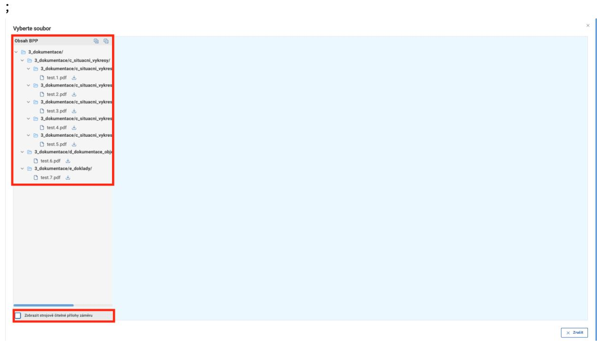

### **Kde najdu doručenou žádost?**

- Přehled Dokumentů -> detail dokumentu -> Hlavní dokument
- Přehled Řízení -> detail řízení -> Dokumenty

### **Kde najdu přiloženou dokumentaci?**

- Přehled Řízení -> detail řízení -> Dokumentace
- Přehled Záměrů -> detail záměru -> Dokumentace

### **Kde najdu přílohy k dokumentu?**

• Přehled Dokumentů -> detail dokumentu -> Přílohy (technické soubory začínajících na "build-application" a "build-intention" ignorujte)
