# 9.2 Příjem žádosti prostřednictvím datové schránky či v listinné podobě

Nejprve zkontrolujete existenci záměru v systému (podle jména a příjmení žadatele, adresy, názvu atd.).

### 9.2.1 Záměr již existuje

V případě, že jste záměr v systému vyhledali, opište si jeho identifikaci a následně pokračujte dle 9.2.3 Postup pro vytvoření dokumentu doručeného.

### 9.2.2 Záměr neexistuje – založení záměru

Pokud jste záměr v systému nenašli, je třeba ho založit.

Nový záměr založíte tlačítkem Nový záměr.

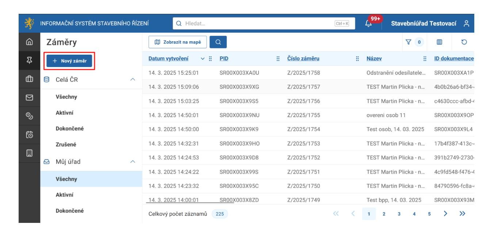

Zde vyplníte název záměru (tak aby byl pochopitelný a později jste ho snadno našli). Můžete také vyplnit popis pro lepší porozumění. Vše podle podané dokumentace.

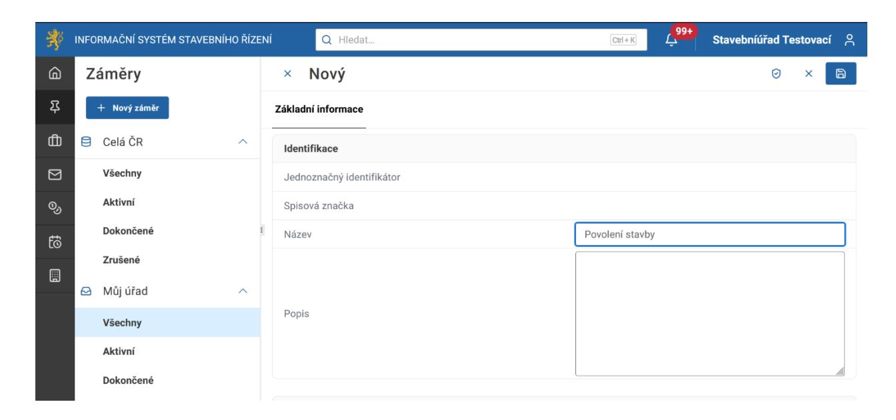

Pro uložení záměru klikněte na tlačítko Uložit.

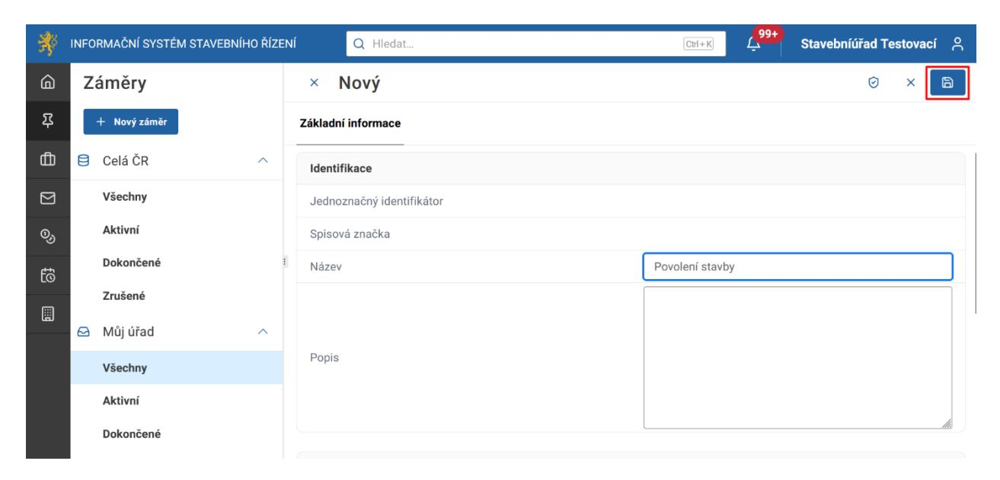

### 9.2.3 Postup pro vytvoření dokumentu doručeného

Přejděte do sekce dokumenty kliknutím na tlačítko Dokumenty na hlavním menu.

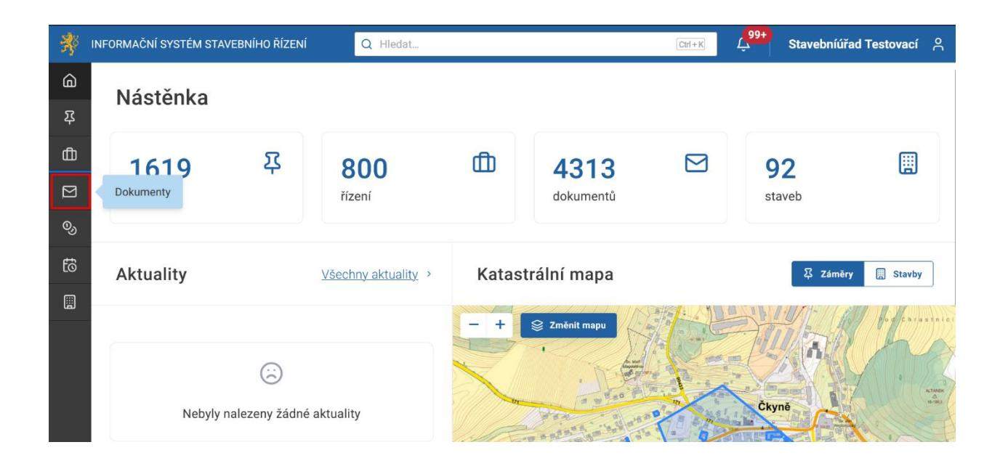

Zobrazí se sekce Dokumenty, kde kliknete na tlačítko Nový dokument.

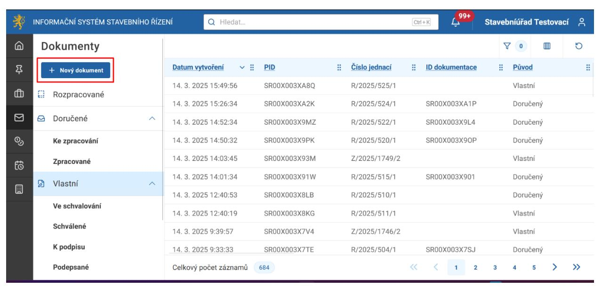

V zobrazeném formuláři vyplníte název, pod kterým chcete, aby byl dokument uložen.

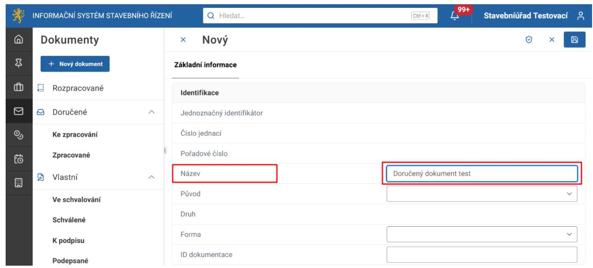

V kolonce Původ můžete vybírat z nabídky buď Vlastní, jedná-li se o dokument, který vytváříte na základě úředního postupu, nebo Doručený, jde-li o založení dokumentu, který byl na Váš úřad doručen. V tomto případě tedy vyberete možnost Doručený.

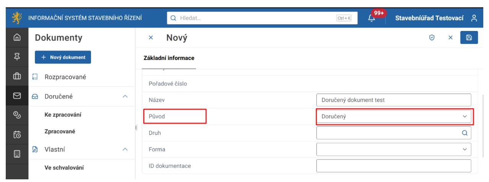

V kolonce Druh vyberete, o jaký konkrétní dokument se jedná. Na výběr jsou různé druhy žádostí, námitka, odvolání atd. Vyberte například Žádost o vydání povolení stavby.

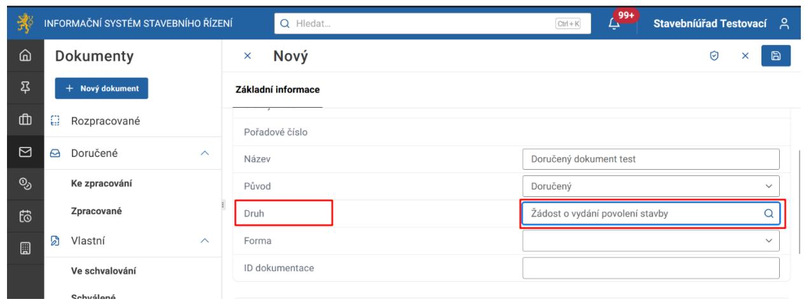

Zvolte formu dokumentu Digitální nebo Analogový.

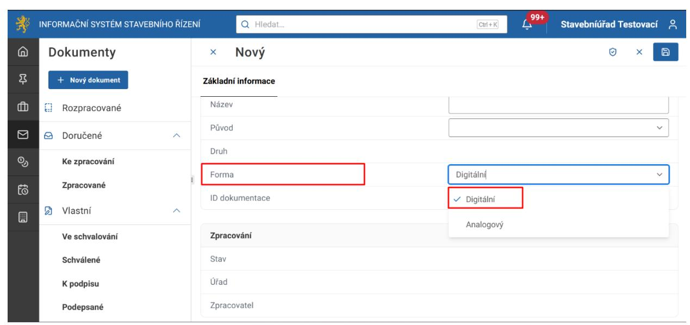

Kliknutím na tlačítko Přidat v části Odesílatel se otevře formulář pro zadání údajů o odesílateli dokumentu.

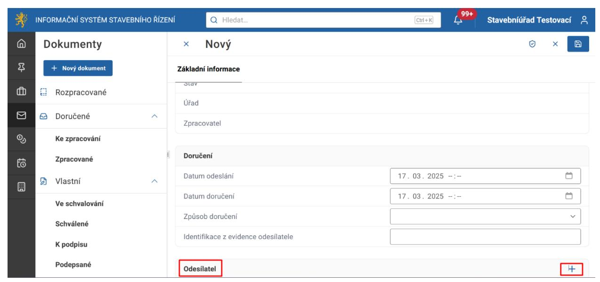

V kolonce Osoba vyberete z nabídky Fyzická osoba, Právnická osoba, Fyzická osoba podnikající.

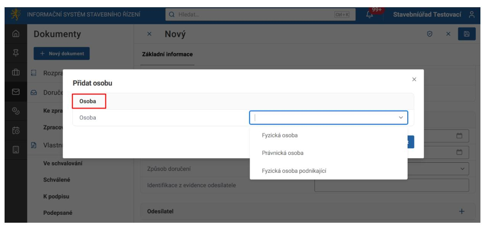

Základní údaje fyzické osoby, které je nutné vyplnit, jsou jméno, příjmení a datum narození. U právnické osoby to jsou název společnosti a IČ. U fyzické podnikající osoby jsou to jméno, příjmení a IČ. Ostatní údaje lze doplnit později.

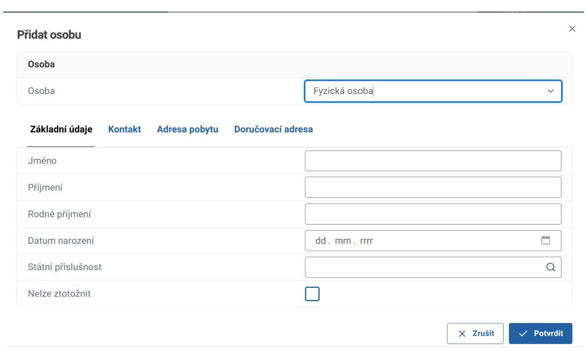

Pro uložení a přidání osoby odesílatele k dokumentu klikněte na tlačítko Potvrdit.

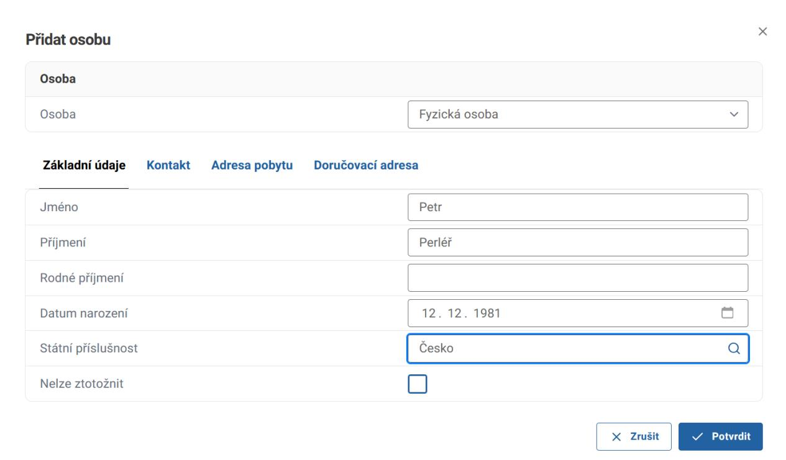

Celý dokument uložíte kliknutím na tlačítko Uložit v pravém horním rohu.

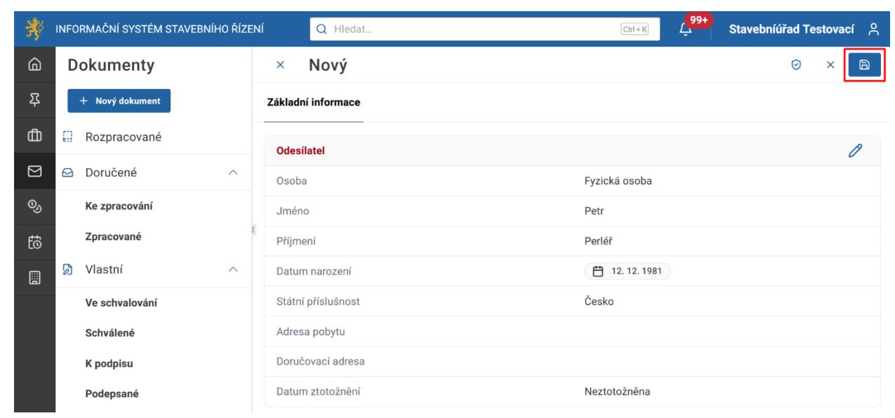

Pokud se dokument správně uložil, zobrazí se oznámení Data byla úspěšně uložena.

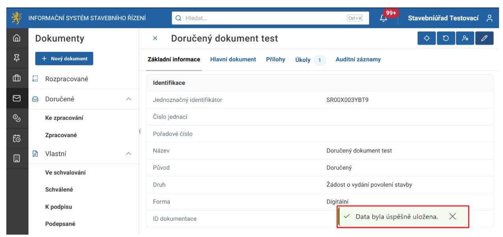

Pro vložení doručeného dokumentu žádosti přejděte na záložku Hlavní dokument a klikněte na tlačítko Přidat hlavní dokument.

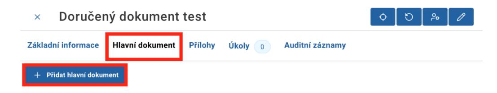

V otevřeném okně nahrajte soubor s dokumentem žádosti a klikněte na tlačítko Potvrdit.

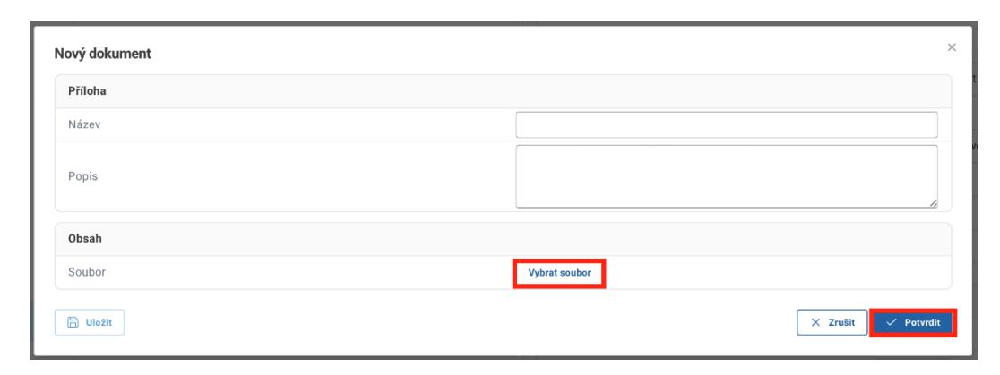

Pokud máte k dispozici přílohy k žádosti, nahrajte je do záložky Přílohy.

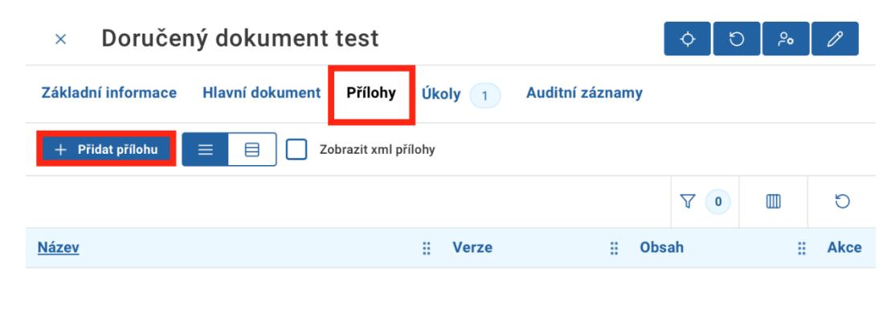

V záložce Úkoly zpracujte úkol Určit způsob zpracování dokumentu.

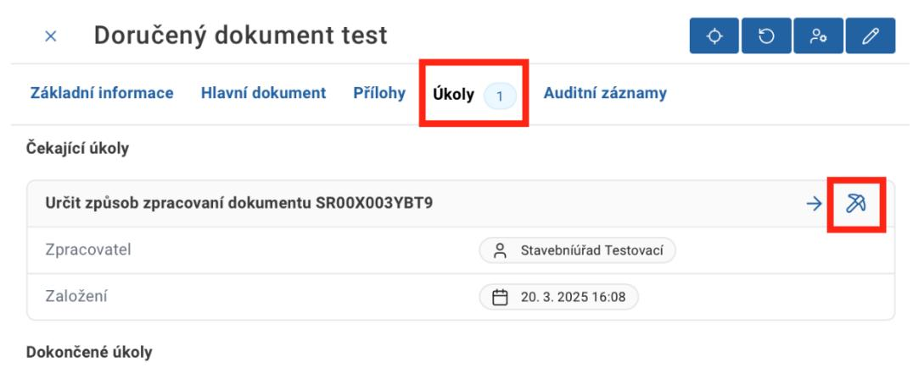

Uživatel má na výběr ze čtyř možností:

• Vložit dokument do záměru,

- Vložit dokument do řízení,
- Založit řízení,
- Jenom zaevidovat beru na vědomí.

V naprosté většině případů je druhá a třetí možnost dostačující.

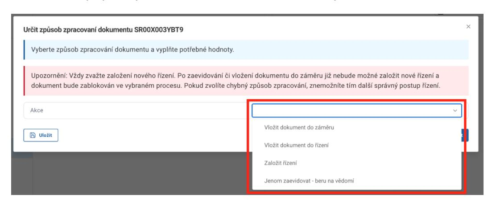
