# 10 Posouzení příslušnosti/postoupení spisu

### 10.1 Posouzení příslušnosti/postoupení spisu ihned po přijetí žádosti

### **Pracovní postup nepříslušného úřadu, který postupuje spis:**

- 1. Úřad obdrží žádost, která mu nepřísluší.
- 2. Uživatel, který je nastavený jako příjemce dokumentů, obdrží aplikační či emailovou notifikaci (dle nastavení notifikací daného uživatele).
- 3. Žádost zpracuje založením nového řízení.
- 4. V řízení vytvoří vlastní dokument "Usnesení o postoupení". Druh = Usnesení o postoupení pro nepříslušnost a jako hlavní dokument vloží samotné usnesení o postoupení.

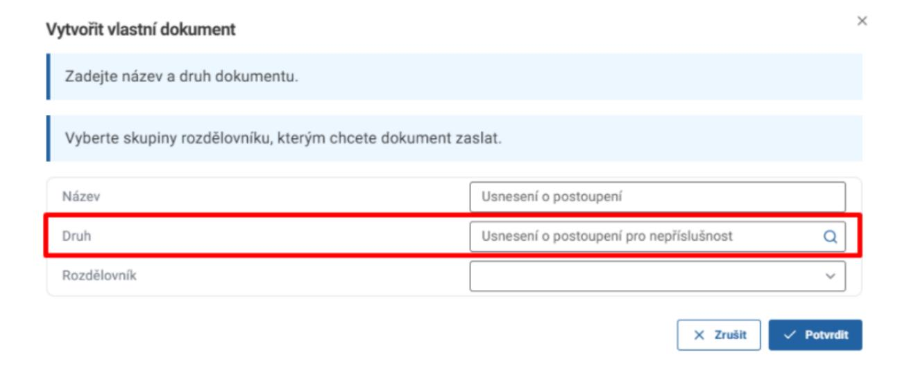

### *Upozornění:*

Vždy vložte do dokumentu Usnesení o postoupení hlavní dokument. Bez vložení hlavního dokumentu nebude moci úřad, kterému je postupováno, založit řízení (vložit dokument do řízení).

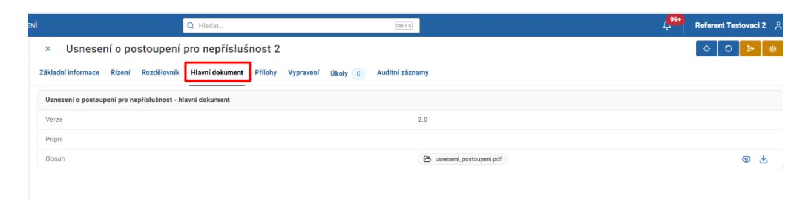

Pokud byly v daném řízení již vytvořeny jakékoli jiné vlatní dokumenty, budou postoupeny ve formě příloh i tyto dokumenty. Zkontrolujte, zda mají být všechny dokumenty postoupeny, případně nevyhovující dokumenty zrušte.

### *Poznámka:*

Při postoupení je třeba splnit úkoly na všech dokumentech. Není možné postoupit spis s rozpracovanými dokumenty.

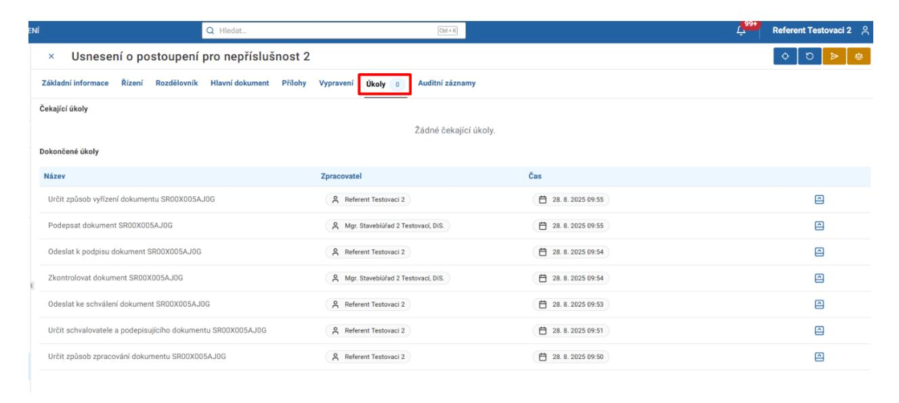

- 5. Postoupení spisu je možné dvěma způsoby v závislosti na procesu v řízení.
  - a. Řízení nemá proces (systém nenabízí úkoly ke zpracování) V přehledu řízení použijete akční tlačítko "Postoupení spisu". V dialogovém okně vložte dokument "Usnesení o postoupení" a zvolte příslušný úřad.

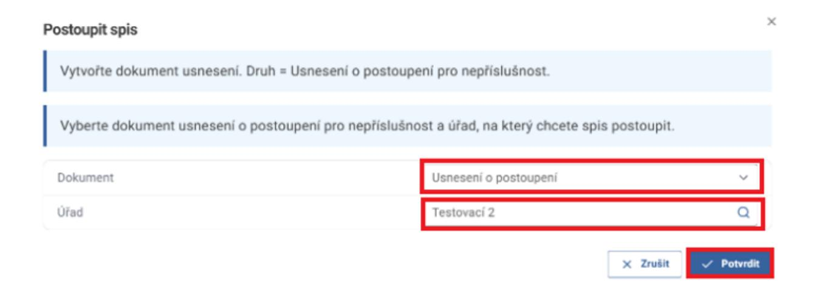

### b. Řízení má proces (systém nabízí úkoly ke zpracování)

V novém dialogovém okně při splnění úkolu "Určit příslušnost žádosti v řízení" zvolte u otázky "Je žádost příslušná" možnost "Ne", vložte dokument "Usnesení o postoupení" a zvolte příslušný úřad.

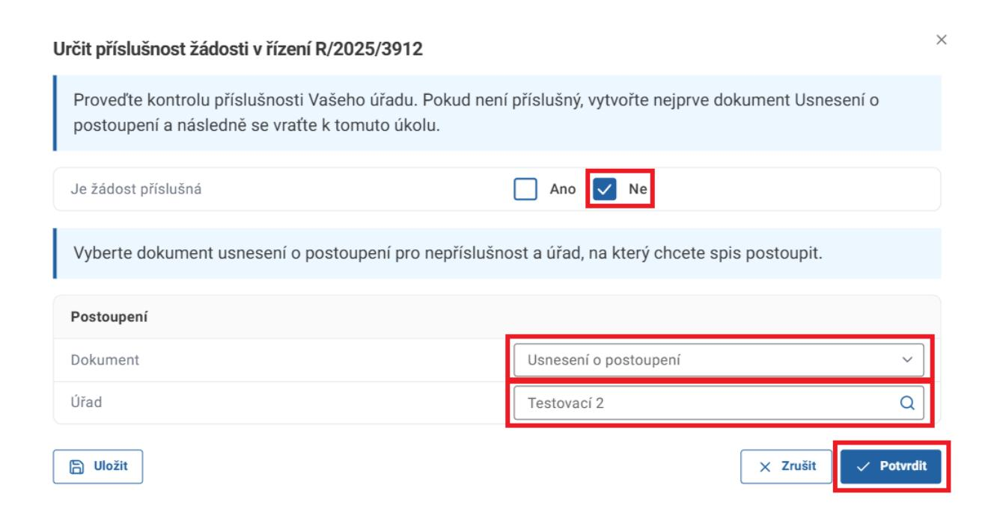

6. Řízení je následně ve stavu "Ukončeno - postoupeno".

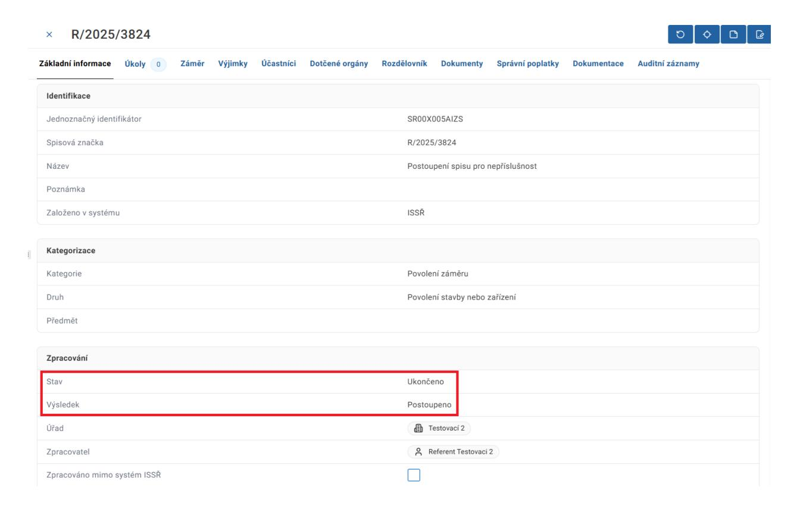

### **Pracovní postup úřadu, kterému byl spis postoupen:**

1. Úřad obdrží dokument Usnesení o postoupení.

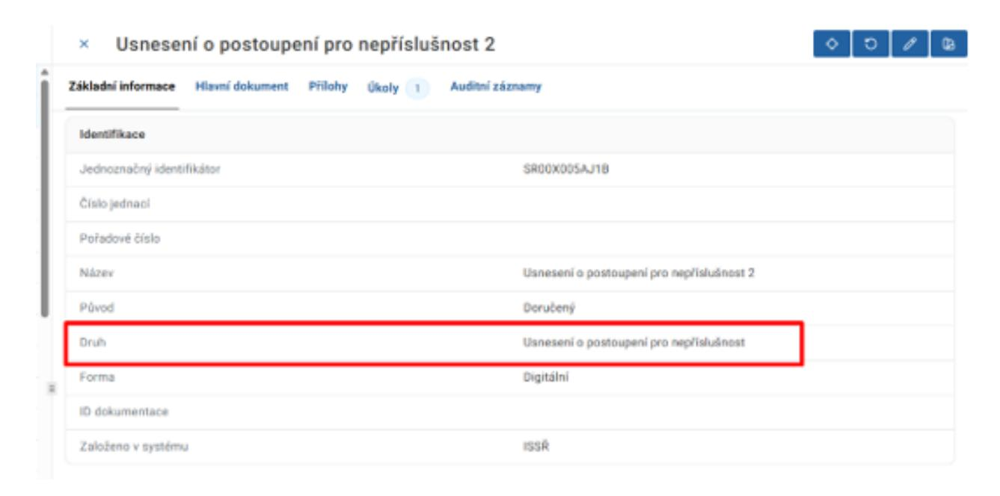

- 2. Uživatel, který je nastaven pro příjem dokumentů, obdrží aplikační či e mailovou notifikaci (dle nastavení notifikace daného uživatele). Notifikace obsahuje identifikátor nového dokumentu (PID), odkaz na dokument a číslo původního řízení.
  - a. Aplikační notifikace

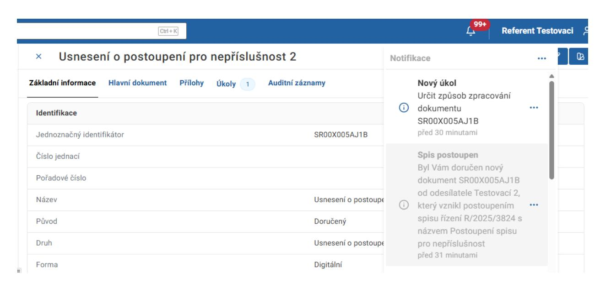

b. Emailová notifikace

3. U doručeného dokumentu ke zpracování záložka Hlavní dokument obsahuje dokument Usnesení o postoupení.

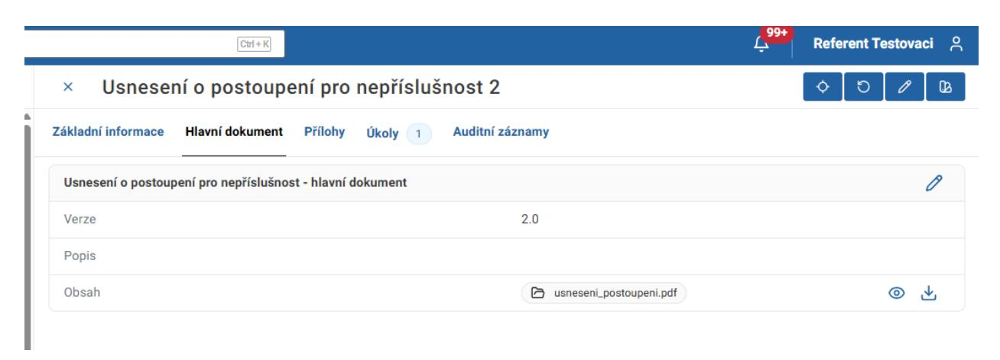

### *Upozornění:*

Pokud hlavní dokument k Usnesení o nepříslušnosti nebyl vložen postupujícím úřadem, systém Vás na to upozorní při zpracování úkolu Určit způsob zpracování dokumentu. V takovém případě prosím kontaktujte daný úřad a domluvte se na zaslání chybějícího dokumentu.

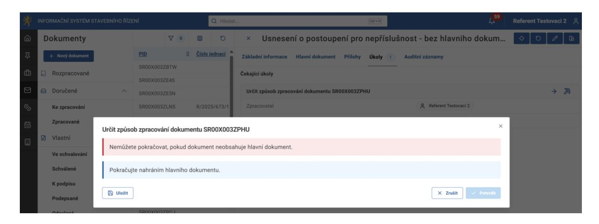

4. Pod záložkou Přílohy jsou žádost (původní iniciační dokument), přílohy žádosti a další dokumenty, které byly obsaženy v původním řízení.

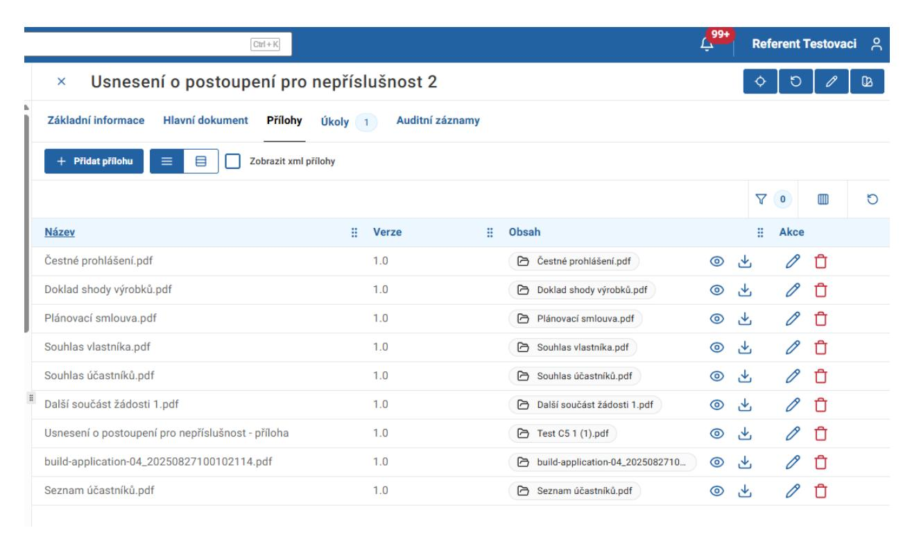

5. U úkolu "Určit způsob zpracování dokumentu" může uživatel zvolit možnost "Založit řízení" nebo "Vložit dokument do řízení" (v případě doplnění žádosti).

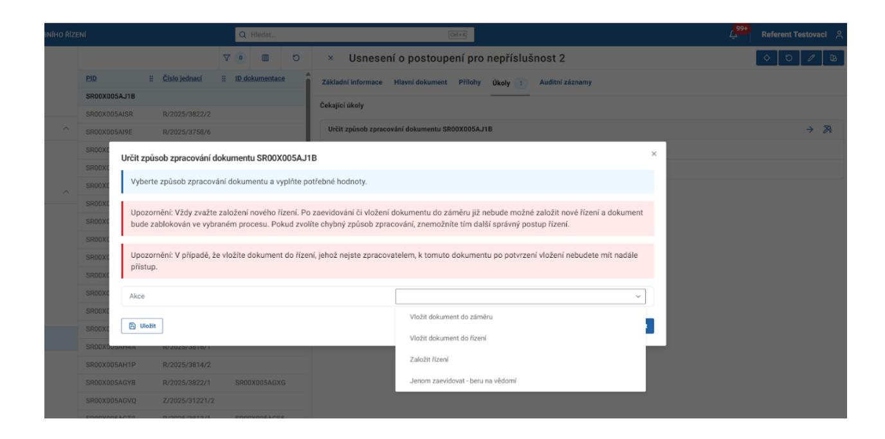

6. Záložka Auditní záznamy obsahuje informaci o dokumentu Usnesení o postoupení.

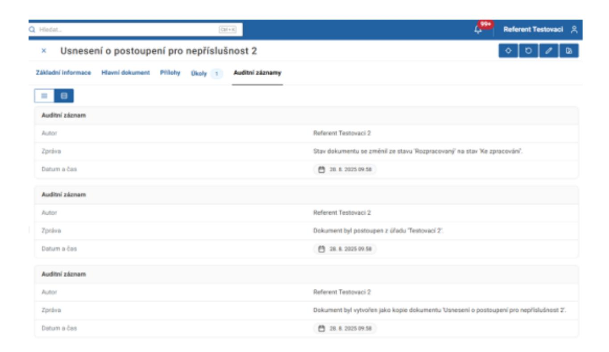

### 10.2 Postoupení spisu manuálně v průběhu procesu

Pokud je potřeba postoupit spis v průběhu procesu řízení je možné toto učinit manuálně kliknutím na tlačítko Postoupit spis v detailu řízení.

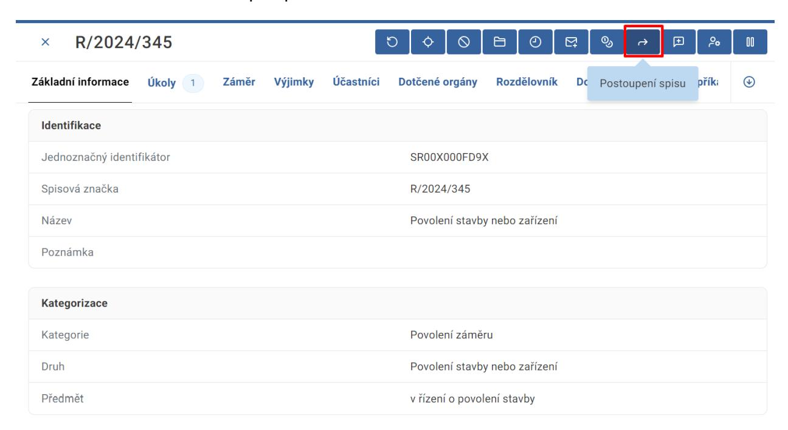

V dialogovém okně vyberte dokument Usnesení o postoupení a příslušný úřad. Tento dokument musí být již vytvořen, aby ho bylo možné vybrat. Vybráním dokumentu v tomto dialogovém okně nedojde k jeho vypravení. Stiskněte tlačítko Potvrdit.

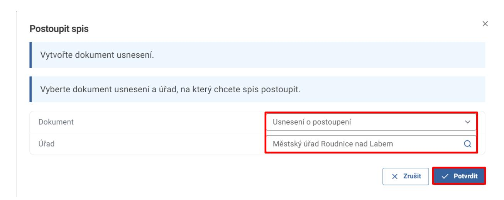

Řízení je následně ve stavu Ukončeno s výsledkem Postoupeno. Řízení naleznete na pohledu Dokončené řízení, záložka Postoupené.

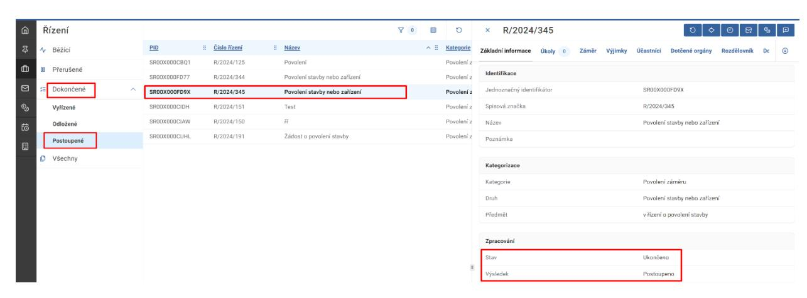

Uživatel z úřadu, na který byl spis postoupen, je upozorněn notifikací na nově založené řízení (aplikační či emailovou dle nastavení).

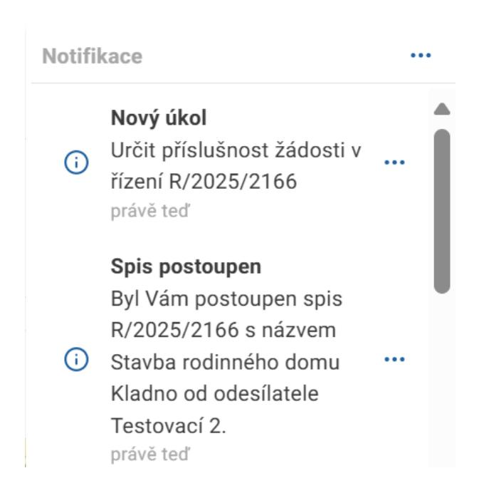

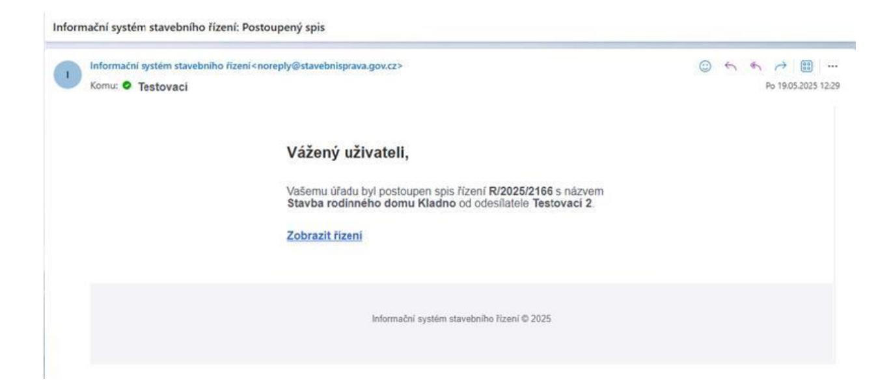
