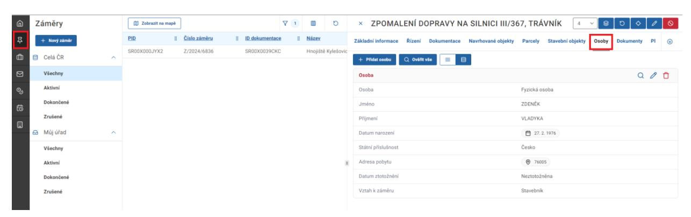

# 11 Přidání odesílatele (podatele)/účastníků řízení a jejich ověření (ztotožnění)

### 11.1 Odesílatel (podatel) žádosti

V případě příjmu žádosti přes Portál stavebníka, jsou údaje o osobě k nalezení v záměru. Klikněte na přehled záměr ve vertikálním menu. Poté vyberte položku z přehledu a klikněte na ni. Zobrazí se detail záměru, kde následně klikněte na záložku Osoby.

V případě příjmu žádosti datovou schránkou nebo v listinné podobě je třeba postupovat viz. kapitola 9.2.3 Postup pro vytvoření dokumentu doručeného
