# 11.2 Účastníci řízení

Nejprve je třeba zobrazit přehled řízení kliknutím na tlačítko Řízení ve vertikálním menu. Pro zobrazení detailu vybraného řízení klikněte na položku z přehledu.

Pro přidání Účastníků řízení klikněte na tlačítko Přidat osobu.

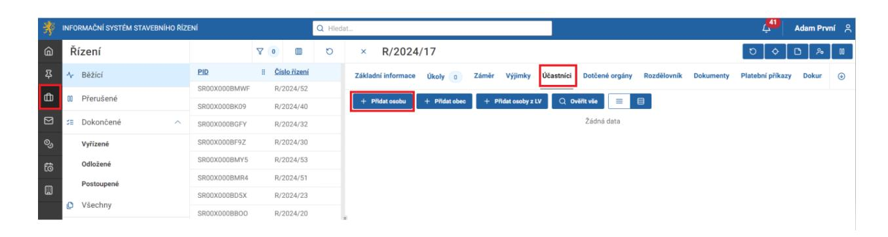

V novém okně vyberte vztah k řízení, způsob komunikace a zda se jedná o fyzickou osobu, právnickou osobu, anebo fyzickou osobu podnikající.

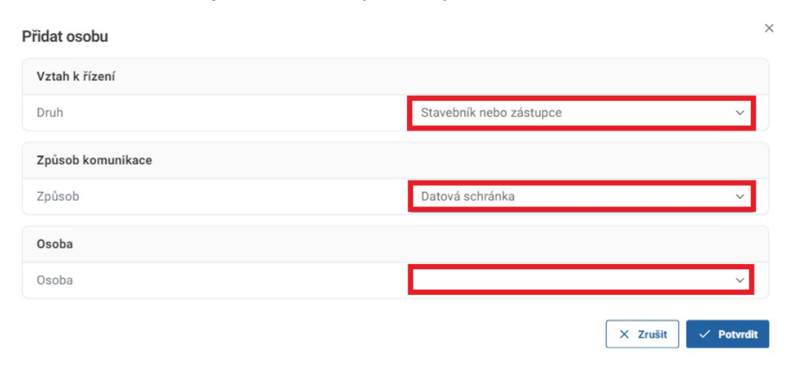

Následně se otevře formulář, do kterého o osobě vyplníte základní údaje. U fyzických osob je nutné zadat jméno, příjmení a datum narození osoby. U fyzických osob podnikajících je nutné zadat jméno, příjmení a IČO a u právnických osob název společnosti a IČO. Po zadání všech relevantních údajů klikněte na tlačítko Potvrdit.

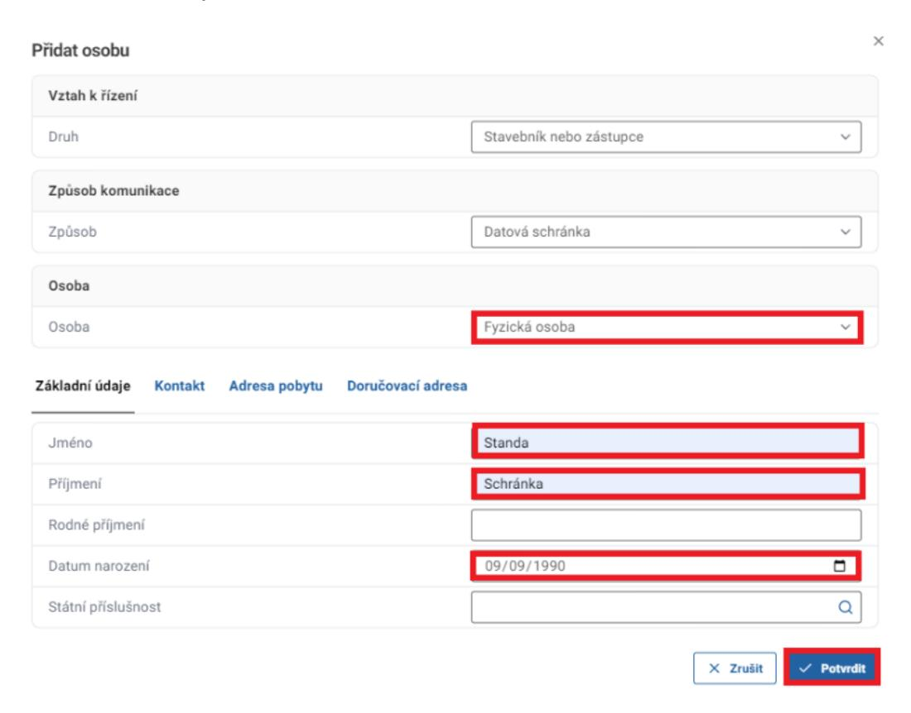

### 11.3 Ověření (ztotožnění) odesílatele/účastníků řízení

Pro ověření vůči základním registrům použijte tlačítko Ověřit osobu.

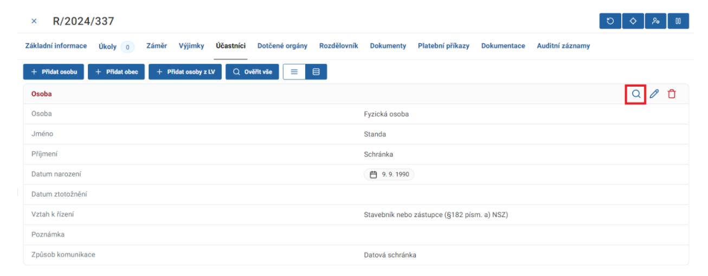

Ověření potvrďte kliknutím na tlačítko Potvrdit.

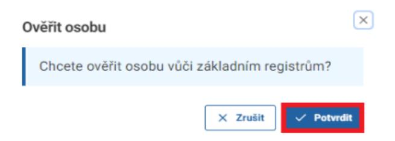

Ztotožněná data zobrazíte kliknutím na tlačítko Zobrazit ztotožněná data.

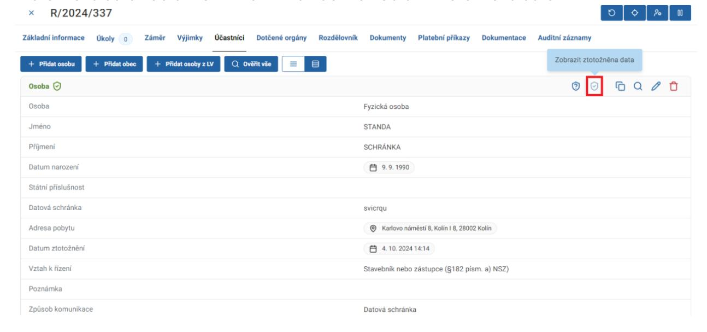

V případě, že chcete převzít data dané osoby ze základních registrů (ověřený data), vyberte ikonu Zkopírovat ověřená data do řízení. Poté se Vám zobrazí okno, kde zaškrtnete checkbox, že chcete zkopírovat ověřená data do řízení a potvrdíte.

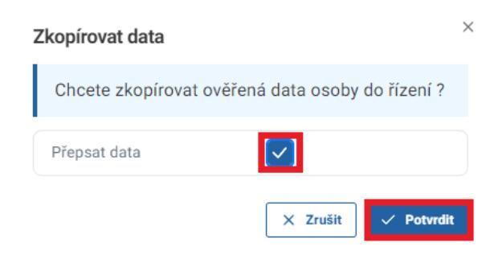

Tímto krokem dojde k přepisu údajů osoby ze záměru údaji ze základních registrů. Tento krok doporučujeme k eliminaci chybně zadaných údajů (ať již žadatelem při vyplňování žádosti či úředníkem), a to zejména adres, které pak mají vliv na selhání vypravení dokumentů. Bližší informace najdete v příručce Vypravování dokumentů.

### 11.4 Ověření zesnulé osoby

Po ověření osob u řízení, v případě, že bude mezi účastníky zesnulá osoba, se u této osoby automaticky zobrazí pole Datum úmrtí s vyplněným datem. Uživatel je navíc na tuto skutečnost upozorněn pomocí ikony s vykřičníkem a vysvětlující hláškou. Systém na tuto skutečnost prověřuje pouze k okamžiku ověřování.

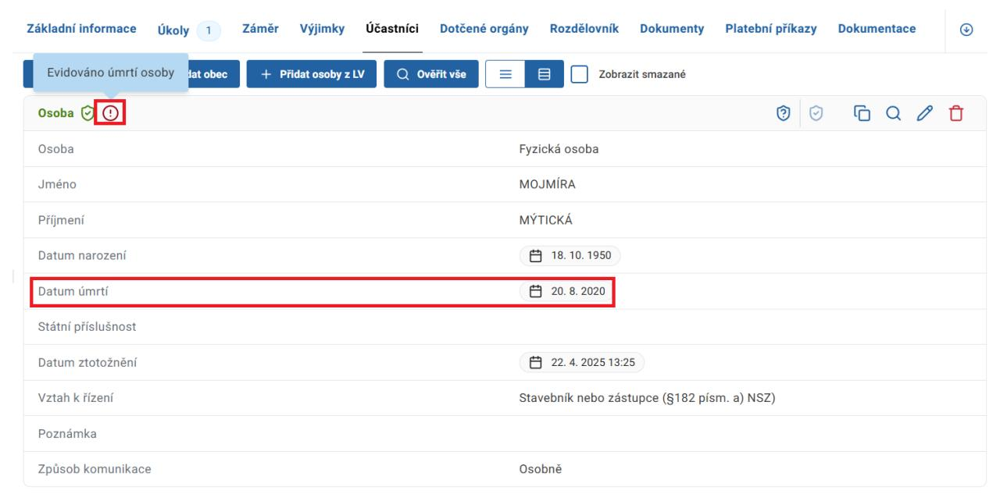

### 11.5 Odebrání účastníka z řízení

Pokud chcete osobu z řízení odebrat, klikněte na Odebrat osobu.

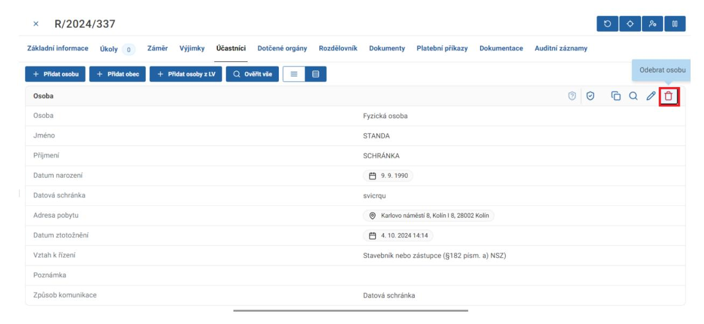

V dialogovém okně poté klikněte na tlačítko Potvrdit.

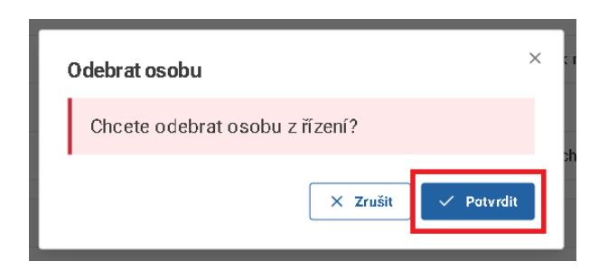

### 11.6 Zobrazení a obnovení odstraněných účastníků řízení

Účastníky řízení můžete v případě potřeby odebrat kliknutím na tlačítko Odebrat osobu a následným potvrzením.

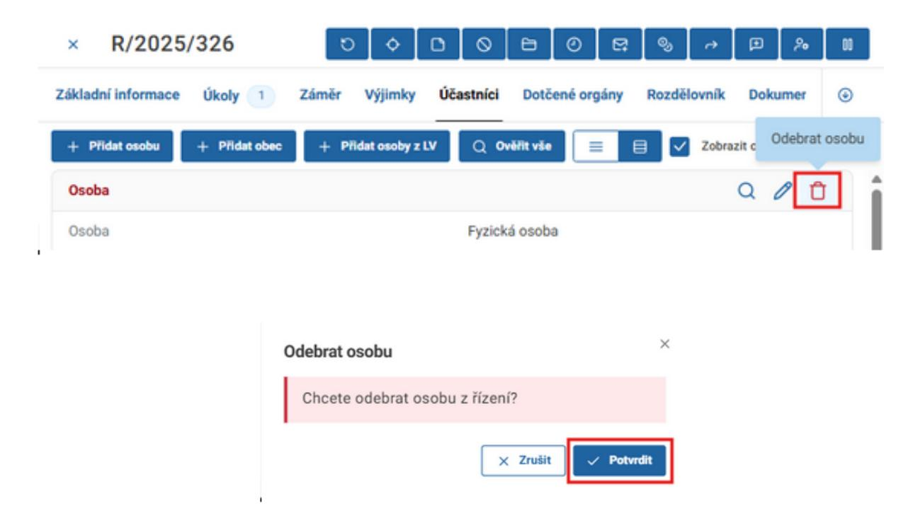

Odebrané účastníky řízení si můžete zobrazit zaškrtnutím možnosti "Zobrazit odstraněné". Odebrané osoby budou podbarveny červeně.

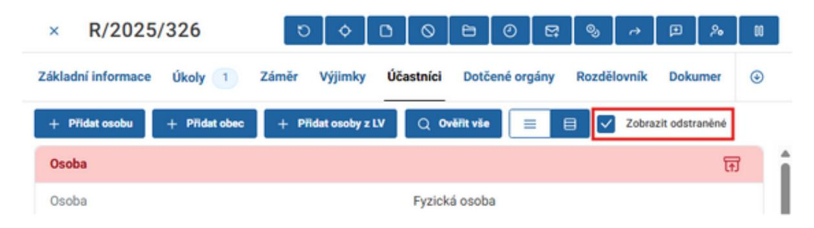

Odebrané účastníky řízení můžete obnovit kliknutím na tlačítko Obnovit osobu a následným potvrzením.

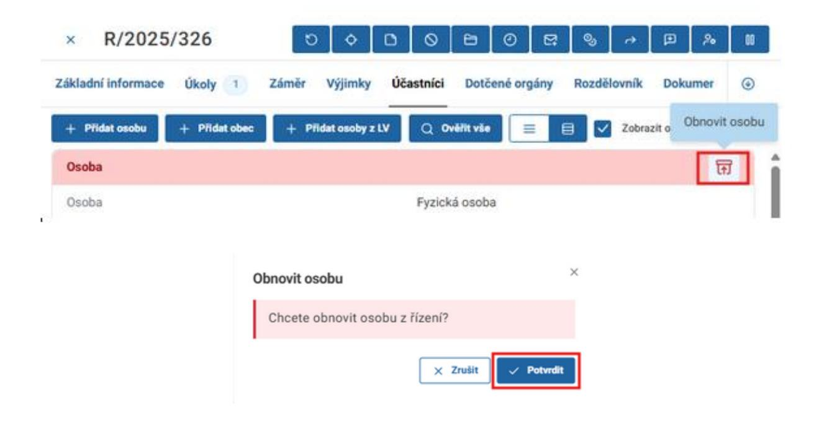

### 11.7 Ověření osob se shodným jménem a datem narození

V případě, kdy je v řízení více osob se shodným jménem a datem narození je nejprve potřeba ověřit adresu. Klikněte na Adresu pobytu.

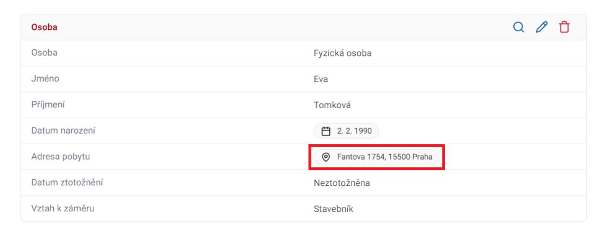

Otevře se nové okno a v něm klikněte na tlačítko Ověřit adresu.

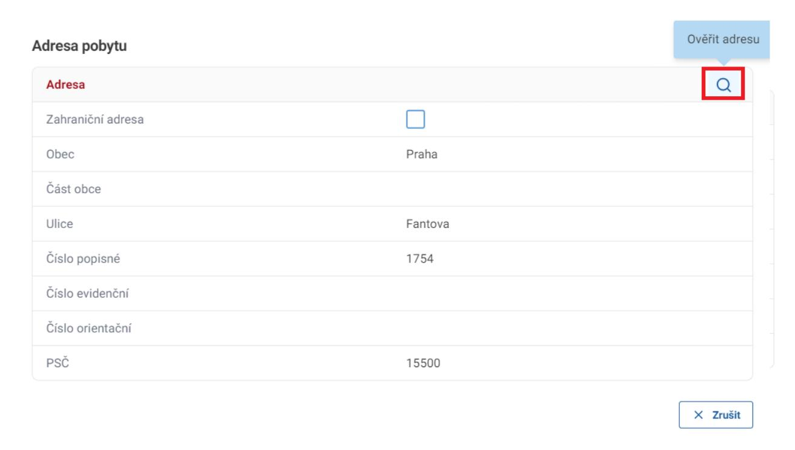

Pro ověření adresy pobytu klikněte na tlačítko Potvrdit.

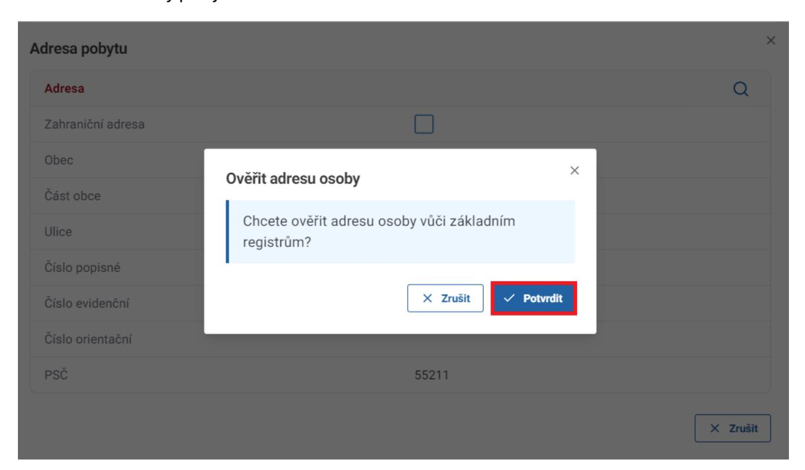

Po ověření adresy můžete okno zavřít.

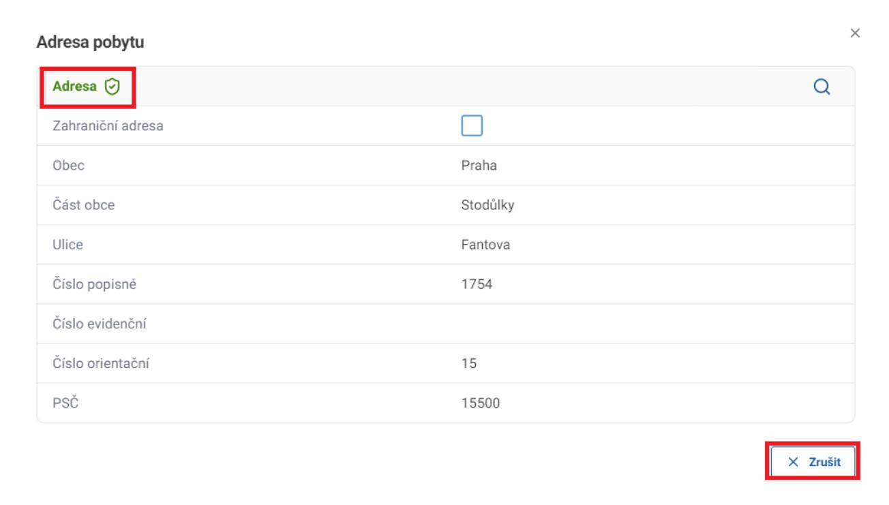

Poté pokračujte v ověření osoby standardním způsobem kliknutím na tlačítko Ověřit osobu.

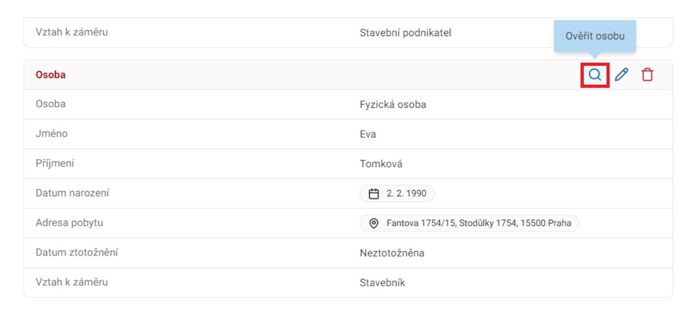

V novém okně potvrďte ověření osoby kliknutím na tlačítko Potvrdit.

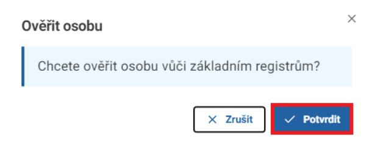
