# 11.8 Podpora pro udělení výjimky ověření (ztotožnění) osob (zejména pro zahraniční osoby)

Může nastat situace, kdy je v rámci řízení třeba komunikovat s osobami, které nelze ověřit vůči základním registrům. V takovém případě je třeba využít následující postup.

U příslušného řízení přejděte na záložku Účastníci a klikněte na tlačítko Přidat osobu.

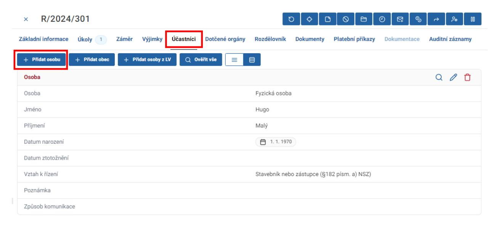

V zobrazeném formuláři vyplňte vztah osoby k řízení a způsob komunikace. V tomto případě datovou schránkou.

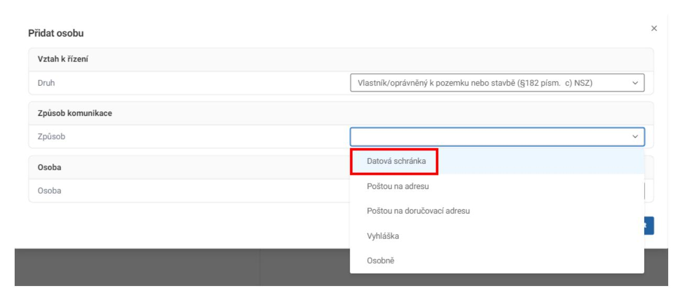

Vyberte, zda se jedná o fyzickou, právnickou či fyzickou osobu podnikající. V tomto případě vyberte fyzickou osobu. Vyplňte její jméno a datum narození. Zcela dole zaškrtněte políčko "Nelze ztotožnit / Zahraniční osoba".

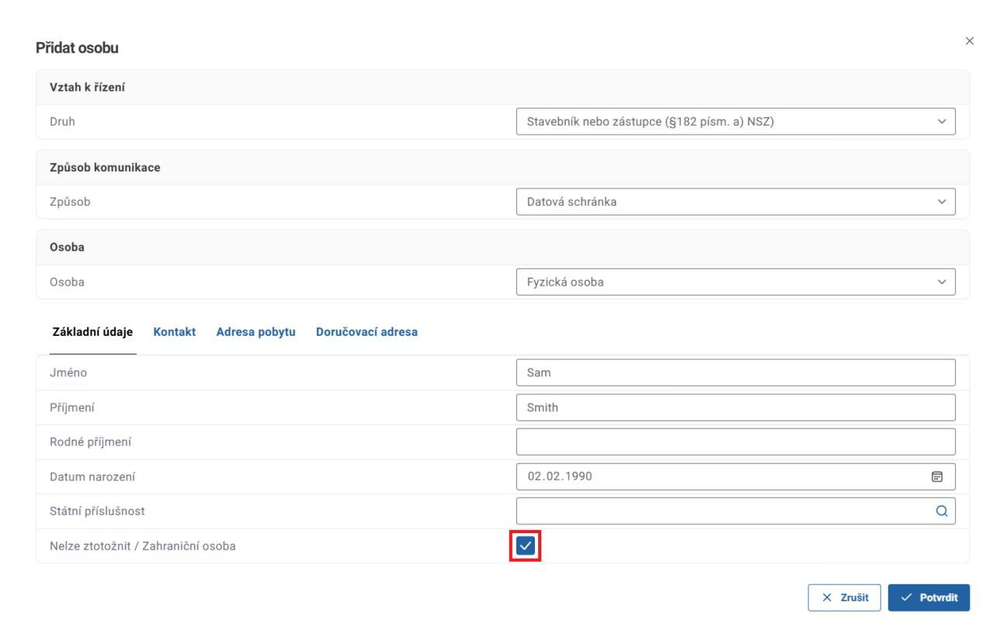

V záložce Kontakt vyplňte adresu datové schránky a potvrďte kliknutím na tlačítko Potvrdit.

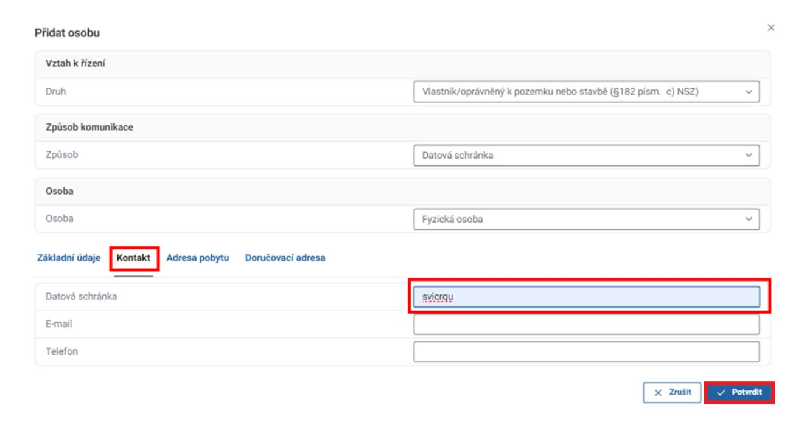

V záložce Účastníci je vložena nová osoba, u které není zobrazeno tlačítko Ověřit osobu a v kolonce Datum ztotožnění je uvedeno "Nelze ztotožnit". Tento stav je však správný.

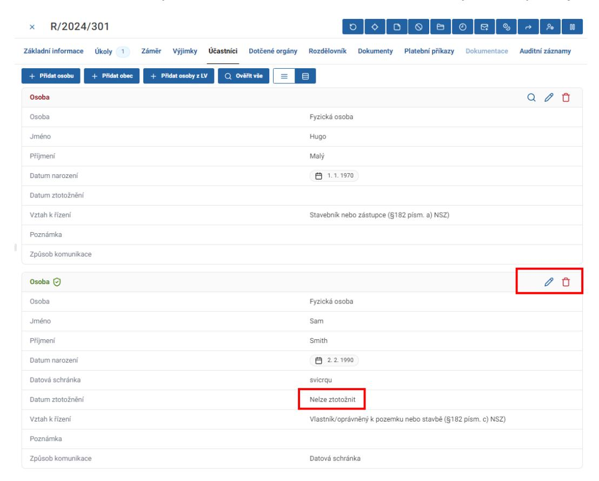

Pokud potřebujete odeslat písemnost prostřednictvím poskytovatele poštovních služeb, vyberte některou z možností způsobů komunikace.

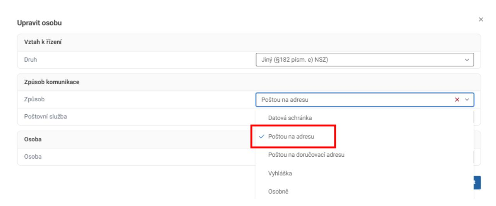

Vyberte požadovanou poštovní službu. Dbejte zvýšené pozornosti při vypravování na zahraniční adresu. Vybírejte pouze z poštovních služeb Doporučená zásilka v EU a Doporučená zásilka svět, ostatní služby jsou určeny pouze pro tuzemské doručování a při jejich výběru dojde k odmítnutí vypravení dokumentu.

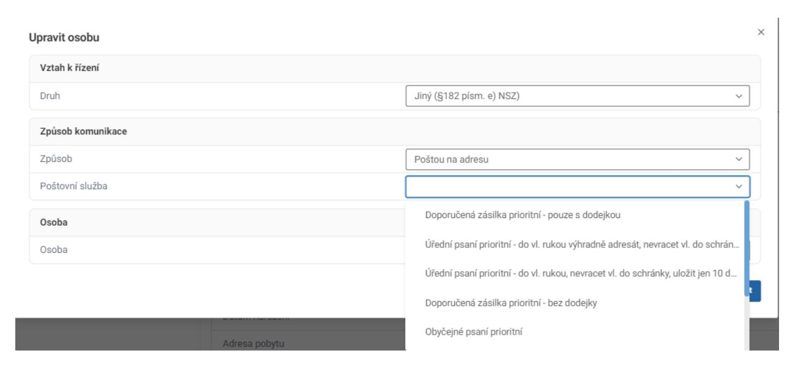

Vyplňte základní údaje o adresátovi a zaškrtněte políčko "Nelze ztotožnit / Zahraniční osoba".

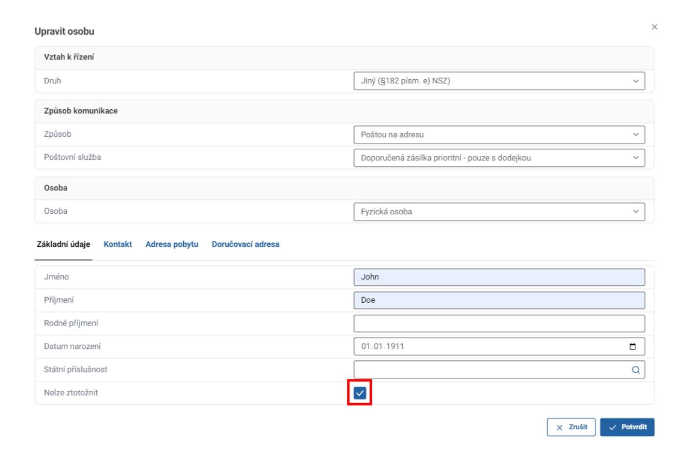

V záložce Adresa pobytu zaškrtněte políčko "Zahraniční adresa" a vyplňte adresu do příslušného formuláře. Poté klikněte na tlačítko Potvrdit.

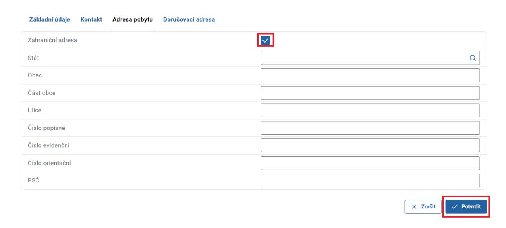

### 11.9 Ověření oprávněné osoby právnické osoby

Pro ověření oprávněné osoby právnické osoby, která je přidána jako účastník řízení, je nutné kliknout na tlačítko Ověřit oprávněnou osoby v kartě daného účastníka řízení.

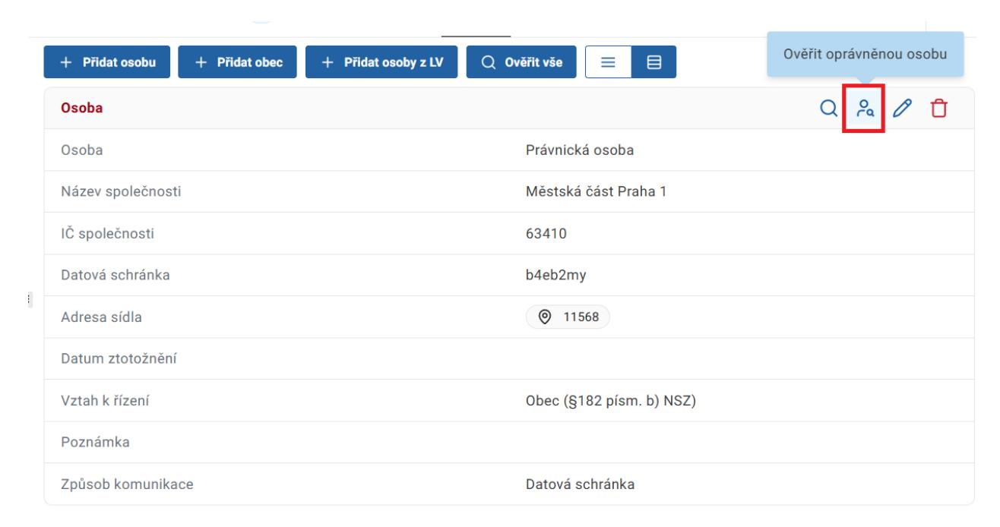

Následně je nutné potvrdit dialogové okno.

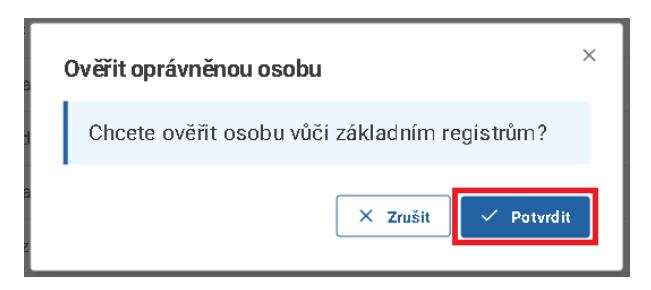
