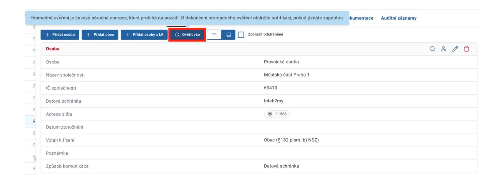
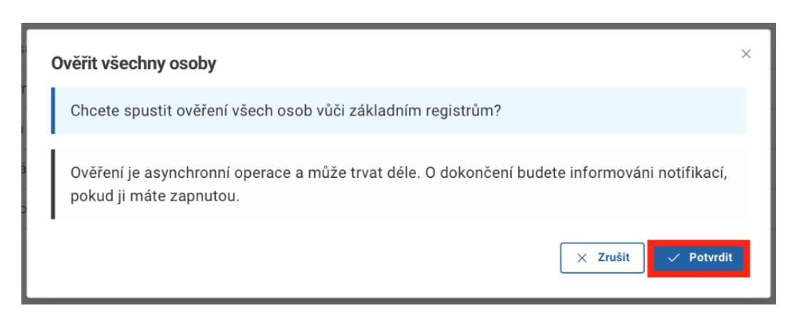
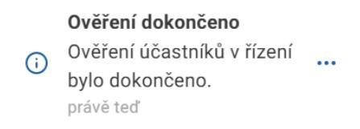

# 11.10 Hromadné ověření osob v řízení

Přidané účastníky řízení je možné ověřit hromadně pomocí tlačítka Ověřit vše.

Po kliknutí na toto tlačítko se objeví dialogové okno a jeho potvrzením spustíte hromadné ověření.

Podle počtu účastníků může hromadné potvrzení trvat delší dobu. O skončení procesu je uživatel informován notifikací, pokud ji má nastavenou.

Hromadným ověřením účastníků dojde zároveň ke zkopírování jejich dat z registrů do dat ze záměru. **Hromadné potvrzení účastníků neověří oprávněné osoby právnických osob, které jsou přidané jako účastníci řízení. Toto je nutné provést manuálně.**
