# 12.1 Vytvoření rozdělovníku v detailu nově vytvořeného vlastního dokumentu

Vytvořte nový vlastní dokument kliknutím na tlačítko Nový dokument na obrazovce Dokumenty.

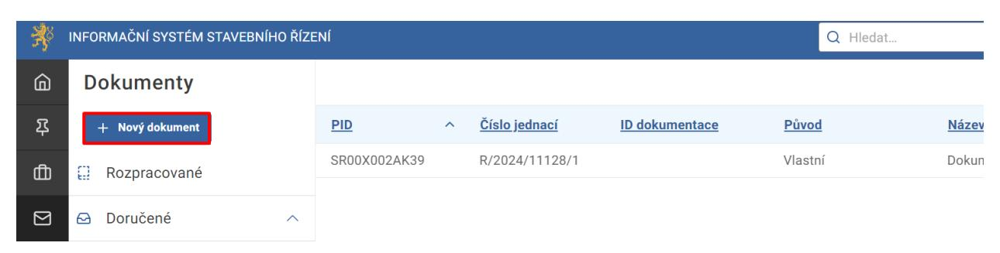

Po vytvoření dokumentu přejdete na záložku Rozdělovník v detailu dokumentu. Pokud nemáte ještě vytvořené řízení bude zobrazeno upozornění, že v dané fázi není možné přidat skupinu.

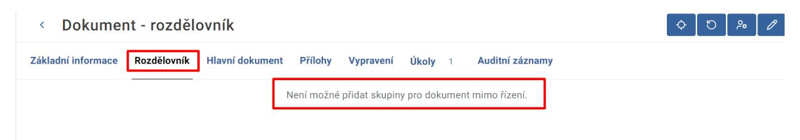

Vytvořte řízení zpracováním úkolu Určit způsob zpracování dokumentu. V detailu vytvořeného řízení na záložce Účastníci přidejte a ověřte účastníky řízení.

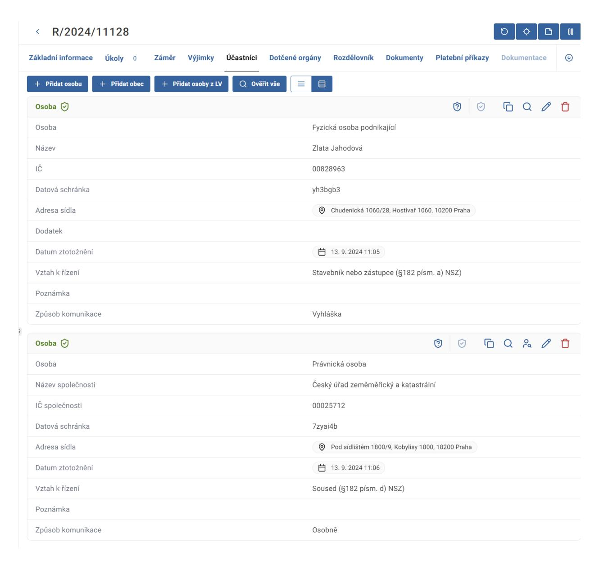

Přejděte na záložku Rozdělovník u dokumentu. Skupinu přidáte kliknutím na tlačítko Přidat skupinu.

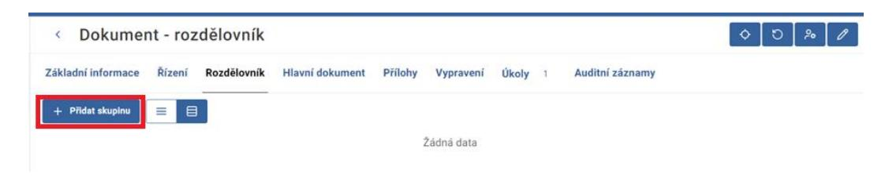

Při vytvoření skupiny se automaticky nabídnou jen ty osoby nebo dotčené orgány, které jsou přidány k řízení a ověřeny.

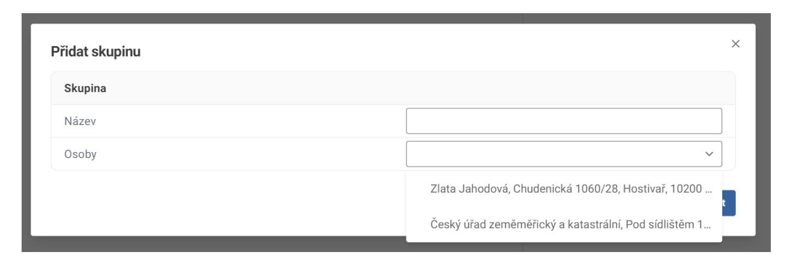

V zobrazeném formuláři vyplňte název skupiny a vložte do ní adresáty. Pro uložení skupiny klikněte na tlačítko Potvrdit.

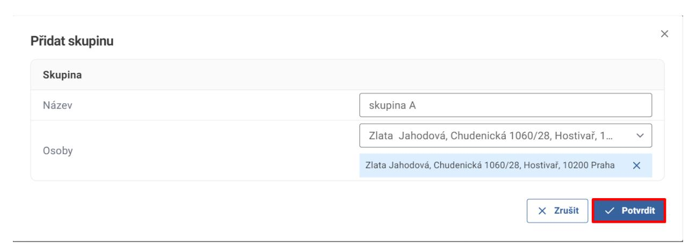

Skupiny lze poté dále upravovat či smazat pomocí tlačítek Upravit skupinu a Odstranit skupinu.

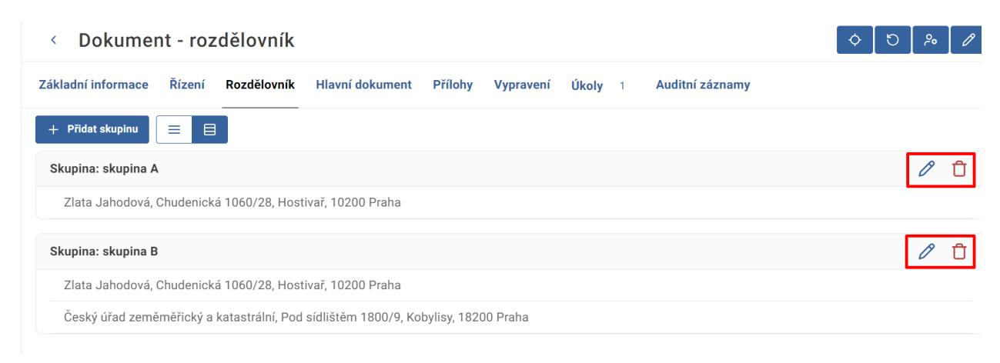

Skupiny rozdělovníku lze zobrazit i v režimu tabulky kliknutím na tlačítko Režim tabulky.

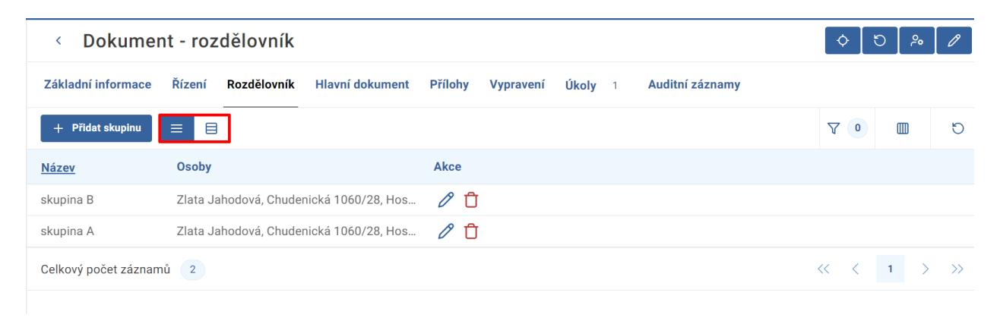

Pokud skupinu nevytvoříte, při zpracování úkolu Odeslat ke schválení dokument se Vám zobrazí upozornění, že nemate vyplněn rozdělovník. Pokud ho nevyplníte, nebudete mít možnost odeslat dokument potřebným osobám.

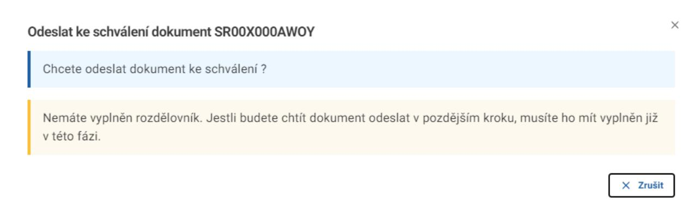

Po zpracování úkolu Odeslat ke schválení dokument již není možné přidávat, opravovat či mazat skupiny. Příslušná tlačítka nejsou zobrazena.

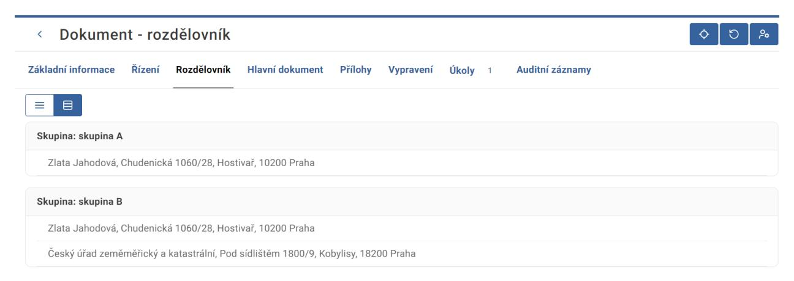

### 12.2 Vytvoření rozdělovníku v detailu dokumentu k běžícímu řízení

V detailu řízení po přidání účastníků řízení na záložce Rozdělovník vytvořte skupinu/skupiny osob kliknutím na tlačítko Přidat skupinu.

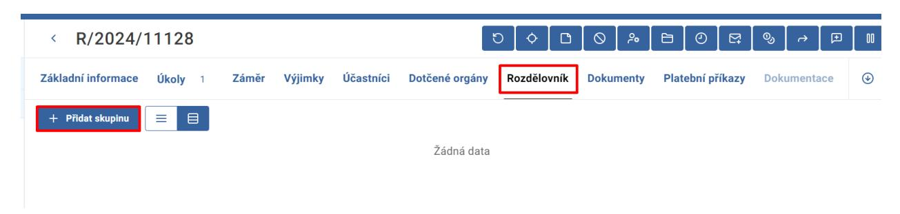

Skupiny jsou zobrazené na záložce Rozdělovník u příslušného řízení.

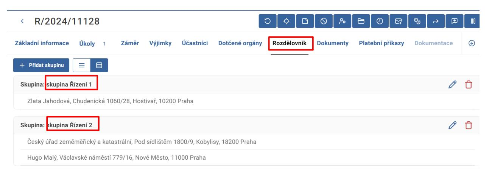

Pro vytvoření vlastního dokumentu k řízení stiskněte tlačítko Vytvořit vlastní dokument v detailu běžícího řízení.

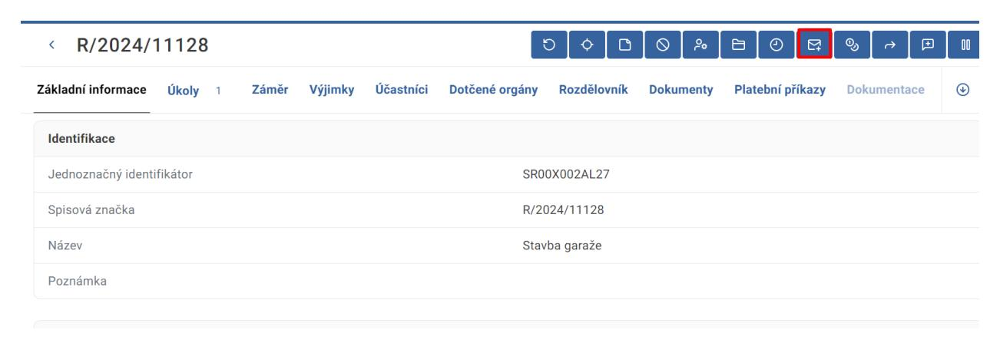

V případě, že již máte skupiny v rozdělovníku k řízení vytvořené, automaticky se Vám nabídnou při vytvoření nového vlastního dokumentu.

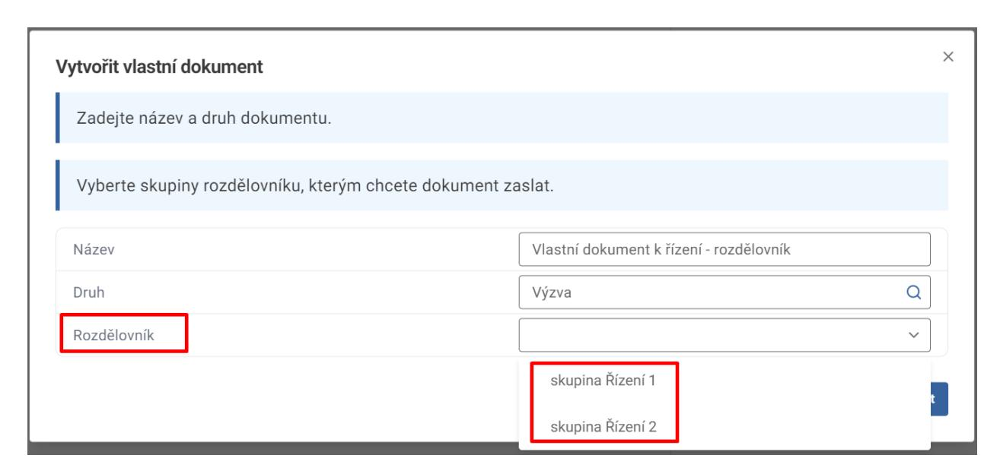

Vyplňte název a druh dokumentu a vyberte jednu nebo více skupin z nabídky. Poté klikněte na tlačítko Potvrdit.

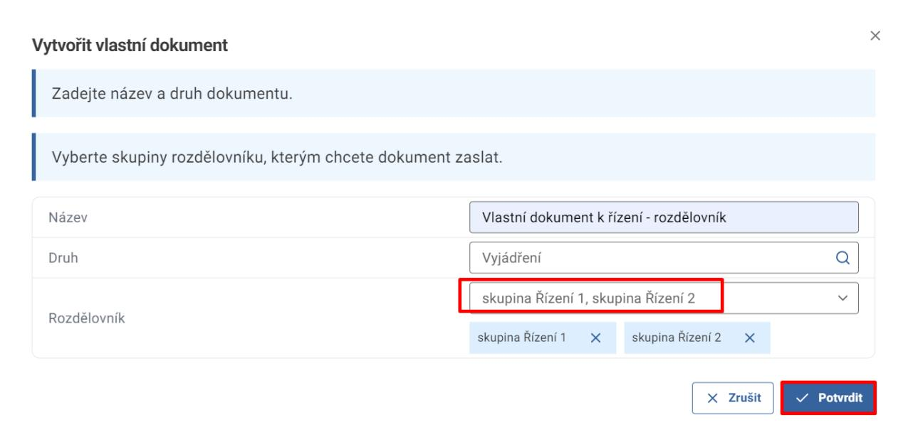

Přejděte na detail vytvořeného dokumentu. Přidané skupiny jsou zobrazené na záložce Rozdělovník.

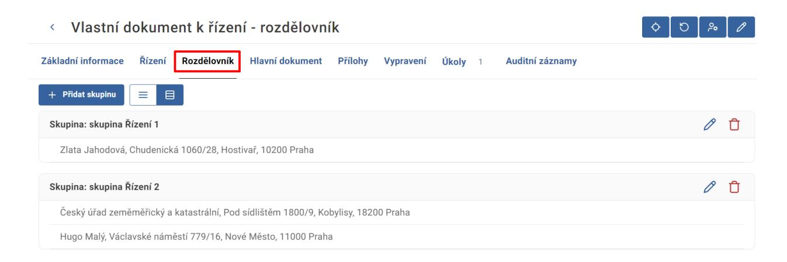

Skupiny lze poté přidávat či dále upravovat a mazat až do splnění úkolu Odeslat ke schválení dokument.

V případě, že v rozdělovníku v detailu řízení přidáte či upravíte skupinu až po vytvoření vlastního dokumentu, tyto změny nejsou do dokumentu automaticky přepsány.

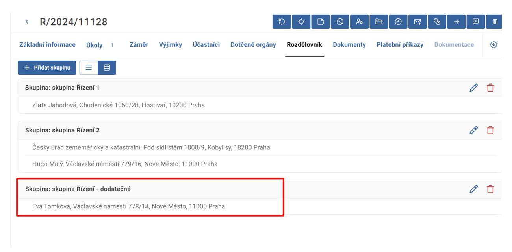

Pro doplnění v rozdělovníku u dokumentu přejděte na detail dokumentu a doplňte pomocí tlačítka Přidat skupinu.

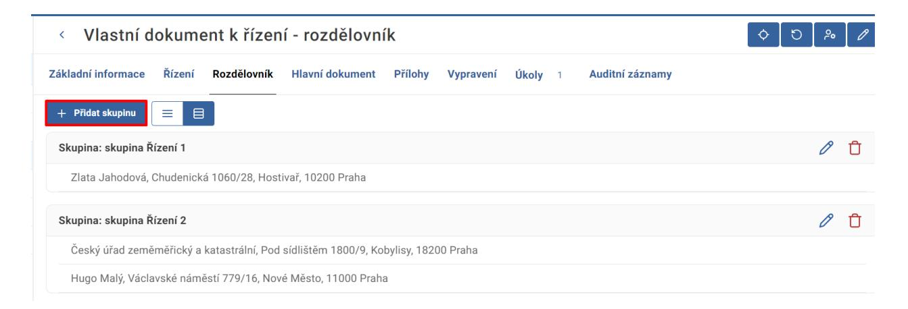

V případě vytvoření vlastního dokumentu k řízení bez rozdělovníku se musí následně přidat skupina na záložce Rozdělovník ručně.

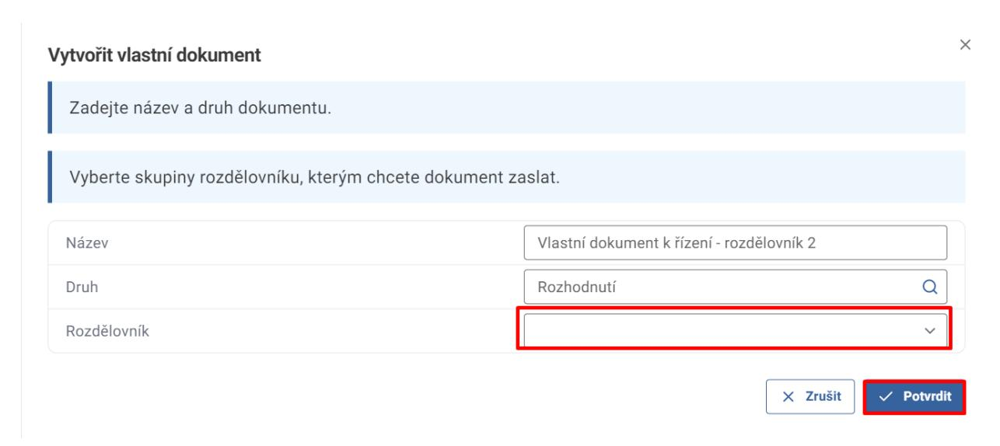

Pro přidání skupiny přejděte na záložku Rozdělovník v detailu dokumentu a stiskněte tlačítko Přidat skupinu.

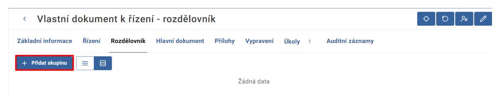
