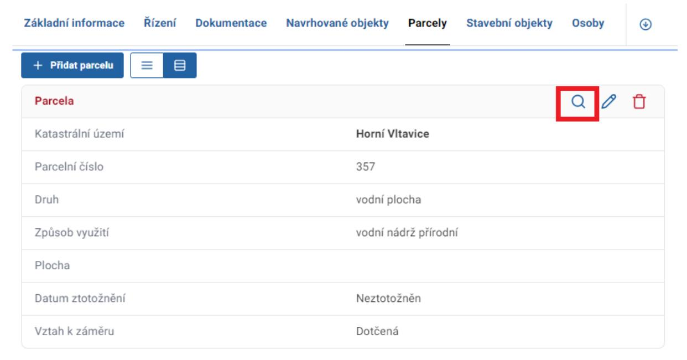
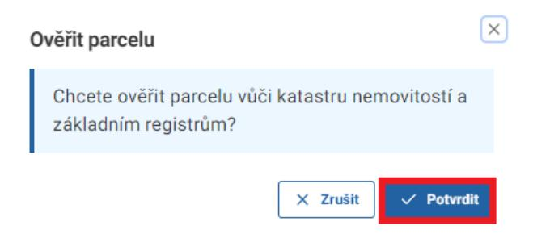
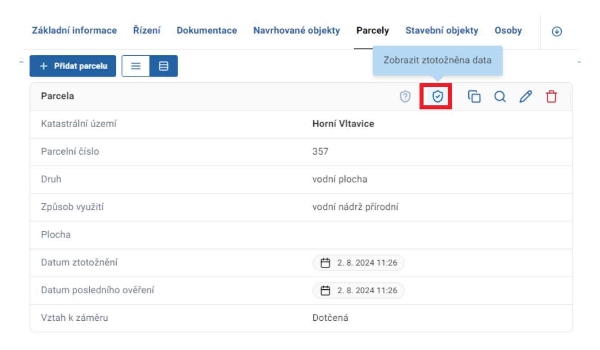
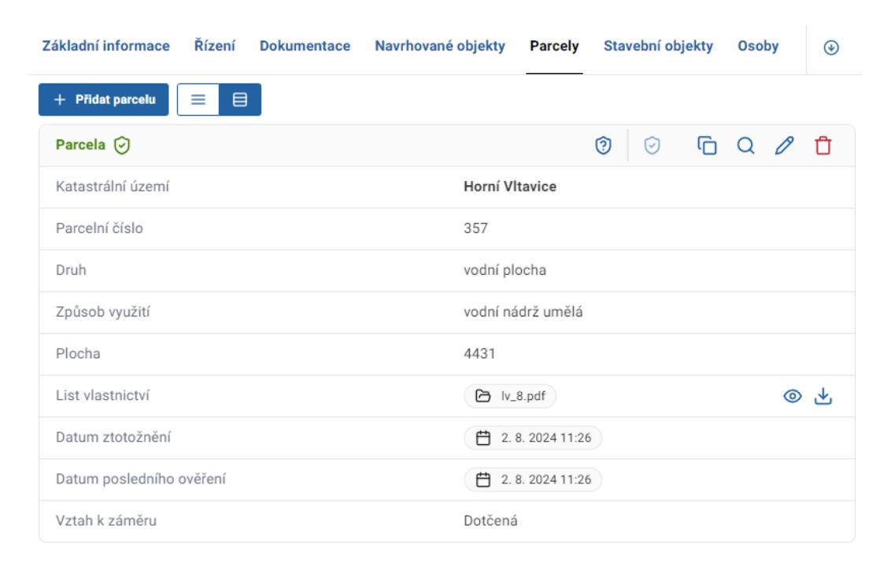
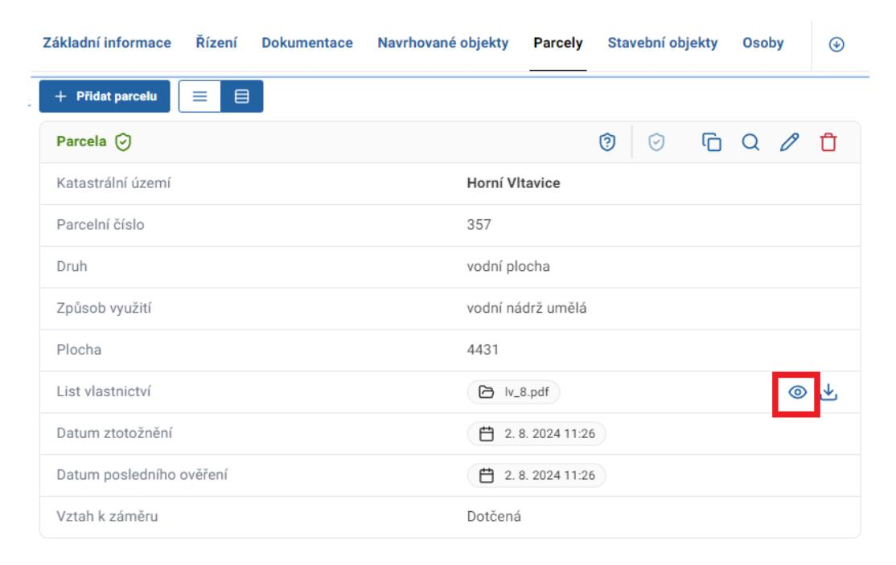
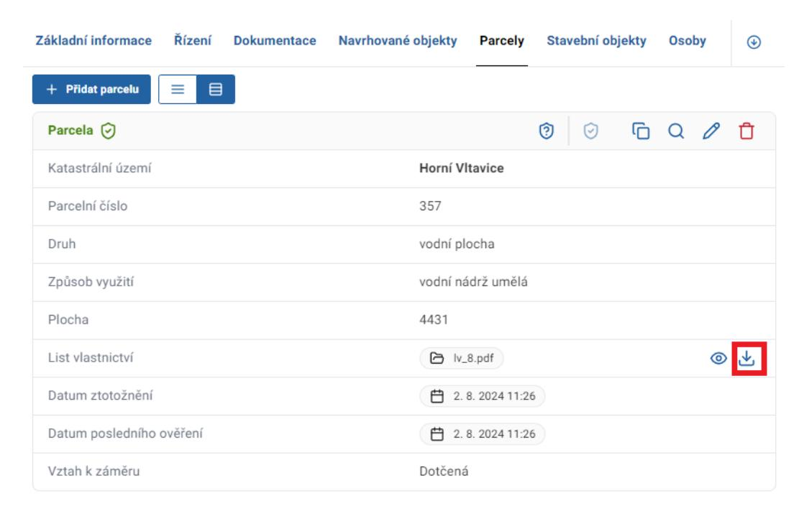

# 13 Ověření (ztotožnění) navrhovaných objektů, parcel a staveb v záměru

V přehledu záměrů rozklikněte záměr, v němž chcete provést ověření. V detailu záměru klikněte na záložku Navrhované objekty, Parcely nebo Stavby. Postup ověření je ve všech případech identický. Následující příklad se vztahuje k ověření parcel.

Pro ověření individuální parcely klikněte na tlačítko Ověřit parcelu s ikonou lupy.

Poté klikněte na tlačítko Potvrdit.

Po ztotožnění se zobrazení parcely v systému změní.

Ztotožněná data či data ze záměru zobrazíte kliknutím na tlačítka Zobrazit ztotožněná data a Zobrazit data ze záměru.

### Ztotožněná data:

List vlastnictví nebo částečný list vlastnictví můžete zobrazit pomocí tlačítka Otevřít v kartě dané parcely.

List vlastnictví nebo částečný list vlastnictví můžete stáhnout pomocí tlačítka Stáhnout v kartě dané parcely.

