# 14 Vyjádření a závazná stanoviska dotčených orgánů

V záložce Úkoly je zobrazen nový úkol "Zkontrolovat a doplnit vyjádření DO v řízení".

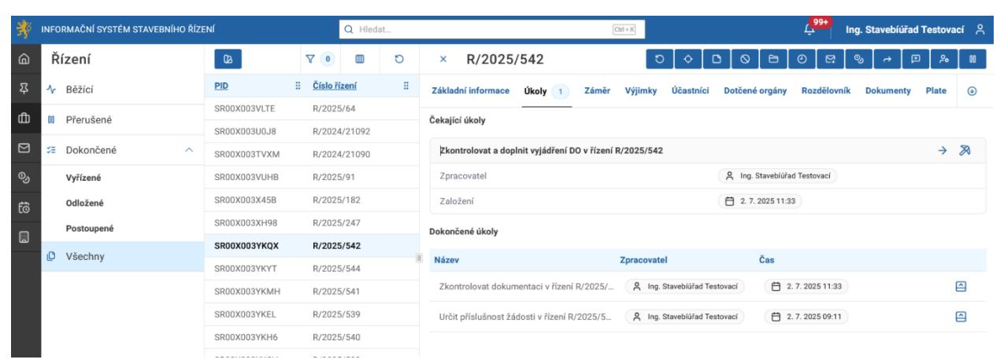

Před vyřízením tohoto úkolu je nutné odeslat žádost o vyjádření dotčenému orgánu. Klikněte na tlačítko "Vyžádat vyjádření dotčeného orgánu".

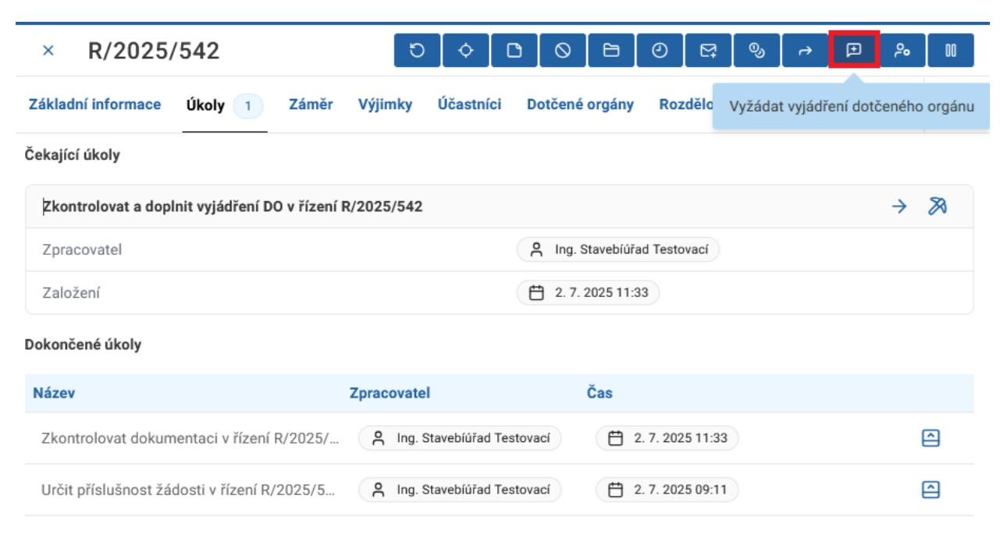

V zobrazeném formuláři vyberete z nabídky, kterému DO chcete žádost odeslat.

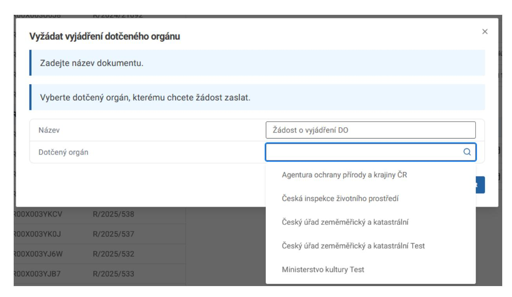

### Klikněte na tlačítko Potvrdit.

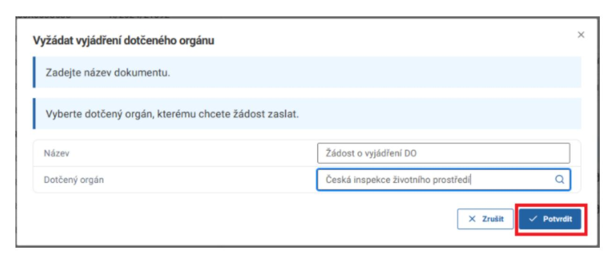

Přejdete na záložku Dotčené orgány, kde je zobrazen detail vybraného DO. Tento DO je třeba ověřit, a to kliknutím na tlačítko Ověřit osobu.

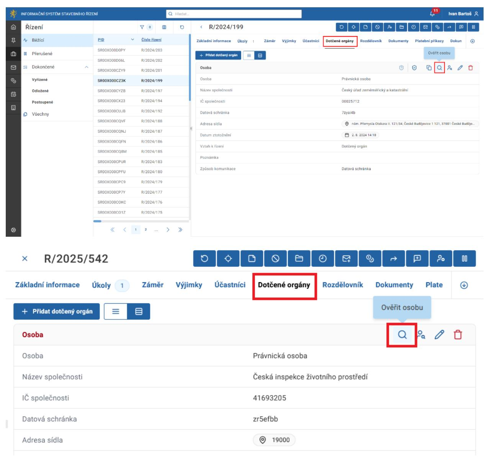

V dialogovém okně klikněte na tlačítko Potvrdit.

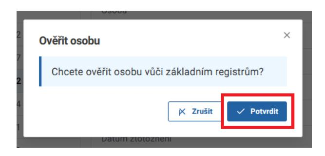

Stejným postupem ověříte oprávněnou osobu.

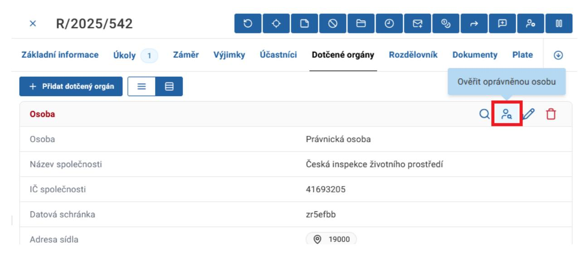

V záložce Dokumenty naleznete dokument s názvem "Žádost o vyjádření DO". Klikněte na tlačítko Otevřít a přejdete na detail tohoto dokumentu.

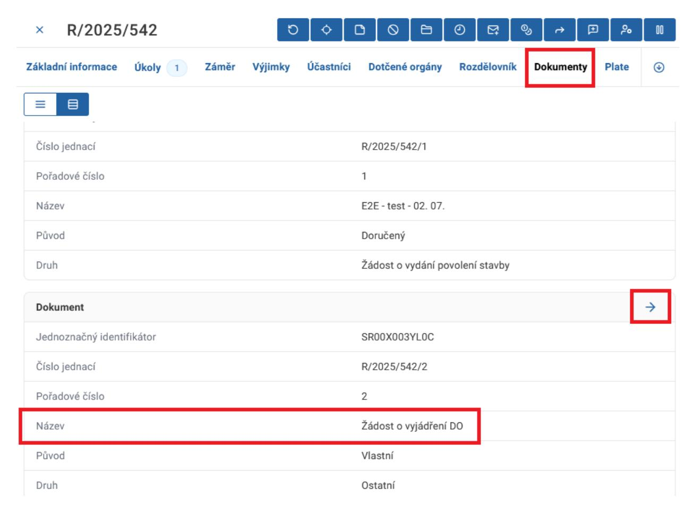

Přejděte na záložku Hlavní dokument a klikněte na tlačítko Přidat hlavní dokument.

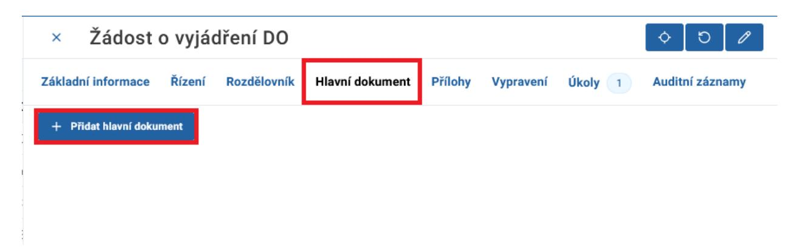

V zobrazeném formuláři vyplňte název. Z nabídky v kolonce Šablona vyberete "Žádost o vyjádření". Doplňte potřebné údaje a obsah žádosti.

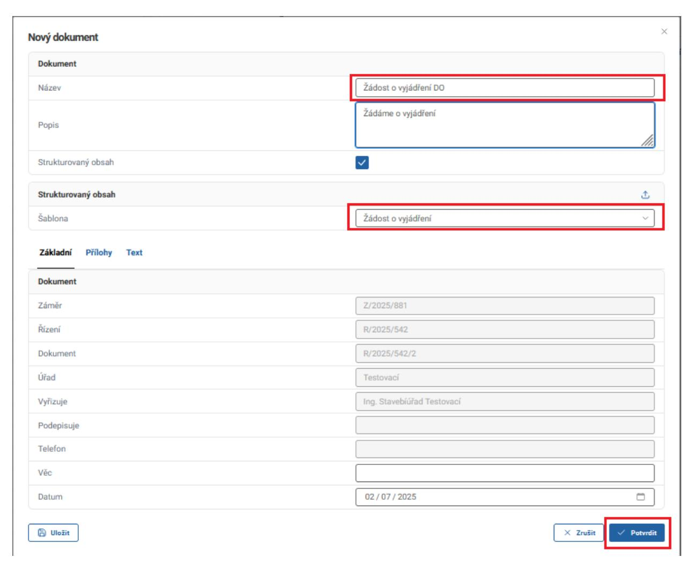

Dále je třeba tento dokument nechat schválit a podepsat k tomu pověřenou osobou. Proces splnění těchto úkolů je popsán v kapitole 14. "Tvorba vlastního dokumentu".

V záložce Úkoly je zobrazen (zobrazí se po splnění předchozích úkolů) úkol "Určit způsob vyřízení dokumentu", u kterého kliknete na tlačítko Provést úkol.

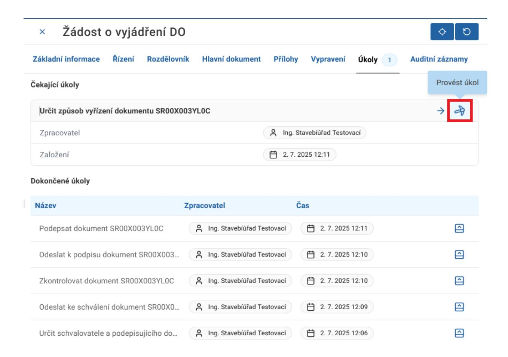

V zobrazeném formuláři vyberete z nabídky možnost "Odeslat dokument subjektům z rozdělovníku".

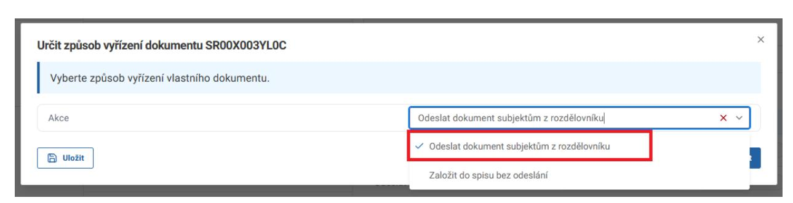

Klikněte na tlačítko Potvrdit.

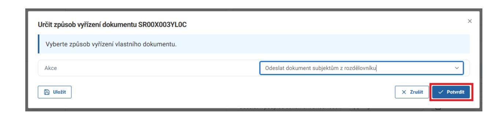
