# 16 Přerušení řízení

K přerušení řízení dochází buď automaticky, anebo je možné řízení přerušit i manuálně. Taktéž obnovení řízení je buď automatické, anebo manuální.

### 16.1 Automatické přerušení řízení

K automatickému přerušení řízení dochází z důvodu přítomnosti vad žádosti či nutnosti jejího doplnění.

Například v řízení o povolení stavby nebo zařízení dochází k automatickému přerušení v případě, že během úkolu Zkontrolovat žádost v řízení je žádost označena jako vadná (nesplňující jednu nebo více podmínek pro schválení).

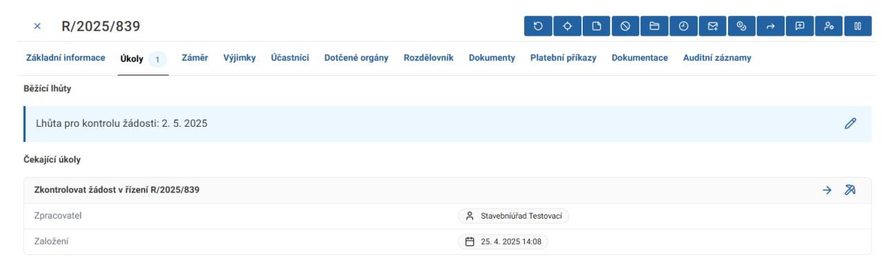

Při označení žádosti jako vadné se dialogové okno změní a objeví se upozornění o přerušení řízení.

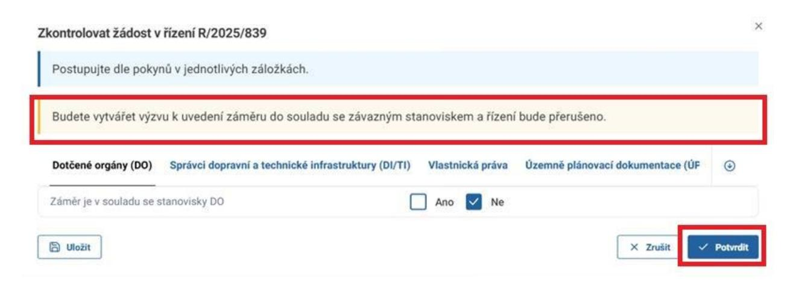

Jako další se objeví úkol Vyžádat doplnění v řízení.

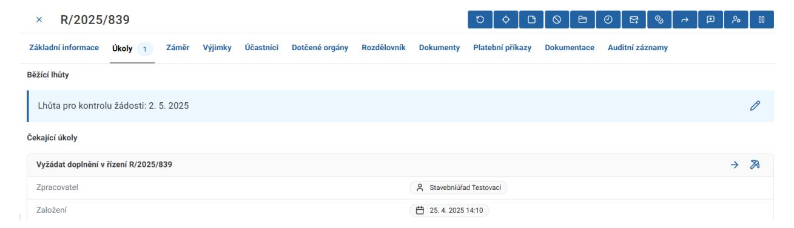

V úkolu Vyžádat doplnění v řízení vyberte připravený vlastní dokument a klikněte na tlačítko Potvrdit.

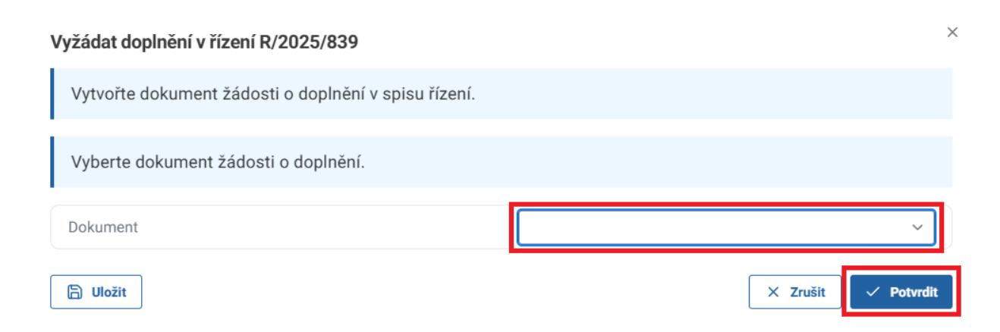

Po dokončení tohoto úkolu se řízení automaticky přeruší, což si můžete potvrdit v okně Zpracování v záložce Základní informace.

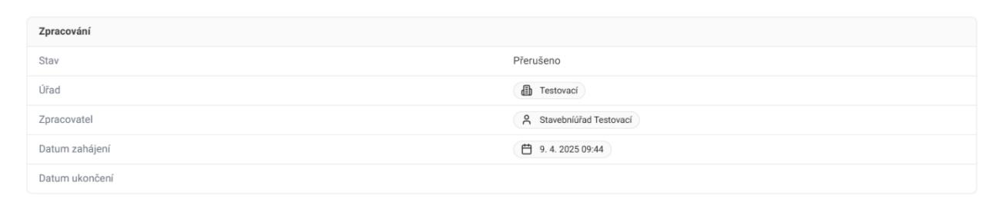

Přerušené řízení lze v přehledu všech řízení najít na záložce Přerušené.

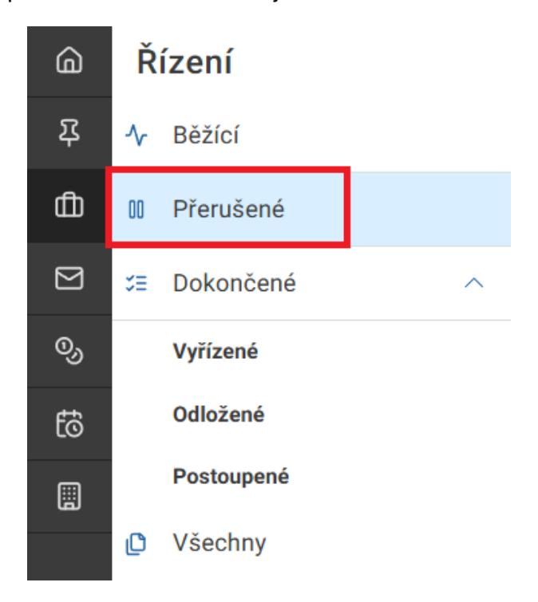

V řízení poté pokračujte úkolem Ukončit doplnění v řízení vybráním doručeného dokumentu doplnění či odstranění vad žádosti. Poté klikněte na tlačítko Potvrdit.

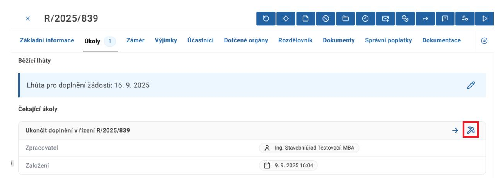

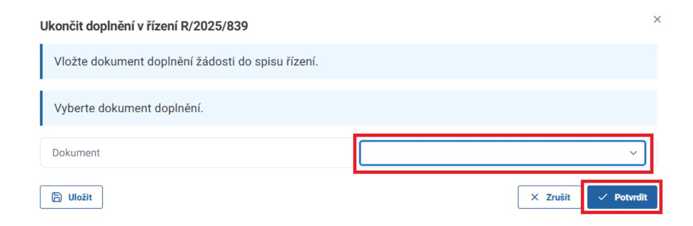

Nyní je řízení automaticky obnoveno a je možné pokračovat ve standardním procesu.

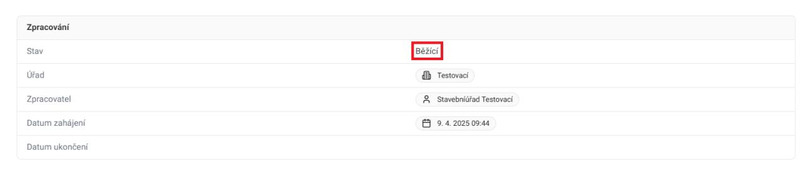

## 16.2 Manuální přerušení řízení

Manuální přerušení je možné vykonat u různých typů řízení i mimo situaci, kdy od stavebníka žádáme doplnění žádosti.

Pro manuální přerušení řízení přejděte na detail řízení a v pravém horním rohu klikněte na tlačítko Přerušit řízení.

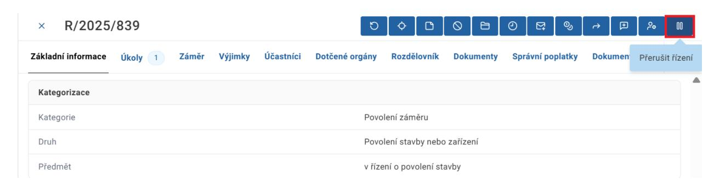

V dialogovém okně Přerušit řízení klikněte na tlačítko Potvrdit.

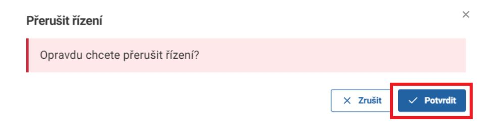

### Řízení je nyní ve stavu Přerušeno.

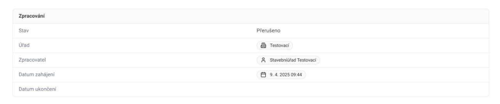

Přerušené řízení je nyní možné najít na záložce Přerušené.

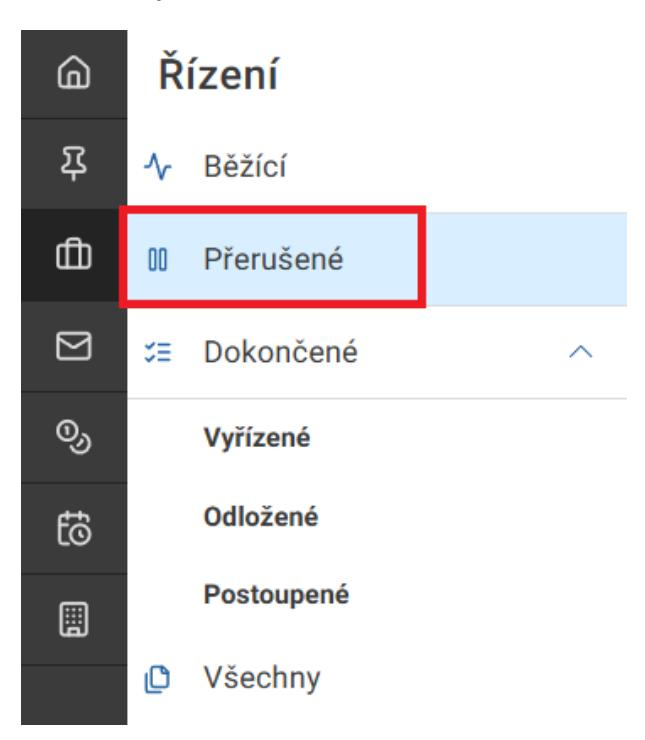

Přerušené řízení je možné manuálně obnovit kliknutím na tlačítko Obnovit řízení v detailu řízení.

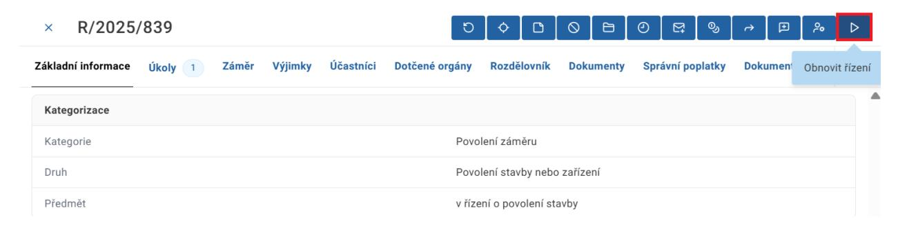

V dialogovém okně Obnovit řízení klikněte na tlačítko Potvrdit.

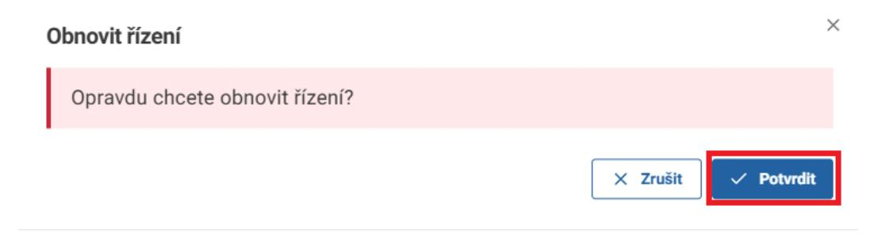

Po obnovení je řízení ve stavu Běžící a je možné pokračovat v procesu.

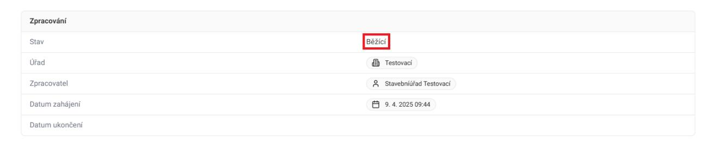
