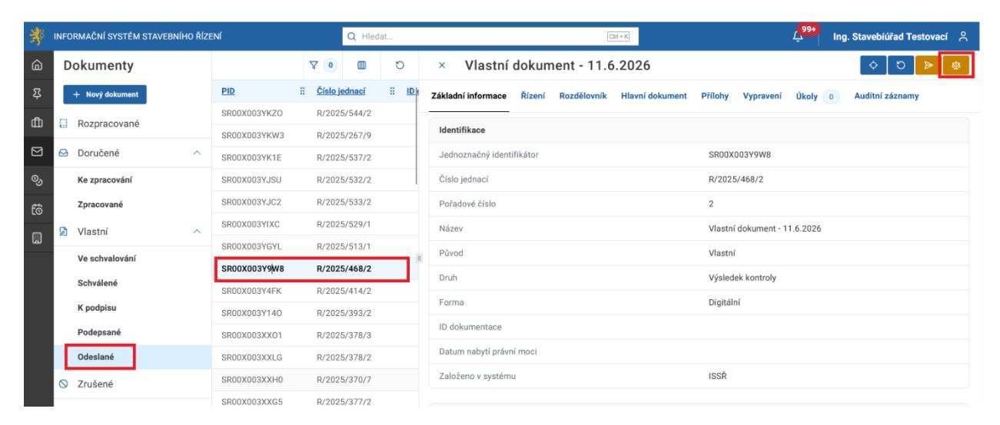
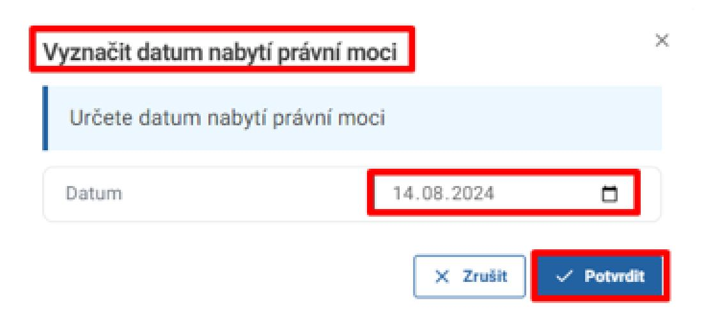
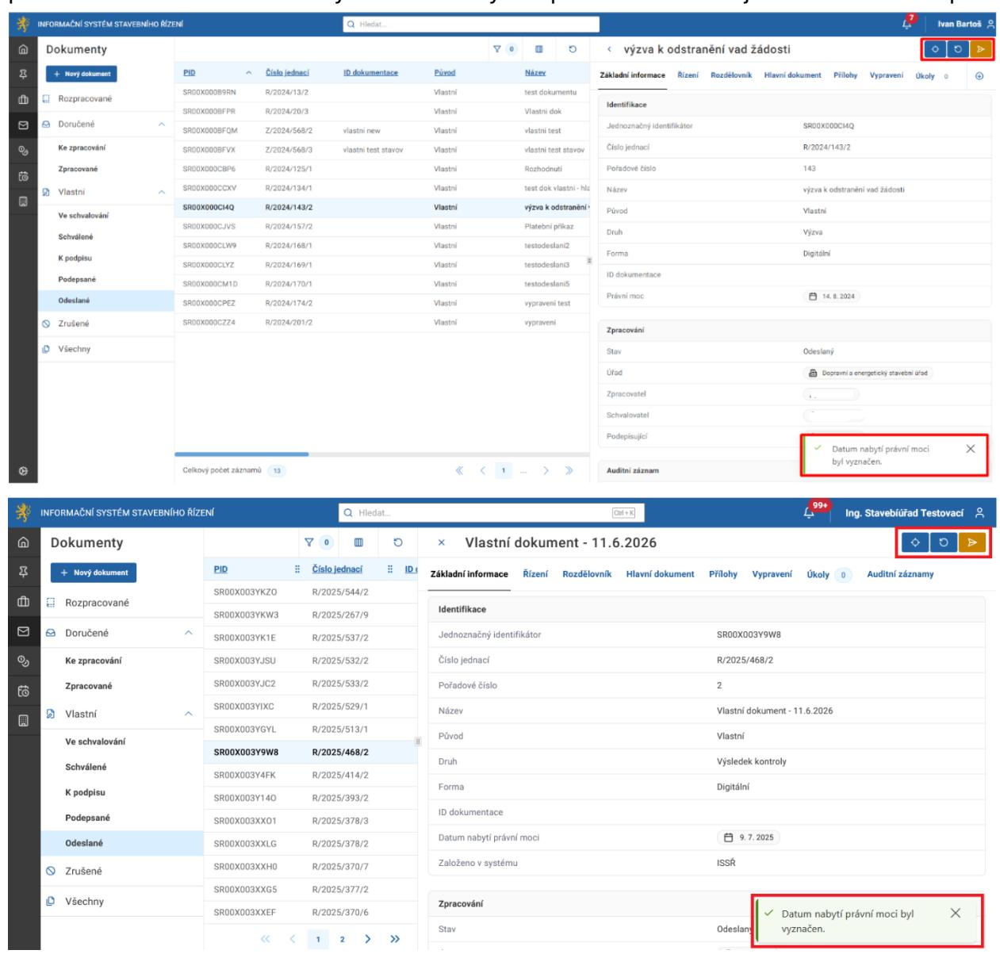

# 17 Vyznačení nabytí právní moci

Nabytí právní moci lze vyznačit manuálně, anebo přes příslušný úkol u řízení s aktivními úkoly.

### 17.1 Manuální proces vyznačení nabytí právní moci u Dokumentů

Vyznačení nabytí právní moci u dokumentů se nabízí pro dokumenty ve stavu Odeslané.

Přejděte na pohled Dokumenty, záložka Odeslané. Vyberte potřebný dokument. V detailu dokumentu v pravém horním rohu klikněte na tlačítko Vyznačit datum nabytí právní moci.

Na dialogu Vyznačit nabytí právní moci zadejte datum nabytí právní moci a klikněte na tlačítko Potvrdit.

Zobrazí se upozornění, že datum nabytí právní moci bylo vyznačeno. Po vyznačení nabytí právní moci tlačítko Vyznačit nabytí právní moci již není dostupné.

Vyznačené datum nabytí právní moci se v případě dokumentů druhu Vyjádření, Rozhodnutí, Usnesení a Usnesení o postoupení pro nepříslušnosti. Vyznačení tohoto datumu u ostatních druhů dokumentů se nepropíše do detailu řízení.
