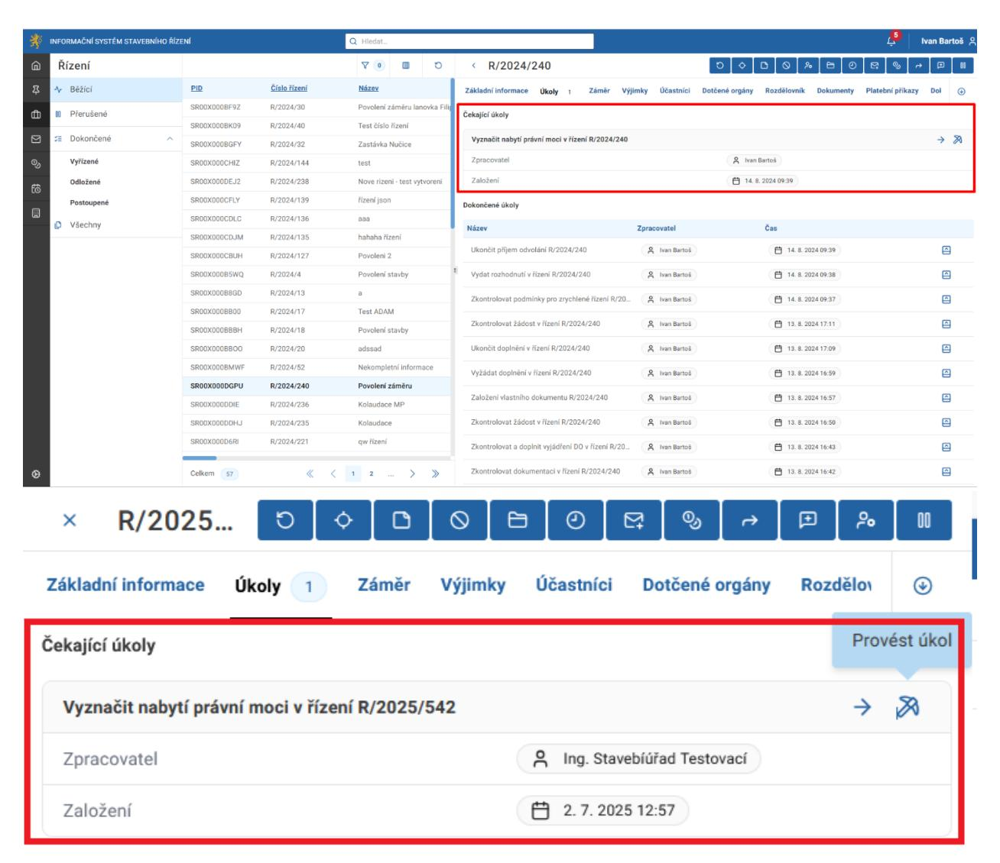
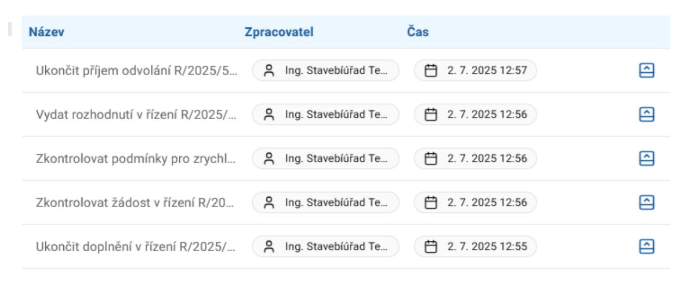
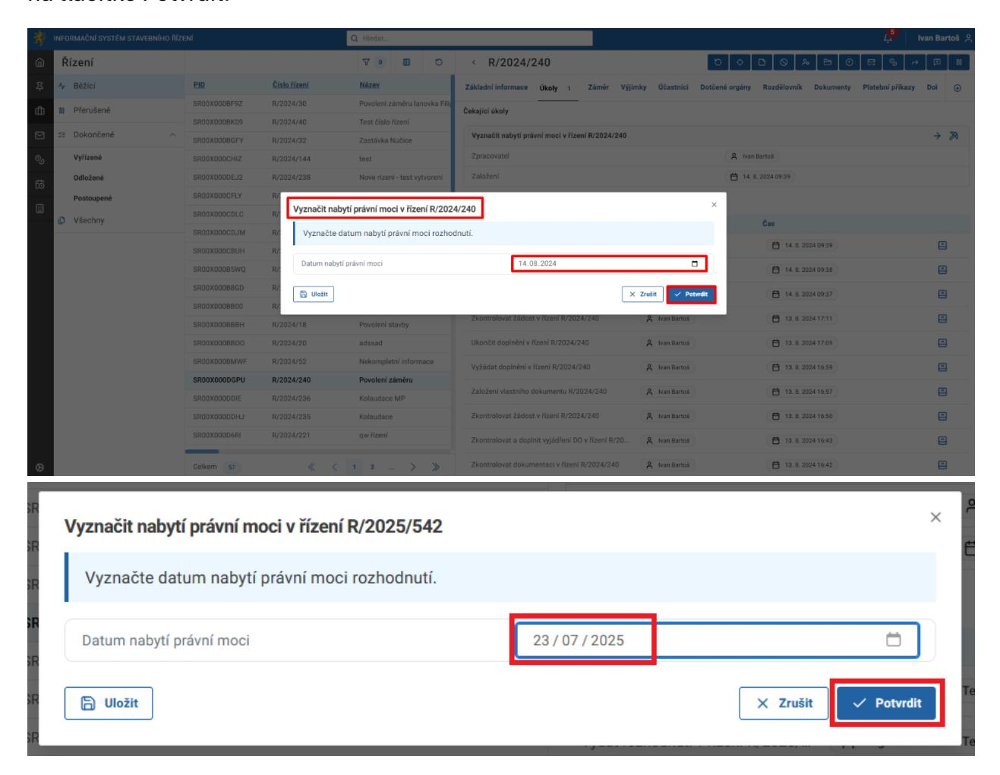
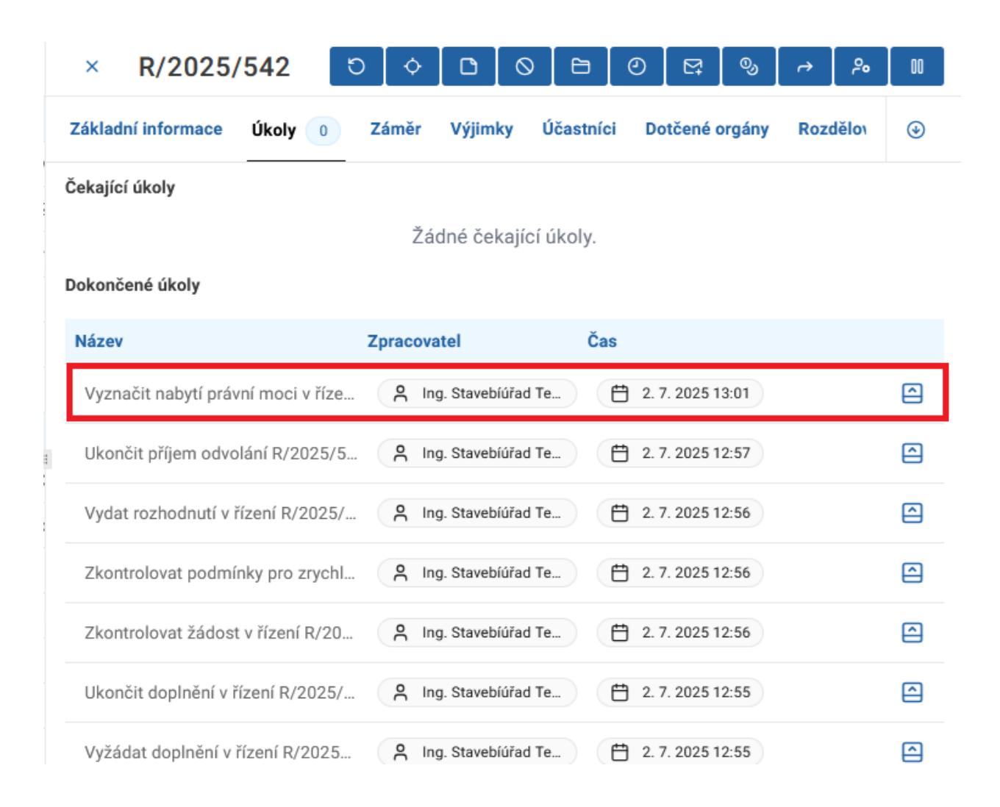

# 17.2 Automatický proces vyznačení nabytí právní moci u Řízení

V řízeních s aktivními úkoly se úkol Vyznačit nabytí právní moci u Řízení se nabídne automaticky po dokončení úkolu Vydat rozhodnutí v řízení.

Na dialogu Vyznačit nabytí právní moci v řízení zadejte datum nabytí právní moci a klikněte na tlačítko Potvrdit.

Úkol je zobrazený jako dokončený na záložce Úkoly.

